<h1>Behavioral analysis of social network users in relation to vaccination of covid-19)</h1>
<h3>Gabriela Tavares Boscarol</h3>
<h3>Marcus Vinícius Souza Costa</h3>

Imports and functions definitions


```python
import pandas as pd
import numpy as np
from datetime import datetime as dt
from matplotlib import pyplot as plt
import re
from matplotlib.ticker import EngFormatter

%matplotlib inline
#Adjust your font-size here
plt.rcParams.update({'font.size': 14})

#convert date to YYYY-MM-DD hh:mm:ss format
def adjustDateFormat(date):
    return re.sub(r'(\d{1,2})-(\d{1,2})-(\d{4})', '\\3-\\2-\\1', date)


#creates a function to remove all @'s, hashtags, and links
#Then applies it to the dataframe
def cleanUpTweetsAndComments(txt):
    # Remove mentions
    txt = re.sub(r'@[A-Za-z0-9_]+', '', txt, flags=re.IGNORECASE)
    # Remove hashtags
    txt = re.sub(r'#', '', txt)
    txt = re.sub(r'&amp;', '', txt, flags=re.IGNORECASE)
    # Remove retweets:
    txt = re.sub(r'RT : ', '', txt)
    # Remove urls
    txt = re.sub(r'http\S+', '', txt, flags=re.IGNORECASE) 
    #removes stop words
    txt = re.sub(r'the' , '', txt, flags=re.IGNORECASE)
    txt = re.sub(r'and' , '', txt, flags=re.IGNORECASE)
    txt = re.sub(r'to ', '', txt, flags=re.IGNORECASE)
    txt =re.sub(r'covid','',txt, flags=re.IGNORECASE)
    txt =re.sub(r'vaccine','',txt, flags=re.IGNORECASE)
    txt =re.sub(r'i\'m','',txt, flags=re.IGNORECASE)
    txt =re.sub('[0-9]','',txt, flags=re.IGNORECASE)
    #removes non-ascci characters
    txt=re.sub(r'[^\x00-\x7f]','', txt) 
    return txt


#Importing dataframes

#Avaliable on https://www.kaggle.com/gpreda/all-covid19-vaccines-tweets
twitter_df=pd.read_csv('datasets/vaccination_all_tweets.csv', low_memory=False)
#Avaliable on https://www.kaggle.com/xhlulu/covid19-vaccine-news-reddit-discussions
reddit_df=pd.read_csv('datasets/reddit_comments.csv')
#Avaliable on https://www.kaggle.com/gpreda/pfizer-vaccine-tweets
twitter_pfizer_df=pd.read_csv('datasets/pfizer_biontech_tweets.csv')
#Avaliable on https://www.kaggle.com/gpreda/pfizer-vaccine-on-reddit
reddit_pfizer_df=pd.read_csv('datasets/reddit_pfizer_vaccine.csv')

```

Evolution of tweets about COVID-19 vaccines used in entire world


```python
#twitter_df=pd.read_csv('datasets/covidvaccine_hashtag.csv', low_memory=False)
#Avaliable in https://www.kaggle.com/gpreda/all-covid19-vaccines-tweets
twitter_df=pd.read_csv('datasets/vaccination_all_tweets.csv', low_memory=False)
twitter_df['date']=twitter_df['date'].dropna().apply(adjustDateFormat)
twitter_data=pd.to_datetime(twitter_df['date'], format='%Y-%m-%d %H:%M:%S.%f', errors='coerce')
df = (pd.to_datetime(twitter_data.dropna())
       .dt.floor('d')
       .value_counts()
       .rename_axis('date')
       .reset_index(name='count'))
#df=df.groupby(pd.Grouper(key='date',freq='1M')).sum().reset_index()
df=df.sort_values(by='date')
#Defining engineering notation for Y-Axis
formatter = EngFormatter()
plt.xticks(rotation=45)
plt.gca().yaxis.set_major_formatter(formatter)
plt.plot(df['date'],df['count'], c='orange')
plt.xlabel('Date')
plt.ylabel('Number of interactions')
plt.title('Evolution of tweets about COVID-19 vaccines used in entire world')
plt.show()
```


    
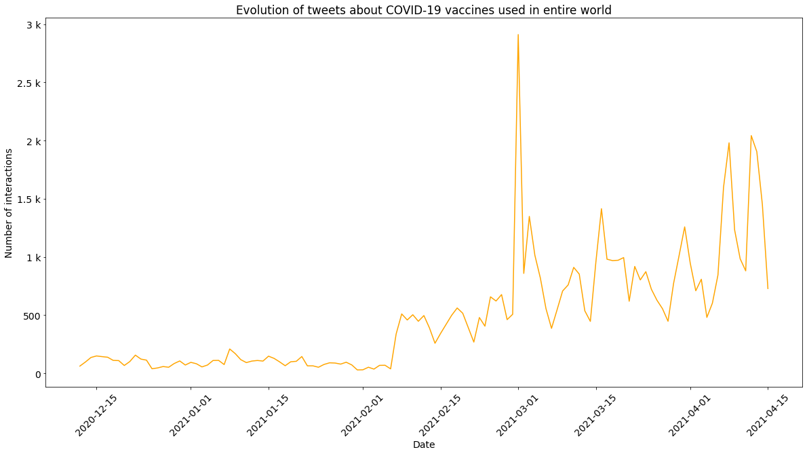
    


Evolution of discussions about COVID-19 vaccination on Reddit


```python
reddit_df['post_date']=reddit_df['post_date'].dropna().apply(adjustDateFormat)
reddit_data=pd.to_datetime(reddit_df['post_date'], format='%Y-%m-%d %H:%M:%S.%f', errors='coerce')
df = (pd.to_datetime(reddit_data.dropna())
       .dt.floor('d')
       .value_counts()
       .rename_axis('date')
       .reset_index(name='count'))

df=df.sort_values(by='date')

#Defining engineering notation for Y-Axis
formatter = EngFormatter()
plt.gca().yaxis.set_major_formatter(formatter)
plt.xticks(rotation=45)
plt.plot(df['date'],df['count'], c='orange')
plt.xlabel('Date')
plt.ylabel('Number of posts')
plt.title('Evolution of discussions about COVID-19 vaccination on Reddit')
plt.show()
```


    
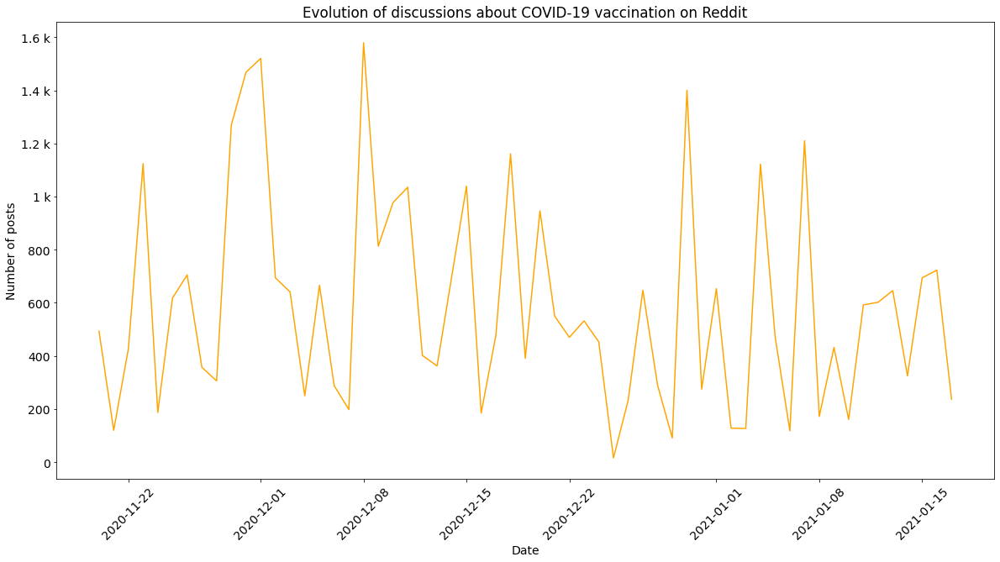
    


Generating word cloud of tweets about COVID-19 vaccines


```python
from wordcloud import WordCloud, STOPWORDS
from PIL import Image

stopwords = set(STOPWORDS)
for i in open('stopwords/twitter-stopwords.txt', "r").read().split(','):
    stopwords.add(i)
for i in open('stopwords/twitter-stopwords - TA.txt', "r").read().split(','):
    stopwords.add(i)
for i in open('stopwords/common-english-verbs.txt', "r").read().split(','):
    stopwords.add(i)    
for i in open('stopwords/common-english-prep-conj.txt', "r").read().split(','):
    stopwords.add(i) 
for i in open('stopwords/common-english-words.txt', "r").read().split(','):
    stopwords.add(i)     
for i in open('stopwords/smart-common-words.txt', "r").read().split(','):
    stopwords.add(i)         
for i in open('stopwords/stopWords.txt', "r").read().split('\n'):
    stopwords.add(i)      
for i in open('stopwords/punctuation.txt', "r").read().split('\n'):
    stopwords.add(i)         
stopwords.add("00A0")
stopwords.add("00BD")
stopwords.add("00B8")
stopwords.add("t")
stopwords.add("co")
stopwords.add("going")
stopwords.add("ed")
stopwords.add("covidvaccine")
stopwords.add("covid")
stopwords.add("corona")
stopwords.add("bot")
stopwords.add("covid19")
stopwords.add("covid-19")
stopwords.add("coronavirusvaccine")
stopwords.add("coronavaccine")
stopwords.add("got")
stopwords.add("will")
stopwords.add("day")
stopwords.add("re")
stopwords.add("coronavirus")
stopwords.add("new")
stopwords.add("now")
stopwords.add("one")
stopwords.add("vaccine")
stopwords.add("covidvaccination")
stopwords.add("vaccination")
stopwords.add("vaccinated")
stopwords.add("vaccinations")
stopwords.add("vaccinate")
stopwords.add("vaccines")
stopwords.add("s")
stopwords.add("m")
stopwords.add("ir")
stopwords.add("pemic")
stopwords.add("covid_19")
stopwords.add("virus")
stopwords.add("dose")
stopwords.add("doses")
wordcloud = WordCloud(background_color="white",stopwords=stopwords,random_state = 2016).generate(" ".join([i for i in twitter_df['text'].dropna().apply(cleanUpTweetsAndComments).str.upper()]))
plt.figure(figsize=(10,4))
plt.imshow(wordcloud)
plt.axis("off")
```


    (-0.5, 399.5, 199.5, -0.5)


    
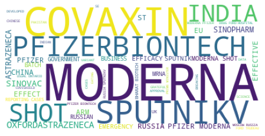
    


Generating word cloud of Reddit users about COVID-19 vaccines


```python
from wordcloud import WordCloud, STOPWORDS
from PIL import Image
import re


stopwords_reddit = set(STOPWORDS)
for i in open('stopwords/twitter-stopwords.txt', "r").read().split(','):
    stopwords_reddit.add(i)
for i in open('stopwords/twitter-stopwords - TA.txt', "r").read().split(','):
    stopwords_reddit.add(i)
for i in open('stopwords/common-english-verbs.txt', "r").read().split(','):
    stopwords_reddit.add(i)    
for i in open('stopwords/common-english-prep-conj.txt', "r").read().split(','):
    stopwords_reddit.add(i) 
for i in open('stopwords/common-english-words.txt', "r").read().split(','):
    stopwords_reddit.add(i)     
for i in open('stopwords/smart-common-words.txt', "r").read().split(','):
    stopwords_reddit.add(i)         
for i in open('stopwords/stopWords.txt', "r").read().split('\n'):
    stopwords_reddit.add(i)      
for i in open('stopwords/punctuation.txt', "r").read().split('\n'):
    stopwords_reddit.add(i)               
stopwords_reddit.add("00A0")
stopwords_reddit.add("00BD")
stopwords_reddit.add("00B8")
stopwords_reddit.add("t")
stopwords_reddit.add("co")
stopwords_reddit.add("going")
stopwords_reddit.add("ed")
stopwords_reddit.add("covidvaccine")
stopwords_reddit.add("covid")
stopwords_reddit.add("corona")
stopwords_reddit.add("bot")
stopwords_reddit.add("covid19")
stopwords_reddit.add("coronavirusvaccine")
stopwords_reddit.add("coronavaccine")
stopwords_reddit.add("got")
stopwords_reddit.add("will")
stopwords_reddit.add("day")
stopwords_reddit.add("re")
stopwords_reddit.add("coronavirus")
stopwords_reddit.add("new")
stopwords_reddit.add("now")
stopwords_reddit.add("one")
stopwords_reddit.add("vaccine")
stopwords_reddit.add("covidvaccination")
stopwords_reddit.add("vaccination")
stopwords_reddit.add("vaccinated")
stopwords_reddit.add("vaccinations")
stopwords_reddit.add("vaccinate")
stopwords_reddit.add("vaccines")
stopwords_reddit.add("s")
stopwords_reddit.add("m")
stopwords_reddit.add("ir")
stopwords_reddit.add("pemic")
stopwords_reddit.add("covid_19")
stopwords_reddit.add("virus")
stopwords_reddit.add('%')
stopwords_reddit.add('[removed]')
stopwords_reddit.add('se')
stopwords_reddit.add('it.')
stopwords_reddit.add("y're")
stopwords_reddit.add("dose")
stopwords_reddit.add("doses")
wordcloud_reddit = WordCloud(background_color="white", stopwords=stopwords_reddit,random_state = 2016).generate(" ".join([i for i in reddit_df['comment_body'].dropna().apply(cleanUpTweetsAndComments).str.upper()]))
plt.figure(figsize=(10,8))
plt.imshow(wordcloud_reddit)
plt.axis("off")
```


    (-0.5, 399.5, 199.5, -0.5)


    

    


Performing most common tweeted' words analysis


```python
from collections import Counter
import re
import matplotlib.cm as cm
from matplotlib import rcParams
all_headlines = ' '.join(twitter_df['text'].dropna().apply(cleanUpTweetsAndComments).str.lower())
filtered_words = [word for word in all_headlines.split() if word not in stopwords]
counted_words = collections.Counter(filtered_words)

top_words_twitter = []
counts = []
for letter, count in list(reversed(counted_words.most_common(10))):
    top_words_twitter.append(letter)
    counts.append(count)
colors = cm.Wistia(np.linspace(0, 1, 10))
rcParams['figure.figsize'] = 20, 10
plt.title('Top words from tweets about vaccines for COVID-19 vs. their count')
formatter = EngFormatter()
plt.gca().xaxis.set_major_formatter(formatter)
plt.xlabel('Count')
plt.ylabel('Words')
plt.barh(top_words_twitter, counts, color=colors) 
```


    <BarContainer object of 10 artists>


    
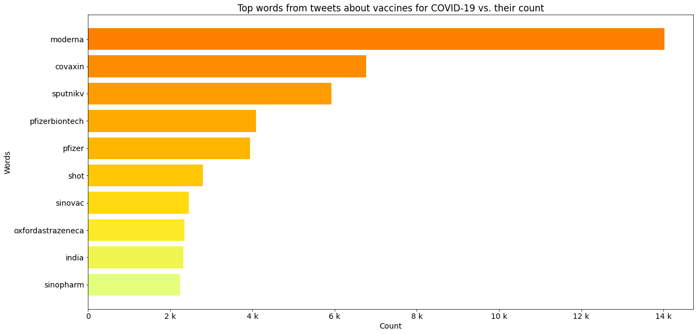
    


Performing most common words analysis on Reddit


```python
from collections import Counter
import re
import matplotlib.cm as cm
from matplotlib import rcParams
all_headlines = ' '.join(reddit_df['comment_body'].dropna().apply(cleanUpTweetsAndComments).str.lower())
filtered_words = [word for word in all_headlines.split() if word not in stopwords_reddit]
counted_words = collections.Counter(filtered_words)

top_words_reddit = []
counts = []
for letter, count in list(reversed(counted_words.most_common(10))):
    top_words_reddit.append(letter)
    counts.append(count)
colors = cm.Wistia(np.linspace(0, 1, 10))
rcParams['figure.figsize'] = 20, 10

plt.title('Top words about COVID-19 vaccination on Reddit vs. their count')
plt.gca().xaxis.set_major_formatter(formatter)
plt.xlabel('Count')
plt.ylabel('Words')
plt.barh(top_words_reddit, counts, color=colors)    
plt.invert_yaxis()
```


    ---------------------------------------------------------------------------

    AttributeError                            Traceback (most recent call last)

    <ipython-input-163-2d64a2dfc9ce> in <module>
         20 plt.ylabel('Words')
         21 plt.barh(top_words_reddit, counts, color=colors)
    ---> 22 plt.invert_yaxis()
    

    AttributeError: module 'matplotlib.pyplot' has no attribute 'invert_yaxis'


    
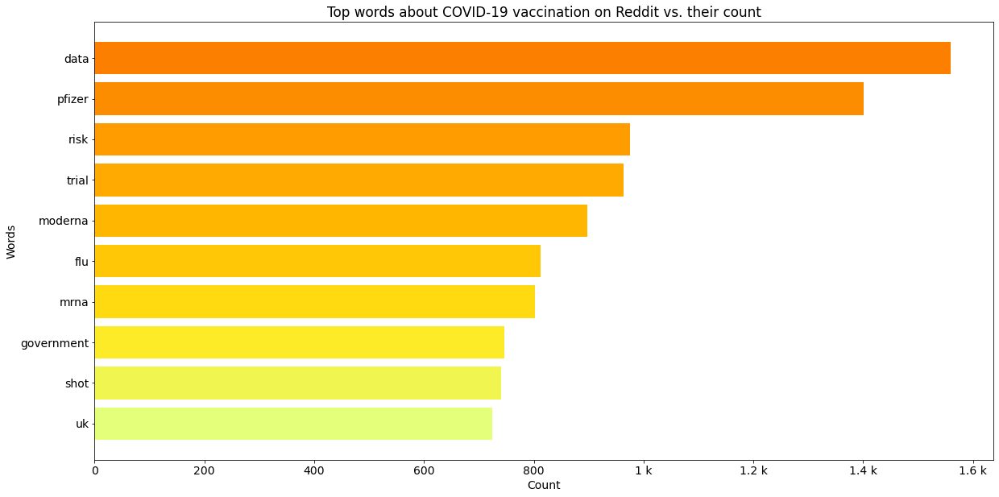
    


Top words evolution in Tweets


```python
colors=['darkorange', 'darkkhaki', 'darkcyan','grey', 'navy', 'yellow', 'black', 'rosybrown', 'hotpink', 'darkslategrey']
cont=0
for word in top_words_twitter:
    regex=r'(?<![^\W_])'+word+'(?![^\W_])'
    top_word_df=twitter_df[twitter_df['text'].dropna().str.contains(regex, case=False)]
    top_word_df = (pd.to_datetime(top_word_df['date'].dropna())
       .dt.floor('d')
       .value_counts()
       .rename_axis('date')
       .reset_index(name='count')) 
    top_word_df=top_word_df.sort_values(by='date')
    plt.plot(top_word_df['date'], top_word_df['count'], label=word, color=colors[cont])
    cont+=1
plt.legend() 

#Defining engineering notation for Y-Axis
formatter = EngFormatter()  
plt.xticks(rotation=45)
plt.gca().yaxis.set_major_formatter(formatter)
plt.xlabel('Date')
plt.ylabel('Number of tweets containing the word')    
plt.show()
```


    
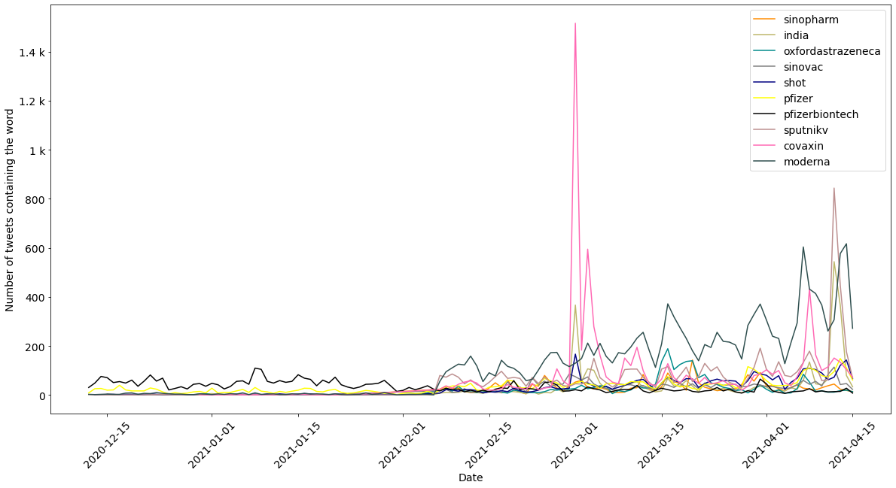
    


Top words evolution in Reddit posts


```python
colors=['darkorange', 'darkkhaki', 'darkcyan','grey', 'navy', 'yellow', 'black', 'rosybrown', 'hotpink', 'darkslategrey']
cont=0
for word in top_words_reddit:
    regex=r'(?<![^\W_])'+word+'(?![^\W_])'
    top_word_df=reddit_df[reddit_df['comment_body'].dropna().str.contains(regex, case=False)]
    top_word_df = (pd.to_datetime(top_word_df['post_date'].dropna())
       .dt.floor('d')
       .value_counts()
       .rename_axis('date')
       .reset_index(name='count')) 
    top_word_df=top_word_df.sort_values(by='date')
    plt.plot(top_word_df['date'], top_word_df['count'], label=word, color=colors[cont])
    cont+=1
plt.legend() 

#Defining engineering notation for Y-Axis
formatter = EngFormatter()  
plt.xticks(rotation=45)
plt.gca().yaxis.set_major_formatter(formatter)
plt.xlabel('Date')
plt.ylabel('Number of posts')    
plt.show()
```


    
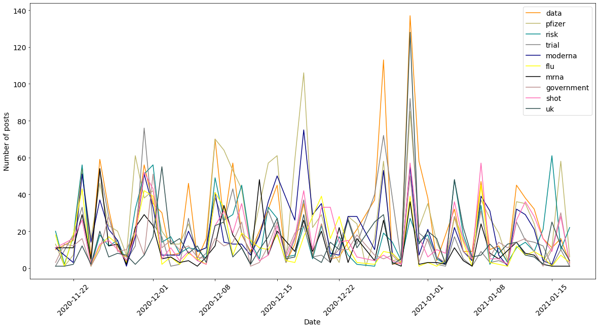
    


<h4>Sentiment Analysis</h4>

Reddit sentiment analysis about Pfizer/BionTech vaccine


```python
from textblob import TextBlob
reddit_sentimental_analysis_df=pd.DataFrame()
#creates a function that determines subjectivity and polarity from publications. Avaliable in https://towardsdatascience.com/sentiment-analysis-evaluating-the-publics-perception-of-the-covid19-vaccine-bef564591078
def getTextSubjectivity(txt):
    return TextBlob(txt).sentiment.subjectivity
def getTextPolarity(txt):
    return TextBlob(txt).sentiment.polarity #applies these functions to the dataframe
def getTextAnalysis(a):
    if a < 0:
        return "Negative"
    elif a == 0:
        return "Neutral"
    else:
        return "Positive" 
#creates another column called Score and applies the function to the dataframe
reddit_comments=reddit_df['comment_body'].dropna().apply(cleanUpTweetsAndComments)
reddit_sentimental_analysis_df['Subjectivity'] = reddit_comments.apply(getTextSubjectivity)
reddit_sentimental_analysis_df['Polarity'] = reddit_comments.apply(getTextPolarity) #builds a function to calculate and categorize each tweet as Negative, Neutral, and Positive
reddit_sentimental_analysis_df['Score'] = reddit_sentimental_analysis_df['Polarity'].apply(getTextAnalysis)


labels = reddit_sentimental_analysis_df.groupby('Score').count().index.values
values = reddit_sentimental_analysis_df.groupby('Score').size().values
plt.bar(labels, values, color = ['tab:olive', 'tab:orange', 'tab:purple'])
plt.title(label = "Vaccine Sentiment Analysis - Reddit", 
                  fontsize = '15')
#calculates percentage of positive, negative, and neutral tweets
positive = reddit_sentimental_analysis_df[reddit_sentimental_analysis_df['Score'] == 'Positive']
print(str(positive.shape[0]/(reddit_sentimental_analysis_df.shape[0])*100) + " % of positive posts")
positive = reddit_sentimental_analysis_df[reddit_sentimental_analysis_df['Score'] == 'Neutral']
print(str(positive.shape[0]/(reddit_sentimental_analysis_df.shape[0])*100) + " % of neutral posts")
positive = reddit_sentimental_analysis_df[reddit_sentimental_analysis_df['Score'] == 'Negative']
print(str(positive.shape[0]/(reddit_sentimental_analysis_df.shape[0])*100) + " % of negative posts")
```

    52.24344224574321 % of positive posts
    28.23573400828348 % of neutral posts
    19.52082374597331 % of negative posts


    
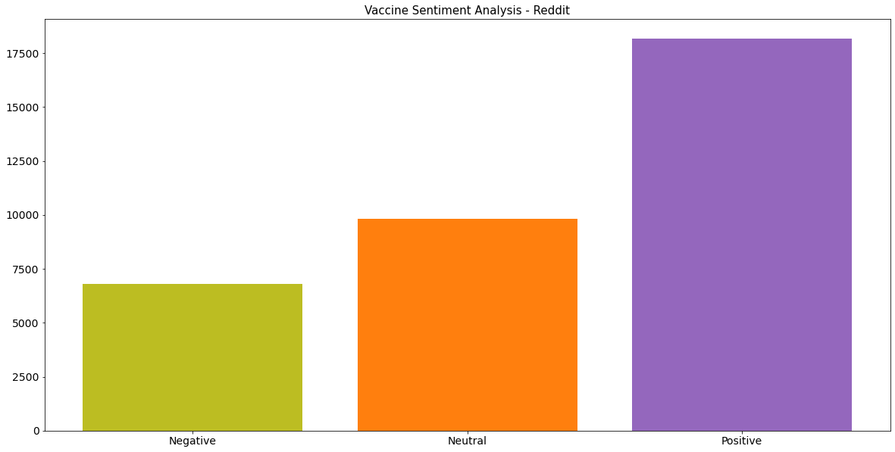
    


Twitter sentiment analysis about COVID-19 vaccine


```python
from textblob import TextBlob
twitter_sentimental_analysis_df=pd.DataFrame()
#creates a function that determines subjectivity and polarity from publications. Avaliable in https://towardsdatascience.com/sentiment-analysis-evaluating-the-publics-perception-of-the-covid19-vaccine-bef564591078
def getTextSubjectivity(txt):
    return TextBlob(txt).sentiment.subjectivity
def getTextPolarity(txt):
    return TextBlob(txt).sentiment.polarity #applies these functions to the dataframe
def getTextAnalysis(a):
    if a < 0:
        return "Negative"
    elif a == 0:
        return "Neutral"
    else:
        return "Positive" 
#creates another column called Score and applies the function to the dataframe
tweets=twitter_df['text'].dropna().apply(cleanUpTweetsAndComments)
twitter_sentimental_analysis_df['Subjectivity'] = tweets.apply(getTextSubjectivity)
twitter_sentimental_analysis_df['Polarity'] = tweets.apply(getTextPolarity) #builds a function to calculate and categorize each tweet as Negative, Neutral, and Positive
twitter_sentimental_analysis_df['Score'] = twitter_sentimental_analysis_df['Polarity'].apply(getTextAnalysis)


labels = twitter_sentimental_analysis_df.groupby('Score').count().index.values
values = twitter_sentimental_analysis_df.groupby('Score').size().values
plt.bar(labels, values, color = ['tab:olive', 'tab:orange', 'tab:purple'])
plt.title(label = "Vaccine Sentiment Analysis - Twitter", fontsize = '15')
#calculates percentage of positive, negative, and neutral tweets
positive = twitter_sentimental_analysis_df[twitter_sentimental_analysis_df['Score'] == 'Positive']
print(str(positive.shape[0]/(twitter_sentimental_analysis_df.shape[0])*100) + " % of positive tweets")
positive = twitter_sentimental_analysis_df[twitter_sentimental_analysis_df['Score'] == 'Neutral']
print(str(positive.shape[0]/(twitter_sentimental_analysis_df.shape[0])*100) + " % of neutral tweets")
positive = twitter_sentimental_analysis_df[twitter_sentimental_analysis_df['Score'] == 'Negative']
print(str(positive.shape[0]/(twitter_sentimental_analysis_df.shape[0])*100) + " % of negative tweets")
```

    41.10243271479031 % of positive tweets
    46.168515662570684 % of neutral tweets
    12.729051622639007 % of negative tweets


    
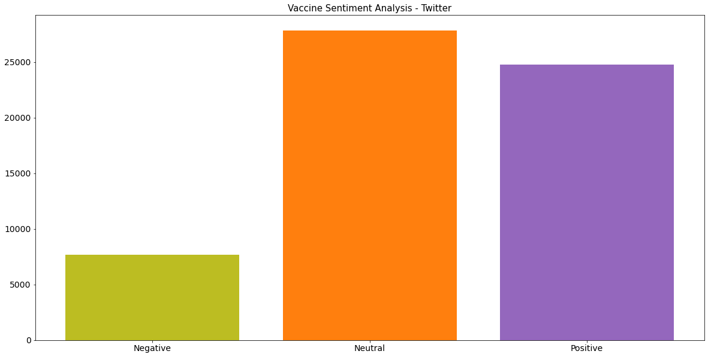
    


Pfizer/BioNTech Vaccine Sentiment Analysis - Twitter


```python
from textblob import TextBlob
twitter_sentimental_analysis_df=pd.DataFrame()
#creates a function that determines subjectivity and polarity from publications. Avaliable in https://towardsdatascience.com/sentiment-analysis-evaluating-the-publics-perception-of-the-covid19-vaccine-bef564591078
def getTextSubjectivity(txt):
    return TextBlob(txt).sentiment.subjectivity
def getTextPolarity(txt):
    return TextBlob(txt).sentiment.polarity #applies these functions to the dataframe
def getTextAnalysis(a):
    if a < 0:
        return "Negative"
    elif a == 0:
        return "Neutral"
    else:
        return "Positive" 
#creates another column called Score and applies the function to the dataframe
tweets=twitter_pfizer_df['text'].dropna().apply(cleanUpTweetsAndComments)
twitter_sentimental_analysis_df['Subjectivity'] = tweets.apply(getTextSubjectivity)
twitter_sentimental_analysis_df['Polarity'] = tweets.apply(getTextPolarity) #builds a function to calculate and categorize each tweet as Negative, Neutral, and Positive
twitter_sentimental_analysis_df['Score'] = twitter_sentimental_analysis_df['Polarity'].apply(getTextAnalysis)


labels = twitter_sentimental_analysis_df.groupby('Score').count().index.values
values = twitter_sentimental_analysis_df.groupby('Score').size().values
plt.bar(labels, values, color = ['tab:olive', 'tab:orange', 'tab:purple'])
plt.title(label = "Pfizer/BioNTech Vaccine Sentiment Analysis - Twitter", fontsize = '15')
#calculates percentage of positive, negative, and neutral tweets
positive = twitter_sentimental_analysis_df[twitter_sentimental_analysis_df['Score'] == 'Positive']
print(str(positive.shape[0]/(twitter_sentimental_analysis_df.shape[0])*100) + " % of positive tweets")
positive = twitter_sentimental_analysis_df[twitter_sentimental_analysis_df['Score'] == 'Neutral']
print(str(positive.shape[0]/(twitter_sentimental_analysis_df.shape[0])*100) + " % of neutral tweets")
positive = twitter_sentimental_analysis_df[twitter_sentimental_analysis_df['Score'] == 'Negative']
print(str(positive.shape[0]/(twitter_sentimental_analysis_df.shape[0])*100) + " % of negative tweets")
```

    44.63574457150199 % of positive tweets
    45.11113966336888 % of neutral tweets
    10.253115765129127 % of negative tweets


    
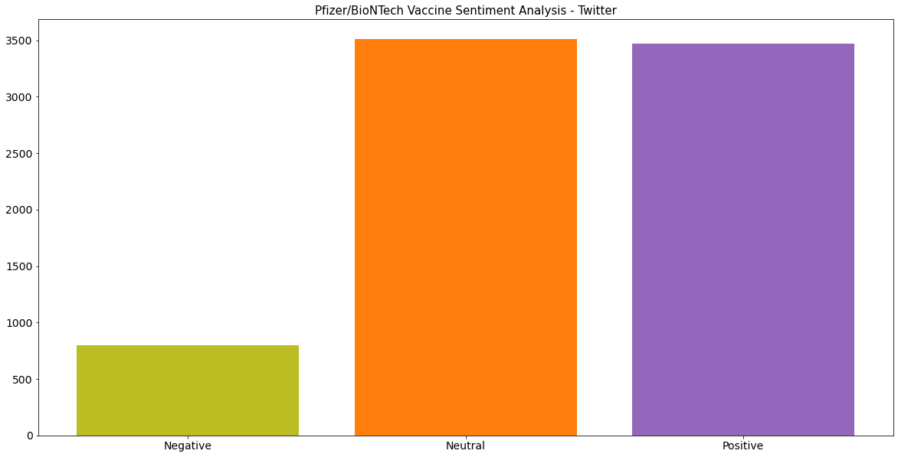
    


Pfizer/BioNTech Vaccine Sentiment Analysis - Posts on Reddit


```python
from textblob import TextBlob
reddit_sentimental_analysis_df=pd.DataFrame()
#creates a function that determines subjectivity and polarity from publications. Avaliable in https://towardsdatascience.com/sentiment-analysis-evaluating-the-publics-perception-of-the-covid19-vaccine-bef564591078
def getTextSubjectivity(txt):
    return TextBlob(txt).sentiment.subjectivity
def getTextPolarity(txt):
    return TextBlob(txt).sentiment.polarity #applies these functions to the dataframe
def getTextAnalysis(a):
    if a < 0:
        return "Negative"
    elif a == 0:
        return "Neutral"
    else:
        return "Positive" 
#creates another column called Score and applies the function to the dataframe
reddit_comments=reddit_pfizer_df['body'].dropna().apply(cleanUpTweetsAndComments)
reddit_sentimental_analysis_df['Subjectivity'] = reddit_comments.apply(getTextSubjectivity)
reddit_sentimental_analysis_df['Polarity'] = reddit_comments.apply(getTextPolarity) #builds a function to calculate and categorize each tweet as Negative, Neutral, and Positive
reddit_sentimental_analysis_df['Score'] = reddit_sentimental_analysis_df['Polarity'].apply(getTextAnalysis)


labels = reddit_sentimental_analysis_df.groupby('Score').count().index.values
values = reddit_sentimental_analysis_df.groupby('Score').size().values
plt.bar(labels, values, color = ['tab:olive', 'tab:orange', 'tab:purple'])
plt.title(label = "Pfizer/BioNTech Vaccine Sentiment Analysis - Posts on Reddit", 
                  fontsize = '15')
#calculates percentage of positive, negative, and neutral tweets
positive = reddit_sentimental_analysis_df[reddit_sentimental_analysis_df['Score'] == 'Positive']
print(str(positive.shape[0]/(reddit_sentimental_analysis_df.shape[0])*100) + " % of positive posts")
positive = reddit_sentimental_analysis_df[reddit_sentimental_analysis_df['Score'] == 'Neutral']
print(str(positive.shape[0]/(reddit_sentimental_analysis_df.shape[0])*100) + " % of neutral posts")
positive = reddit_sentimental_analysis_df[reddit_sentimental_analysis_df['Score'] == 'Negative']
print(str(positive.shape[0]/(reddit_sentimental_analysis_df.shape[0])*100) + " % of negative posts")
```

    57.669172932330824 % of positive posts
    17.518796992481203 % of neutral posts
    24.81203007518797 % of negative posts


    
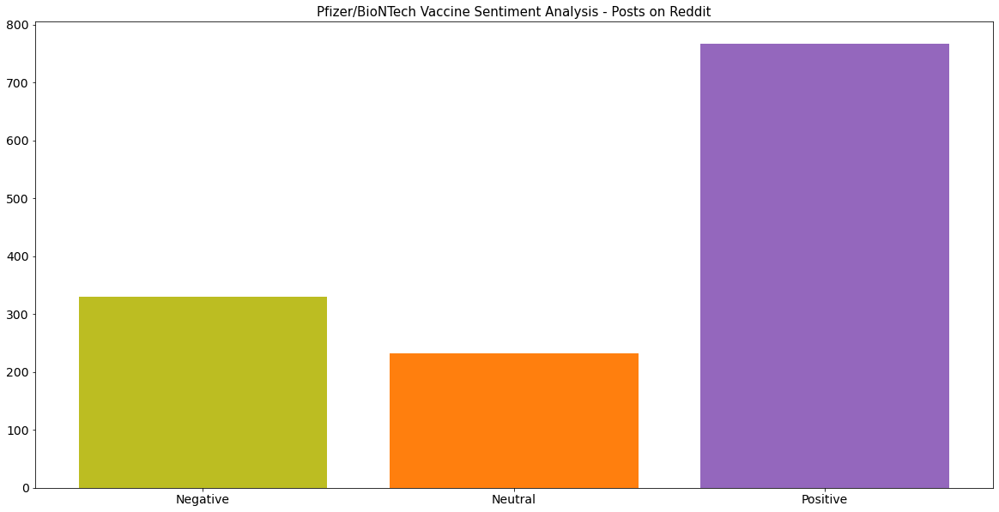
    


<h3>Interactive Plots</h3>


```python
import plotly.express as px
#Avaliable in https://www.kaggle.com/gpreda/all-covid19-vaccines-tweets
twitter_df=pd.read_csv('datasets/vaccination_all_tweets.csv', low_memory=False)
twitter_df['date']=twitter_df['date'].dropna().apply(adjustDateFormat)
twitter_data=pd.to_datetime(twitter_df['date'], format='%Y-%m-%d %H:%M:%S.%f', errors='coerce')
df = (pd.to_datetime(twitter_data.dropna())
       .dt.floor('d')
       .value_counts()
       .rename_axis('date')
       .reset_index(name='count'))
df=df.sort_values(by='date')
fig = px.line(df,x="date", y="count", hover_name="date",
             labels={
                     "date": "Date",
                     "count": "Number of interactions"
                 })

fig.update_xaxes(tickangle=45)
formatter = EngFormatter()
fig.update_layout(yaxis_tickformat = 's')
fig.update_layout(
    xaxis_tickformat = '%d %B<br>%Y'
)
fig.show()
```


<div>                            <div id="93c74f00-ac6b-42c6-925a-b78c5f2d2e12" class="plotly-graph-div" style="height:525px; width:100%;"></div>            <script type="text/javascript">                require(["plotly"], function(Plotly) {                    window.PLOTLYENV=window.PLOTLYENV || {};                                    if (document.getElementById("93c74f00-ac6b-42c6-925a-b78c5f2d2e12")) {                    Plotly.newPlot(                        "93c74f00-ac6b-42c6-925a-b78c5f2d2e12",                        [{"hovertemplate": "<b>%{hovertext}</b><br><br>Date=%{x}<br>Number of interactions=%{y}<extra></extra>", "hovertext": ["2020-12-12T00:00:00", "2020-12-13T00:00:00", "2020-12-14T00:00:00", "2020-12-15T00:00:00", "2020-12-16T00:00:00", "2020-12-17T00:00:00", "2020-12-18T00:00:00", "2020-12-19T00:00:00", "2020-12-20T00:00:00", "2020-12-21T00:00:00", "2020-12-22T00:00:00", "2020-12-23T00:00:00", "2020-12-24T00:00:00", "2020-12-25T00:00:00", "2020-12-26T00:00:00", "2020-12-27T00:00:00", "2020-12-28T00:00:00", "2020-12-29T00:00:00", "2020-12-30T00:00:00", "2020-12-31T00:00:00", "2021-01-01T00:00:00", "2021-01-02T00:00:00", "2021-01-03T00:00:00", "2021-01-04T00:00:00", "2021-01-05T00:00:00", "2021-01-06T00:00:00", "2021-01-07T00:00:00", "2021-01-08T00:00:00", "2021-01-09T00:00:00", "2021-01-10T00:00:00", "2021-01-11T00:00:00", "2021-01-12T00:00:00", "2021-01-13T00:00:00", "2021-01-14T00:00:00", "2021-01-15T00:00:00", "2021-01-16T00:00:00", "2021-01-17T00:00:00", "2021-01-18T00:00:00", "2021-01-19T00:00:00", "2021-01-20T00:00:00", "2021-01-21T00:00:00", "2021-01-22T00:00:00", "2021-01-23T00:00:00", "2021-01-24T00:00:00", "2021-01-25T00:00:00", "2021-01-26T00:00:00", "2021-01-27T00:00:00", "2021-01-28T00:00:00", "2021-01-29T00:00:00", "2021-01-30T00:00:00", "2021-01-31T00:00:00", "2021-02-01T00:00:00", "2021-02-02T00:00:00", "2021-02-03T00:00:00", "2021-02-04T00:00:00", "2021-02-05T00:00:00", "2021-02-06T00:00:00", "2021-02-07T00:00:00", "2021-02-08T00:00:00", "2021-02-09T00:00:00", "2021-02-10T00:00:00", "2021-02-11T00:00:00", "2021-02-12T00:00:00", "2021-02-13T00:00:00", "2021-02-14T00:00:00", "2021-02-15T00:00:00", "2021-02-16T00:00:00", "2021-02-17T00:00:00", "2021-02-18T00:00:00", "2021-02-19T00:00:00", "2021-02-20T00:00:00", "2021-02-21T00:00:00", "2021-02-22T00:00:00", "2021-02-23T00:00:00", "2021-02-24T00:00:00", "2021-02-25T00:00:00", "2021-02-26T00:00:00", "2021-02-27T00:00:00", "2021-02-28T00:00:00", "2021-03-01T00:00:00", "2021-03-02T00:00:00", "2021-03-03T00:00:00", "2021-03-04T00:00:00", "2021-03-05T00:00:00", "2021-03-06T00:00:00", "2021-03-07T00:00:00", "2021-03-08T00:00:00", "2021-03-09T00:00:00", "2021-03-10T00:00:00", "2021-03-11T00:00:00", "2021-03-12T00:00:00", "2021-03-13T00:00:00", "2021-03-14T00:00:00", "2021-03-15T00:00:00", "2021-03-16T00:00:00", "2021-03-17T00:00:00", "2021-03-18T00:00:00", "2021-03-19T00:00:00", "2021-03-20T00:00:00", "2021-03-21T00:00:00", "2021-03-22T00:00:00", "2021-03-23T00:00:00", "2021-03-24T00:00:00", "2021-03-25T00:00:00", "2021-03-26T00:00:00", "2021-03-27T00:00:00", "2021-03-28T00:00:00", "2021-03-29T00:00:00", "2021-03-30T00:00:00", "2021-03-31T00:00:00", "2021-04-01T00:00:00", "2021-04-02T00:00:00", "2021-04-03T00:00:00", "2021-04-04T00:00:00", "2021-04-05T00:00:00", "2021-04-06T00:00:00", "2021-04-07T00:00:00", "2021-04-08T00:00:00", "2021-04-09T00:00:00", "2021-04-10T00:00:00", "2021-04-11T00:00:00", "2021-04-12T00:00:00", "2021-04-13T00:00:00", "2021-04-14T00:00:00", "2021-04-15T00:00:00"], "legendgroup": "", "line": {"color": "#636efa", "dash": "solid"}, "mode": "lines", "name": "", "orientation": "v", "showlegend": false, "type": "scatter", "x": ["2020-12-12T00:00:00", "2020-12-13T00:00:00", "2020-12-14T00:00:00", "2020-12-15T00:00:00", "2020-12-16T00:00:00", "2020-12-17T00:00:00", "2020-12-18T00:00:00", "2020-12-19T00:00:00", "2020-12-20T00:00:00", "2020-12-21T00:00:00", "2020-12-22T00:00:00", "2020-12-23T00:00:00", "2020-12-24T00:00:00", "2020-12-25T00:00:00", "2020-12-26T00:00:00", "2020-12-27T00:00:00", "2020-12-28T00:00:00", "2020-12-29T00:00:00", "2020-12-30T00:00:00", "2020-12-31T00:00:00", "2021-01-01T00:00:00", "2021-01-02T00:00:00", "2021-01-03T00:00:00", "2021-01-04T00:00:00", "2021-01-05T00:00:00", "2021-01-06T00:00:00", "2021-01-07T00:00:00", "2021-01-08T00:00:00", "2021-01-09T00:00:00", "2021-01-10T00:00:00", "2021-01-11T00:00:00", "2021-01-12T00:00:00", "2021-01-13T00:00:00", "2021-01-14T00:00:00", "2021-01-15T00:00:00", "2021-01-16T00:00:00", "2021-01-17T00:00:00", "2021-01-18T00:00:00", "2021-01-19T00:00:00", "2021-01-20T00:00:00", "2021-01-21T00:00:00", "2021-01-22T00:00:00", "2021-01-23T00:00:00", "2021-01-24T00:00:00", "2021-01-25T00:00:00", "2021-01-26T00:00:00", "2021-01-27T00:00:00", "2021-01-28T00:00:00", "2021-01-29T00:00:00", "2021-01-30T00:00:00", "2021-01-31T00:00:00", "2021-02-01T00:00:00", "2021-02-02T00:00:00", "2021-02-03T00:00:00", "2021-02-04T00:00:00", "2021-02-05T00:00:00", "2021-02-06T00:00:00", "2021-02-07T00:00:00", "2021-02-08T00:00:00", "2021-02-09T00:00:00", "2021-02-10T00:00:00", "2021-02-11T00:00:00", "2021-02-12T00:00:00", "2021-02-13T00:00:00", "2021-02-14T00:00:00", "2021-02-15T00:00:00", "2021-02-16T00:00:00", "2021-02-17T00:00:00", "2021-02-18T00:00:00", "2021-02-19T00:00:00", "2021-02-20T00:00:00", "2021-02-21T00:00:00", "2021-02-22T00:00:00", "2021-02-23T00:00:00", "2021-02-24T00:00:00", "2021-02-25T00:00:00", "2021-02-26T00:00:00", "2021-02-27T00:00:00", "2021-02-28T00:00:00", "2021-03-01T00:00:00", "2021-03-02T00:00:00", "2021-03-03T00:00:00", "2021-03-04T00:00:00", "2021-03-05T00:00:00", "2021-03-06T00:00:00", "2021-03-07T00:00:00", "2021-03-08T00:00:00", "2021-03-09T00:00:00", "2021-03-10T00:00:00", "2021-03-11T00:00:00", "2021-03-12T00:00:00", "2021-03-13T00:00:00", "2021-03-14T00:00:00", "2021-03-15T00:00:00", "2021-03-16T00:00:00", "2021-03-17T00:00:00", "2021-03-18T00:00:00", "2021-03-19T00:00:00", "2021-03-20T00:00:00", "2021-03-21T00:00:00", "2021-03-22T00:00:00", "2021-03-23T00:00:00", "2021-03-24T00:00:00", "2021-03-25T00:00:00", "2021-03-26T00:00:00", "2021-03-27T00:00:00", "2021-03-28T00:00:00", "2021-03-29T00:00:00", "2021-03-30T00:00:00", "2021-03-31T00:00:00", "2021-04-01T00:00:00", "2021-04-02T00:00:00", "2021-04-03T00:00:00", "2021-04-04T00:00:00", "2021-04-05T00:00:00", "2021-04-06T00:00:00", "2021-04-07T00:00:00", "2021-04-08T00:00:00", "2021-04-09T00:00:00", "2021-04-10T00:00:00", "2021-04-11T00:00:00", "2021-04-12T00:00:00", "2021-04-13T00:00:00", "2021-04-14T00:00:00", "2021-04-15T00:00:00"], "xaxis": "x", "y": [63, 98, 137, 150, 144, 139, 112, 110, 68, 102, 157, 123, 114, 40, 47, 59, 53, 85, 107, 72, 95, 83, 56, 72, 111, 112, 76, 210, 170, 118, 93, 106, 111, 106, 148, 129, 99, 66, 100, 104, 145, 65, 65, 53, 77, 91, 89, 80, 96, 73, 30, 31, 53, 37, 69, 70, 39, 339, 511, 459, 504, 448, 497, 391, 259, 343, 421, 499, 562, 517, 393, 269, 480, 406, 658, 622, 677, 462, 508, 2911, 859, 1349, 1015, 817, 557, 387, 546, 708, 760, 911, 853, 538, 447, 958, 1415, 981, 969, 972, 995, 620, 919, 803, 874, 723, 629, 556, 448, 773, 1014, 1259, 948, 710, 809, 481, 604, 846, 1597, 1981, 1233, 985, 881, 2043, 1905, 1452, 729], "yaxis": "y"}],                        {"legend": {"tracegroupgap": 0}, "margin": {"t": 60}, "template": {"data": {"bar": [{"error_x": {"color": "#2a3f5f"}, "error_y": {"color": "#2a3f5f"}, "marker": {"line": {"color": "#E5ECF6", "width": 0.5}}, "type": "bar"}], "barpolar": [{"marker": {"line": {"color": "#E5ECF6", "width": 0.5}}, "type": "barpolar"}], "carpet": [{"aaxis": {"endlinecolor": "#2a3f5f", "gridcolor": "white", "linecolor": "white", "minorgridcolor": "white", "startlinecolor": "#2a3f5f"}, "baxis": {"endlinecolor": "#2a3f5f", "gridcolor": "white", "linecolor": "white", "minorgridcolor": "white", "startlinecolor": "#2a3f5f"}, "type": "carpet"}], "choropleth": [{"colorbar": {"outlinewidth": 0, "ticks": ""}, "type": "choropleth"}], "contour": [{"colorbar": {"outlinewidth": 0, "ticks": ""}, "colorscale": [[0.0, "#0d0887"], [0.1111111111111111, "#46039f"], [0.2222222222222222, "#7201a8"], [0.3333333333333333, "#9c179e"], [0.4444444444444444, "#bd3786"], [0.5555555555555556, "#d8576b"], [0.6666666666666666, "#ed7953"], [0.7777777777777778, "#fb9f3a"], [0.8888888888888888, "#fdca26"], [1.0, "#f0f921"]], "type": "contour"}], "contourcarpet": [{"colorbar": {"outlinewidth": 0, "ticks": ""}, "type": "contourcarpet"}], "heatmap": [{"colorbar": {"outlinewidth": 0, "ticks": ""}, "colorscale": [[0.0, "#0d0887"], [0.1111111111111111, "#46039f"], [0.2222222222222222, "#7201a8"], [0.3333333333333333, "#9c179e"], [0.4444444444444444, "#bd3786"], [0.5555555555555556, "#d8576b"], [0.6666666666666666, "#ed7953"], [0.7777777777777778, "#fb9f3a"], [0.8888888888888888, "#fdca26"], [1.0, "#f0f921"]], "type": "heatmap"}], "heatmapgl": [{"colorbar": {"outlinewidth": 0, "ticks": ""}, "colorscale": [[0.0, "#0d0887"], [0.1111111111111111, "#46039f"], [0.2222222222222222, "#7201a8"], [0.3333333333333333, "#9c179e"], [0.4444444444444444, "#bd3786"], [0.5555555555555556, "#d8576b"], [0.6666666666666666, "#ed7953"], [0.7777777777777778, "#fb9f3a"], [0.8888888888888888, "#fdca26"], [1.0, "#f0f921"]], "type": "heatmapgl"}], "histogram": [{"marker": {"colorbar": {"outlinewidth": 0, "ticks": ""}}, "type": "histogram"}], "histogram2d": [{"colorbar": {"outlinewidth": 0, "ticks": ""}, "colorscale": [[0.0, "#0d0887"], [0.1111111111111111, "#46039f"], [0.2222222222222222, "#7201a8"], [0.3333333333333333, "#9c179e"], [0.4444444444444444, "#bd3786"], [0.5555555555555556, "#d8576b"], [0.6666666666666666, "#ed7953"], [0.7777777777777778, "#fb9f3a"], [0.8888888888888888, "#fdca26"], [1.0, "#f0f921"]], "type": "histogram2d"}], "histogram2dcontour": [{"colorbar": {"outlinewidth": 0, "ticks": ""}, "colorscale": [[0.0, "#0d0887"], [0.1111111111111111, "#46039f"], [0.2222222222222222, "#7201a8"], [0.3333333333333333, "#9c179e"], [0.4444444444444444, "#bd3786"], [0.5555555555555556, "#d8576b"], [0.6666666666666666, "#ed7953"], [0.7777777777777778, "#fb9f3a"], [0.8888888888888888, "#fdca26"], [1.0, "#f0f921"]], "type": "histogram2dcontour"}], "mesh3d": [{"colorbar": {"outlinewidth": 0, "ticks": ""}, "type": "mesh3d"}], "parcoords": [{"line": {"colorbar": {"outlinewidth": 0, "ticks": ""}}, "type": "parcoords"}], "pie": [{"automargin": true, "type": "pie"}], "scatter": [{"marker": {"colorbar": {"outlinewidth": 0, "ticks": ""}}, "type": "scatter"}], "scatter3d": [{"line": {"colorbar": {"outlinewidth": 0, "ticks": ""}}, "marker": {"colorbar": {"outlinewidth": 0, "ticks": ""}}, "type": "scatter3d"}], "scattercarpet": [{"marker": {"colorbar": {"outlinewidth": 0, "ticks": ""}}, "type": "scattercarpet"}], "scattergeo": [{"marker": {"colorbar": {"outlinewidth": 0, "ticks": ""}}, "type": "scattergeo"}], "scattergl": [{"marker": {"colorbar": {"outlinewidth": 0, "ticks": ""}}, "type": "scattergl"}], "scattermapbox": [{"marker": {"colorbar": {"outlinewidth": 0, "ticks": ""}}, "type": "scattermapbox"}], "scatterpolar": [{"marker": {"colorbar": {"outlinewidth": 0, "ticks": ""}}, "type": "scatterpolar"}], "scatterpolargl": [{"marker": {"colorbar": {"outlinewidth": 0, "ticks": ""}}, "type": "scatterpolargl"}], "scatterternary": [{"marker": {"colorbar": {"outlinewidth": 0, "ticks": ""}}, "type": "scatterternary"}], "surface": [{"colorbar": {"outlinewidth": 0, "ticks": ""}, "colorscale": [[0.0, "#0d0887"], [0.1111111111111111, "#46039f"], [0.2222222222222222, "#7201a8"], [0.3333333333333333, "#9c179e"], [0.4444444444444444, "#bd3786"], [0.5555555555555556, "#d8576b"], [0.6666666666666666, "#ed7953"], [0.7777777777777778, "#fb9f3a"], [0.8888888888888888, "#fdca26"], [1.0, "#f0f921"]], "type": "surface"}], "table": [{"cells": {"fill": {"color": "#EBF0F8"}, "line": {"color": "white"}}, "header": {"fill": {"color": "#C8D4E3"}, "line": {"color": "white"}}, "type": "table"}]}, "layout": {"annotationdefaults": {"arrowcolor": "#2a3f5f", "arrowhead": 0, "arrowwidth": 1}, "autotypenumbers": "strict", "coloraxis": {"colorbar": {"outlinewidth": 0, "ticks": ""}}, "colorscale": {"diverging": [[0, "#8e0152"], [0.1, "#c51b7d"], [0.2, "#de77ae"], [0.3, "#f1b6da"], [0.4, "#fde0ef"], [0.5, "#f7f7f7"], [0.6, "#e6f5d0"], [0.7, "#b8e186"], [0.8, "#7fbc41"], [0.9, "#4d9221"], [1, "#276419"]], "sequential": [[0.0, "#0d0887"], [0.1111111111111111, "#46039f"], [0.2222222222222222, "#7201a8"], [0.3333333333333333, "#9c179e"], [0.4444444444444444, "#bd3786"], [0.5555555555555556, "#d8576b"], [0.6666666666666666, "#ed7953"], [0.7777777777777778, "#fb9f3a"], [0.8888888888888888, "#fdca26"], [1.0, "#f0f921"]], "sequentialminus": [[0.0, "#0d0887"], [0.1111111111111111, "#46039f"], [0.2222222222222222, "#7201a8"], [0.3333333333333333, "#9c179e"], [0.4444444444444444, "#bd3786"], [0.5555555555555556, "#d8576b"], [0.6666666666666666, "#ed7953"], [0.7777777777777778, "#fb9f3a"], [0.8888888888888888, "#fdca26"], [1.0, "#f0f921"]]}, "colorway": ["#636efa", "#EF553B", "#00cc96", "#ab63fa", "#FFA15A", "#19d3f3", "#FF6692", "#B6E880", "#FF97FF", "#FECB52"], "font": {"color": "#2a3f5f"}, "geo": {"bgcolor": "white", "lakecolor": "white", "landcolor": "#E5ECF6", "showlakes": true, "showland": true, "subunitcolor": "white"}, "hoverlabel": {"align": "left"}, "hovermode": "closest", "mapbox": {"style": "light"}, "paper_bgcolor": "white", "plot_bgcolor": "#E5ECF6", "polar": {"angularaxis": {"gridcolor": "white", "linecolor": "white", "ticks": ""}, "bgcolor": "#E5ECF6", "radialaxis": {"gridcolor": "white", "linecolor": "white", "ticks": ""}}, "scene": {"xaxis": {"backgroundcolor": "#E5ECF6", "gridcolor": "white", "gridwidth": 2, "linecolor": "white", "showbackground": true, "ticks": "", "zerolinecolor": "white"}, "yaxis": {"backgroundcolor": "#E5ECF6", "gridcolor": "white", "gridwidth": 2, "linecolor": "white", "showbackground": true, "ticks": "", "zerolinecolor": "white"}, "zaxis": {"backgroundcolor": "#E5ECF6", "gridcolor": "white", "gridwidth": 2, "linecolor": "white", "showbackground": true, "ticks": "", "zerolinecolor": "white"}}, "shapedefaults": {"line": {"color": "#2a3f5f"}}, "ternary": {"aaxis": {"gridcolor": "white", "linecolor": "white", "ticks": ""}, "baxis": {"gridcolor": "white", "linecolor": "white", "ticks": ""}, "bgcolor": "#E5ECF6", "caxis": {"gridcolor": "white", "linecolor": "white", "ticks": ""}}, "title": {"x": 0.05}, "xaxis": {"automargin": true, "gridcolor": "white", "linecolor": "white", "ticks": "", "title": {"standoff": 15}, "zerolinecolor": "white", "zerolinewidth": 2}, "yaxis": {"automargin": true, "gridcolor": "white", "linecolor": "white", "ticks": "", "title": {"standoff": 15}, "zerolinecolor": "white", "zerolinewidth": 2}}}, "xaxis": {"anchor": "y", "domain": [0.0, 1.0], "tickangle": 45, "tickformat": "%d %B<br>%Y", "title": {"text": "Date"}}, "yaxis": {"anchor": "x", "domain": [0.0, 1.0], "tickformat": "s", "title": {"text": "Number of interactions"}}},                        {"responsive": true}                    ).then(function(){

var gd = document.getElementById('93c74f00-ac6b-42c6-925a-b78c5f2d2e12');
var x = new MutationObserver(function (mutations, observer) {{
        var display = window.getComputedStyle(gd).display;
        if (!display || display === 'none') {{
            console.log([gd, 'removed!']);
            Plotly.purge(gd);
            observer.disconnect();
        }}
}});

// Listen for the removal of the full notebook cells
var notebookContainer = gd.closest('#notebook-container');
if (notebookContainer) {{
    x.observe(notebookContainer, {childList: true});
}}

// Listen for the clearing of the current output cell
var outputEl = gd.closest('.output');
if (outputEl) {{
    x.observe(outputEl, {childList: true});
}}

                        })                };                });            </script>        </div>


Evolution of discussions about COVID-19 vaccination on Reddit


```python
reddit_df['post_date']=reddit_df['post_date'].dropna().apply(adjustDateFormat)
reddit_data=pd.to_datetime(reddit_df['post_date'], format='%Y-%m-%d %H:%M:%S.%f', errors='coerce')
df = (pd.to_datetime(reddit_data.dropna())
       .dt.floor('d')
       .value_counts()
       .rename_axis('date')
       .reset_index(name='count'))

df=df.sort_values(by='date')
fig = px.line(df,x="date", y="count", hover_name="date",
             labels={
                     "date": "Date",
                     "count": "Number of interactions"
                 })

fig.update_xaxes(tickangle=45)
formatter = EngFormatter()
fig.update_layout(yaxis_tickformat = 's')
fig.update_layout(
    xaxis_tickformat = '%d %B<br>%Y'
)
fig.show()
```


<div>                            <div id="aac23efe-6bee-4a27-825c-034721a3f5ac" class="plotly-graph-div" style="height:525px; width:100%;"></div>            <script type="text/javascript">                require(["plotly"], function(Plotly) {                    window.PLOTLYENV=window.PLOTLYENV || {};                                    if (document.getElementById("aac23efe-6bee-4a27-825c-034721a3f5ac")) {                    Plotly.newPlot(                        "aac23efe-6bee-4a27-825c-034721a3f5ac",                        [{"hovertemplate": "<b>%{hovertext}</b><br><br>Date=%{x}<br>Number of interactions=%{y}<extra></extra>", "hovertext": ["2020-11-20T00:00:00", "2020-11-21T00:00:00", "2020-11-22T00:00:00", "2020-11-23T00:00:00", "2020-11-24T00:00:00", "2020-11-25T00:00:00", "2020-11-26T00:00:00", "2020-11-27T00:00:00", "2020-11-28T00:00:00", "2020-11-29T00:00:00", "2020-11-30T00:00:00", "2020-12-01T00:00:00", "2020-12-02T00:00:00", "2020-12-03T00:00:00", "2020-12-04T00:00:00", "2020-12-05T00:00:00", "2020-12-06T00:00:00", "2020-12-07T00:00:00", "2020-12-08T00:00:00", "2020-12-09T00:00:00", "2020-12-10T00:00:00", "2020-12-11T00:00:00", "2020-12-12T00:00:00", "2020-12-13T00:00:00", "2020-12-14T00:00:00", "2020-12-15T00:00:00", "2020-12-16T00:00:00", "2020-12-17T00:00:00", "2020-12-18T00:00:00", "2020-12-19T00:00:00", "2020-12-20T00:00:00", "2020-12-21T00:00:00", "2020-12-22T00:00:00", "2020-12-23T00:00:00", "2020-12-24T00:00:00", "2020-12-25T00:00:00", "2020-12-26T00:00:00", "2020-12-27T00:00:00", "2020-12-28T00:00:00", "2020-12-29T00:00:00", "2020-12-30T00:00:00", "2020-12-31T00:00:00", "2021-01-01T00:00:00", "2021-01-02T00:00:00", "2021-01-03T00:00:00", "2021-01-04T00:00:00", "2021-01-05T00:00:00", "2021-01-06T00:00:00", "2021-01-07T00:00:00", "2021-01-08T00:00:00", "2021-01-09T00:00:00", "2021-01-10T00:00:00", "2021-01-11T00:00:00", "2021-01-12T00:00:00", "2021-01-13T00:00:00", "2021-01-14T00:00:00", "2021-01-15T00:00:00", "2021-01-16T00:00:00", "2021-01-17T00:00:00"], "legendgroup": "", "line": {"color": "#636efa", "dash": "solid"}, "mode": "lines", "name": "", "orientation": "v", "showlegend": false, "type": "scatter", "x": ["2020-11-20T00:00:00", "2020-11-21T00:00:00", "2020-11-22T00:00:00", "2020-11-23T00:00:00", "2020-11-24T00:00:00", "2020-11-25T00:00:00", "2020-11-26T00:00:00", "2020-11-27T00:00:00", "2020-11-28T00:00:00", "2020-11-29T00:00:00", "2020-11-30T00:00:00", "2020-12-01T00:00:00", "2020-12-02T00:00:00", "2020-12-03T00:00:00", "2020-12-04T00:00:00", "2020-12-05T00:00:00", "2020-12-06T00:00:00", "2020-12-07T00:00:00", "2020-12-08T00:00:00", "2020-12-09T00:00:00", "2020-12-10T00:00:00", "2020-12-11T00:00:00", "2020-12-12T00:00:00", "2020-12-13T00:00:00", "2020-12-14T00:00:00", "2020-12-15T00:00:00", "2020-12-16T00:00:00", "2020-12-17T00:00:00", "2020-12-18T00:00:00", "2020-12-19T00:00:00", "2020-12-20T00:00:00", "2020-12-21T00:00:00", "2020-12-22T00:00:00", "2020-12-23T00:00:00", "2020-12-24T00:00:00", "2020-12-25T00:00:00", "2020-12-26T00:00:00", "2020-12-27T00:00:00", "2020-12-28T00:00:00", "2020-12-29T00:00:00", "2020-12-30T00:00:00", "2020-12-31T00:00:00", "2021-01-01T00:00:00", "2021-01-02T00:00:00", "2021-01-03T00:00:00", "2021-01-04T00:00:00", "2021-01-05T00:00:00", "2021-01-06T00:00:00", "2021-01-07T00:00:00", "2021-01-08T00:00:00", "2021-01-09T00:00:00", "2021-01-10T00:00:00", "2021-01-11T00:00:00", "2021-01-12T00:00:00", "2021-01-13T00:00:00", "2021-01-14T00:00:00", "2021-01-15T00:00:00", "2021-01-16T00:00:00", "2021-01-17T00:00:00"], "xaxis": "x", "y": [493, 120, 427, 1124, 187, 618, 705, 357, 306, 1269, 1468, 1520, 694, 641, 250, 666, 288, 198, 1579, 813, 977, 1035, 402, 362, 700, 1039, 185, 477, 1161, 391, 946, 550, 470, 532, 453, 16, 233, 647, 290, 91, 1400, 275, 653, 128, 127, 1122, 471, 118, 1210, 172, 432, 161, 592, 602, 646, 325, 694, 723, 237], "yaxis": "y"}],                        {"legend": {"tracegroupgap": 0}, "margin": {"t": 60}, "template": {"data": {"bar": [{"error_x": {"color": "#2a3f5f"}, "error_y": {"color": "#2a3f5f"}, "marker": {"line": {"color": "#E5ECF6", "width": 0.5}}, "type": "bar"}], "barpolar": [{"marker": {"line": {"color": "#E5ECF6", "width": 0.5}}, "type": "barpolar"}], "carpet": [{"aaxis": {"endlinecolor": "#2a3f5f", "gridcolor": "white", "linecolor": "white", "minorgridcolor": "white", "startlinecolor": "#2a3f5f"}, "baxis": {"endlinecolor": "#2a3f5f", "gridcolor": "white", "linecolor": "white", "minorgridcolor": "white", "startlinecolor": "#2a3f5f"}, "type": "carpet"}], "choropleth": [{"colorbar": {"outlinewidth": 0, "ticks": ""}, "type": "choropleth"}], "contour": [{"colorbar": {"outlinewidth": 0, "ticks": ""}, "colorscale": [[0.0, "#0d0887"], [0.1111111111111111, "#46039f"], [0.2222222222222222, "#7201a8"], [0.3333333333333333, "#9c179e"], [0.4444444444444444, "#bd3786"], [0.5555555555555556, "#d8576b"], [0.6666666666666666, "#ed7953"], [0.7777777777777778, "#fb9f3a"], [0.8888888888888888, "#fdca26"], [1.0, "#f0f921"]], "type": "contour"}], "contourcarpet": [{"colorbar": {"outlinewidth": 0, "ticks": ""}, "type": "contourcarpet"}], "heatmap": [{"colorbar": {"outlinewidth": 0, "ticks": ""}, "colorscale": [[0.0, "#0d0887"], [0.1111111111111111, "#46039f"], [0.2222222222222222, "#7201a8"], [0.3333333333333333, "#9c179e"], [0.4444444444444444, "#bd3786"], [0.5555555555555556, "#d8576b"], [0.6666666666666666, "#ed7953"], [0.7777777777777778, "#fb9f3a"], [0.8888888888888888, "#fdca26"], [1.0, "#f0f921"]], "type": "heatmap"}], "heatmapgl": [{"colorbar": {"outlinewidth": 0, "ticks": ""}, "colorscale": [[0.0, "#0d0887"], [0.1111111111111111, "#46039f"], [0.2222222222222222, "#7201a8"], [0.3333333333333333, "#9c179e"], [0.4444444444444444, "#bd3786"], [0.5555555555555556, "#d8576b"], [0.6666666666666666, "#ed7953"], [0.7777777777777778, "#fb9f3a"], [0.8888888888888888, "#fdca26"], [1.0, "#f0f921"]], "type": "heatmapgl"}], "histogram": [{"marker": {"colorbar": {"outlinewidth": 0, "ticks": ""}}, "type": "histogram"}], "histogram2d": [{"colorbar": {"outlinewidth": 0, "ticks": ""}, "colorscale": [[0.0, "#0d0887"], [0.1111111111111111, "#46039f"], [0.2222222222222222, "#7201a8"], [0.3333333333333333, "#9c179e"], [0.4444444444444444, "#bd3786"], [0.5555555555555556, "#d8576b"], [0.6666666666666666, "#ed7953"], [0.7777777777777778, "#fb9f3a"], [0.8888888888888888, "#fdca26"], [1.0, "#f0f921"]], "type": "histogram2d"}], "histogram2dcontour": [{"colorbar": {"outlinewidth": 0, "ticks": ""}, "colorscale": [[0.0, "#0d0887"], [0.1111111111111111, "#46039f"], [0.2222222222222222, "#7201a8"], [0.3333333333333333, "#9c179e"], [0.4444444444444444, "#bd3786"], [0.5555555555555556, "#d8576b"], [0.6666666666666666, "#ed7953"], [0.7777777777777778, "#fb9f3a"], [0.8888888888888888, "#fdca26"], [1.0, "#f0f921"]], "type": "histogram2dcontour"}], "mesh3d": [{"colorbar": {"outlinewidth": 0, "ticks": ""}, "type": "mesh3d"}], "parcoords": [{"line": {"colorbar": {"outlinewidth": 0, "ticks": ""}}, "type": "parcoords"}], "pie": [{"automargin": true, "type": "pie"}], "scatter": [{"marker": {"colorbar": {"outlinewidth": 0, "ticks": ""}}, "type": "scatter"}], "scatter3d": [{"line": {"colorbar": {"outlinewidth": 0, "ticks": ""}}, "marker": {"colorbar": {"outlinewidth": 0, "ticks": ""}}, "type": "scatter3d"}], "scattercarpet": [{"marker": {"colorbar": {"outlinewidth": 0, "ticks": ""}}, "type": "scattercarpet"}], "scattergeo": [{"marker": {"colorbar": {"outlinewidth": 0, "ticks": ""}}, "type": "scattergeo"}], "scattergl": [{"marker": {"colorbar": {"outlinewidth": 0, "ticks": ""}}, "type": "scattergl"}], "scattermapbox": [{"marker": {"colorbar": {"outlinewidth": 0, "ticks": ""}}, "type": "scattermapbox"}], "scatterpolar": [{"marker": {"colorbar": {"outlinewidth": 0, "ticks": ""}}, "type": "scatterpolar"}], "scatterpolargl": [{"marker": {"colorbar": {"outlinewidth": 0, "ticks": ""}}, "type": "scatterpolargl"}], "scatterternary": [{"marker": {"colorbar": {"outlinewidth": 0, "ticks": ""}}, "type": "scatterternary"}], "surface": [{"colorbar": {"outlinewidth": 0, "ticks": ""}, "colorscale": [[0.0, "#0d0887"], [0.1111111111111111, "#46039f"], [0.2222222222222222, "#7201a8"], [0.3333333333333333, "#9c179e"], [0.4444444444444444, "#bd3786"], [0.5555555555555556, "#d8576b"], [0.6666666666666666, "#ed7953"], [0.7777777777777778, "#fb9f3a"], [0.8888888888888888, "#fdca26"], [1.0, "#f0f921"]], "type": "surface"}], "table": [{"cells": {"fill": {"color": "#EBF0F8"}, "line": {"color": "white"}}, "header": {"fill": {"color": "#C8D4E3"}, "line": {"color": "white"}}, "type": "table"}]}, "layout": {"annotationdefaults": {"arrowcolor": "#2a3f5f", "arrowhead": 0, "arrowwidth": 1}, "autotypenumbers": "strict", "coloraxis": {"colorbar": {"outlinewidth": 0, "ticks": ""}}, "colorscale": {"diverging": [[0, "#8e0152"], [0.1, "#c51b7d"], [0.2, "#de77ae"], [0.3, "#f1b6da"], [0.4, "#fde0ef"], [0.5, "#f7f7f7"], [0.6, "#e6f5d0"], [0.7, "#b8e186"], [0.8, "#7fbc41"], [0.9, "#4d9221"], [1, "#276419"]], "sequential": [[0.0, "#0d0887"], [0.1111111111111111, "#46039f"], [0.2222222222222222, "#7201a8"], [0.3333333333333333, "#9c179e"], [0.4444444444444444, "#bd3786"], [0.5555555555555556, "#d8576b"], [0.6666666666666666, "#ed7953"], [0.7777777777777778, "#fb9f3a"], [0.8888888888888888, "#fdca26"], [1.0, "#f0f921"]], "sequentialminus": [[0.0, "#0d0887"], [0.1111111111111111, "#46039f"], [0.2222222222222222, "#7201a8"], [0.3333333333333333, "#9c179e"], [0.4444444444444444, "#bd3786"], [0.5555555555555556, "#d8576b"], [0.6666666666666666, "#ed7953"], [0.7777777777777778, "#fb9f3a"], [0.8888888888888888, "#fdca26"], [1.0, "#f0f921"]]}, "colorway": ["#636efa", "#EF553B", "#00cc96", "#ab63fa", "#FFA15A", "#19d3f3", "#FF6692", "#B6E880", "#FF97FF", "#FECB52"], "font": {"color": "#2a3f5f"}, "geo": {"bgcolor": "white", "lakecolor": "white", "landcolor": "#E5ECF6", "showlakes": true, "showland": true, "subunitcolor": "white"}, "hoverlabel": {"align": "left"}, "hovermode": "closest", "mapbox": {"style": "light"}, "paper_bgcolor": "white", "plot_bgcolor": "#E5ECF6", "polar": {"angularaxis": {"gridcolor": "white", "linecolor": "white", "ticks": ""}, "bgcolor": "#E5ECF6", "radialaxis": {"gridcolor": "white", "linecolor": "white", "ticks": ""}}, "scene": {"xaxis": {"backgroundcolor": "#E5ECF6", "gridcolor": "white", "gridwidth": 2, "linecolor": "white", "showbackground": true, "ticks": "", "zerolinecolor": "white"}, "yaxis": {"backgroundcolor": "#E5ECF6", "gridcolor": "white", "gridwidth": 2, "linecolor": "white", "showbackground": true, "ticks": "", "zerolinecolor": "white"}, "zaxis": {"backgroundcolor": "#E5ECF6", "gridcolor": "white", "gridwidth": 2, "linecolor": "white", "showbackground": true, "ticks": "", "zerolinecolor": "white"}}, "shapedefaults": {"line": {"color": "#2a3f5f"}}, "ternary": {"aaxis": {"gridcolor": "white", "linecolor": "white", "ticks": ""}, "baxis": {"gridcolor": "white", "linecolor": "white", "ticks": ""}, "bgcolor": "#E5ECF6", "caxis": {"gridcolor": "white", "linecolor": "white", "ticks": ""}}, "title": {"x": 0.05}, "xaxis": {"automargin": true, "gridcolor": "white", "linecolor": "white", "ticks": "", "title": {"standoff": 15}, "zerolinecolor": "white", "zerolinewidth": 2}, "yaxis": {"automargin": true, "gridcolor": "white", "linecolor": "white", "ticks": "", "title": {"standoff": 15}, "zerolinecolor": "white", "zerolinewidth": 2}}}, "xaxis": {"anchor": "y", "domain": [0.0, 1.0], "tickangle": 45, "tickformat": "%d %B<br>%Y", "title": {"text": "Date"}}, "yaxis": {"anchor": "x", "domain": [0.0, 1.0], "tickformat": "s", "title": {"text": "Number of interactions"}}},                        {"responsive": true}                    ).then(function(){

var gd = document.getElementById('aac23efe-6bee-4a27-825c-034721a3f5ac');
var x = new MutationObserver(function (mutations, observer) {{
        var display = window.getComputedStyle(gd).display;
        if (!display || display === 'none') {{
            console.log([gd, 'removed!']);
            Plotly.purge(gd);
            observer.disconnect();
        }}
}});

// Listen for the removal of the full notebook cells
var notebookContainer = gd.closest('#notebook-container');
if (notebookContainer) {{
    x.observe(notebookContainer, {childList: true});
}}

// Listen for the clearing of the current output cell
var outputEl = gd.closest('.output');
if (outputEl) {{
    x.observe(outputEl, {childList: true});
}}

                        })                };                });            </script>        </div>


Top words evolution in Tweets


```python
data=list()
for word in top_words_twitter:
    regex=r'(?<![^\W_])'+word+'(?![^\W_])'
    temp=twitter_df[twitter_df['text'].dropna().str.contains(regex, case=False)]
    temp = (pd.to_datetime(temp['date'].dropna())
       .dt.floor('d')
       .value_counts()
       .rename_axis('date')
       .reset_index(name='count')) 
    temp=temp.sort_values(by='date')
    temp['top_word']=word
    data.extend(temp.values.tolist())
    cont+=1
df = pd.DataFrame(data, columns=['date','count','top_word'])    
fig = px.line(df,x="date", y="count", hover_name="date", color='top_word',
             labels={
                     "date": "Date",
                     "count": "Number of tweets containing the word",
                     "top_word": "Top Word"
                 })    
fig.update_xaxes(tickangle=45)
fig.update_layout(yaxis_tickformat = 's')
fig.update_layout(
    xaxis_tickformat = '%d %B<br>%Y'
)

fig.show()
```


<div>                            <div id="12ff36ac-8c6a-4aef-9a90-b7aae7d61e35" class="plotly-graph-div" style="height:525px; width:100%;"></div>            <script type="text/javascript">                require(["plotly"], function(Plotly) {                    window.PLOTLYENV=window.PLOTLYENV || {};                                    if (document.getElementById("12ff36ac-8c6a-4aef-9a90-b7aae7d61e35")) {                    Plotly.newPlot(                        "12ff36ac-8c6a-4aef-9a90-b7aae7d61e35",                        [{"hovertemplate": "<b>%{hovertext}</b><br><br>Top Word=moderna<br>Date=%{x}<br>Number of tweets containing the word=%{y}<extra></extra>", "hovertext": ["2020-12-12T00:00:00", "2020-12-13T00:00:00", "2020-12-14T00:00:00", "2020-12-15T00:00:00", "2020-12-16T00:00:00", "2020-12-17T00:00:00", "2020-12-18T00:00:00", "2020-12-19T00:00:00", "2020-12-20T00:00:00", "2020-12-21T00:00:00", "2020-12-22T00:00:00", "2020-12-23T00:00:00", "2020-12-24T00:00:00", "2020-12-26T00:00:00", "2020-12-27T00:00:00", "2020-12-28T00:00:00", "2020-12-29T00:00:00", "2020-12-30T00:00:00", "2020-12-31T00:00:00", "2021-01-01T00:00:00", "2021-01-02T00:00:00", "2021-01-03T00:00:00", "2021-01-04T00:00:00", "2021-01-05T00:00:00", "2021-01-06T00:00:00", "2021-01-07T00:00:00", "2021-01-08T00:00:00", "2021-01-09T00:00:00", "2021-01-10T00:00:00", "2021-01-11T00:00:00", "2021-01-12T00:00:00", "2021-01-13T00:00:00", "2021-01-14T00:00:00", "2021-01-15T00:00:00", "2021-01-16T00:00:00", "2021-01-17T00:00:00", "2021-01-18T00:00:00", "2021-01-19T00:00:00", "2021-01-20T00:00:00", "2021-01-21T00:00:00", "2021-01-22T00:00:00", "2021-01-23T00:00:00", "2021-01-24T00:00:00", "2021-01-25T00:00:00", "2021-01-26T00:00:00", "2021-01-27T00:00:00", "2021-01-28T00:00:00", "2021-01-29T00:00:00", "2021-01-30T00:00:00", "2021-01-31T00:00:00", "2021-02-01T00:00:00", "2021-02-02T00:00:00", "2021-02-03T00:00:00", "2021-02-04T00:00:00", "2021-02-05T00:00:00", "2021-02-06T00:00:00", "2021-02-07T00:00:00", "2021-02-08T00:00:00", "2021-02-09T00:00:00", "2021-02-10T00:00:00", "2021-02-11T00:00:00", "2021-02-12T00:00:00", "2021-02-13T00:00:00", "2021-02-14T00:00:00", "2021-02-15T00:00:00", "2021-02-16T00:00:00", "2021-02-17T00:00:00", "2021-02-18T00:00:00", "2021-02-19T00:00:00", "2021-02-20T00:00:00", "2021-02-21T00:00:00", "2021-02-22T00:00:00", "2021-02-23T00:00:00", "2021-02-24T00:00:00", "2021-02-25T00:00:00", "2021-02-26T00:00:00", "2021-02-27T00:00:00", "2021-02-28T00:00:00", "2021-03-01T00:00:00", "2021-03-02T00:00:00", "2021-03-03T00:00:00", "2021-03-04T00:00:00", "2021-03-05T00:00:00", "2021-03-06T00:00:00", "2021-03-07T00:00:00", "2021-03-08T00:00:00", "2021-03-09T00:00:00", "2021-03-10T00:00:00", "2021-03-11T00:00:00", "2021-03-12T00:00:00", "2021-03-13T00:00:00", "2021-03-14T00:00:00", "2021-03-15T00:00:00", "2021-03-16T00:00:00", "2021-03-17T00:00:00", "2021-03-18T00:00:00", "2021-03-19T00:00:00", "2021-03-20T00:00:00", "2021-03-21T00:00:00", "2021-03-22T00:00:00", "2021-03-23T00:00:00", "2021-03-24T00:00:00", "2021-03-25T00:00:00", "2021-03-26T00:00:00", "2021-03-27T00:00:00", "2021-03-28T00:00:00", "2021-03-29T00:00:00", "2021-03-30T00:00:00", "2021-03-31T00:00:00", "2021-04-01T00:00:00", "2021-04-02T00:00:00", "2021-04-03T00:00:00", "2021-04-04T00:00:00", "2021-04-05T00:00:00", "2021-04-06T00:00:00", "2021-04-07T00:00:00", "2021-04-08T00:00:00", "2021-04-09T00:00:00", "2021-04-10T00:00:00", "2021-04-11T00:00:00", "2021-04-12T00:00:00", "2021-04-13T00:00:00", "2021-04-14T00:00:00", "2021-04-15T00:00:00"], "legendgroup": "moderna", "line": {"color": "#636efa", "dash": "solid"}, "mode": "lines", "name": "moderna", "orientation": "v", "showlegend": true, "type": "scatter", "x": ["2020-12-12T00:00:00", "2020-12-13T00:00:00", "2020-12-14T00:00:00", "2020-12-15T00:00:00", "2020-12-16T00:00:00", "2020-12-17T00:00:00", "2020-12-18T00:00:00", "2020-12-19T00:00:00", "2020-12-20T00:00:00", "2020-12-21T00:00:00", "2020-12-22T00:00:00", "2020-12-23T00:00:00", "2020-12-24T00:00:00", "2020-12-26T00:00:00", "2020-12-27T00:00:00", "2020-12-28T00:00:00", "2020-12-29T00:00:00", "2020-12-30T00:00:00", "2020-12-31T00:00:00", "2021-01-01T00:00:00", "2021-01-02T00:00:00", "2021-01-03T00:00:00", "2021-01-04T00:00:00", "2021-01-05T00:00:00", "2021-01-06T00:00:00", "2021-01-07T00:00:00", "2021-01-08T00:00:00", "2021-01-09T00:00:00", "2021-01-10T00:00:00", "2021-01-11T00:00:00", "2021-01-12T00:00:00", "2021-01-13T00:00:00", "2021-01-14T00:00:00", "2021-01-15T00:00:00", "2021-01-16T00:00:00", "2021-01-17T00:00:00", "2021-01-18T00:00:00", "2021-01-19T00:00:00", "2021-01-20T00:00:00", "2021-01-21T00:00:00", "2021-01-22T00:00:00", "2021-01-23T00:00:00", "2021-01-24T00:00:00", "2021-01-25T00:00:00", "2021-01-26T00:00:00", "2021-01-27T00:00:00", "2021-01-28T00:00:00", "2021-01-29T00:00:00", "2021-01-30T00:00:00", "2021-01-31T00:00:00", "2021-02-01T00:00:00", "2021-02-02T00:00:00", "2021-02-03T00:00:00", "2021-02-04T00:00:00", "2021-02-05T00:00:00", "2021-02-06T00:00:00", "2021-02-07T00:00:00", "2021-02-08T00:00:00", "2021-02-09T00:00:00", "2021-02-10T00:00:00", "2021-02-11T00:00:00", "2021-02-12T00:00:00", "2021-02-13T00:00:00", "2021-02-14T00:00:00", "2021-02-15T00:00:00", "2021-02-16T00:00:00", "2021-02-17T00:00:00", "2021-02-18T00:00:00", "2021-02-19T00:00:00", "2021-02-20T00:00:00", "2021-02-21T00:00:00", "2021-02-22T00:00:00", "2021-02-23T00:00:00", "2021-02-24T00:00:00", "2021-02-25T00:00:00", "2021-02-26T00:00:00", "2021-02-27T00:00:00", "2021-02-28T00:00:00", "2021-03-01T00:00:00", "2021-03-02T00:00:00", "2021-03-03T00:00:00", "2021-03-04T00:00:00", "2021-03-05T00:00:00", "2021-03-06T00:00:00", "2021-03-07T00:00:00", "2021-03-08T00:00:00", "2021-03-09T00:00:00", "2021-03-10T00:00:00", "2021-03-11T00:00:00", "2021-03-12T00:00:00", "2021-03-13T00:00:00", "2021-03-14T00:00:00", "2021-03-15T00:00:00", "2021-03-16T00:00:00", "2021-03-17T00:00:00", "2021-03-18T00:00:00", "2021-03-19T00:00:00", "2021-03-20T00:00:00", "2021-03-21T00:00:00", "2021-03-22T00:00:00", "2021-03-23T00:00:00", "2021-03-24T00:00:00", "2021-03-25T00:00:00", "2021-03-26T00:00:00", "2021-03-27T00:00:00", "2021-03-28T00:00:00", "2021-03-29T00:00:00", "2021-03-30T00:00:00", "2021-03-31T00:00:00", "2021-04-01T00:00:00", "2021-04-02T00:00:00", "2021-04-03T00:00:00", "2021-04-04T00:00:00", "2021-04-05T00:00:00", "2021-04-06T00:00:00", "2021-04-07T00:00:00", "2021-04-08T00:00:00", "2021-04-09T00:00:00", "2021-04-10T00:00:00", "2021-04-11T00:00:00", "2021-04-12T00:00:00", "2021-04-13T00:00:00", "2021-04-14T00:00:00", "2021-04-15T00:00:00"], "xaxis": "x", "y": [3, 2, 3, 4, 3, 3, 8, 9, 3, 7, 6, 10, 7, 4, 4, 2, 2, 5, 4, 2, 5, 3, 6, 4, 9, 2, 9, 3, 4, 5, 2, 2, 5, 4, 7, 4, 5, 4, 2, 5, 2, 1, 2, 3, 9, 3, 5, 10, 5, 1, 2, 3, 3, 3, 3, 1, 56, 95, 111, 126, 123, 159, 119, 55, 91, 78, 142, 117, 109, 90, 59, 64, 102, 143, 173, 174, 130, 116, 130, 149, 212, 162, 211, 158, 131, 173, 168, 196, 232, 256, 181, 113, 209, 372, 319, 274, 231, 181, 140, 206, 194, 256, 219, 216, 204, 147, 284, 329, 371, 307, 240, 231, 128, 214, 294, 604, 432, 414, 367, 261, 307, 577, 617, 272], "yaxis": "y"}, {"hovertemplate": "<b>%{hovertext}</b><br><br>Top Word=covaxin<br>Date=%{x}<br>Number of tweets containing the word=%{y}<extra></extra>", "hovertext": ["2020-12-30T00:00:00", "2021-01-03T00:00:00", "2021-01-05T00:00:00", "2021-01-06T00:00:00", "2021-01-07T00:00:00", "2021-01-16T00:00:00", "2021-01-18T00:00:00", "2021-01-21T00:00:00", "2021-01-23T00:00:00", "2021-02-07T00:00:00", "2021-02-08T00:00:00", "2021-02-09T00:00:00", "2021-02-10T00:00:00", "2021-02-11T00:00:00", "2021-02-12T00:00:00", "2021-02-13T00:00:00", "2021-02-14T00:00:00", "2021-02-15T00:00:00", "2021-02-16T00:00:00", "2021-02-17T00:00:00", "2021-02-18T00:00:00", "2021-02-19T00:00:00", "2021-02-20T00:00:00", "2021-02-21T00:00:00", "2021-02-22T00:00:00", "2021-02-23T00:00:00", "2021-02-24T00:00:00", "2021-02-25T00:00:00", "2021-02-26T00:00:00", "2021-02-27T00:00:00", "2021-02-28T00:00:00", "2021-03-01T00:00:00", "2021-03-02T00:00:00", "2021-03-03T00:00:00", "2021-03-04T00:00:00", "2021-03-05T00:00:00", "2021-03-06T00:00:00", "2021-03-07T00:00:00", "2021-03-08T00:00:00", "2021-03-09T00:00:00", "2021-03-10T00:00:00", "2021-03-11T00:00:00", "2021-03-12T00:00:00", "2021-03-13T00:00:00", "2021-03-14T00:00:00", "2021-03-15T00:00:00", "2021-03-16T00:00:00", "2021-03-17T00:00:00", "2021-03-18T00:00:00", "2021-03-19T00:00:00", "2021-03-20T00:00:00", "2021-03-21T00:00:00", "2021-03-22T00:00:00", "2021-03-23T00:00:00", "2021-03-24T00:00:00", "2021-03-25T00:00:00", "2021-03-26T00:00:00", "2021-03-27T00:00:00", "2021-03-28T00:00:00", "2021-03-29T00:00:00", "2021-03-30T00:00:00", "2021-03-31T00:00:00", "2021-04-01T00:00:00", "2021-04-02T00:00:00", "2021-04-03T00:00:00", "2021-04-04T00:00:00", "2021-04-05T00:00:00", "2021-04-06T00:00:00", "2021-04-07T00:00:00", "2021-04-08T00:00:00", "2021-04-09T00:00:00", "2021-04-10T00:00:00", "2021-04-11T00:00:00", "2021-04-12T00:00:00", "2021-04-13T00:00:00", "2021-04-14T00:00:00", "2021-04-15T00:00:00"], "legendgroup": "covaxin", "line": {"color": "#EF553B", "dash": "solid"}, "mode": "lines", "name": "covaxin", "orientation": "v", "showlegend": true, "type": "scatter", "x": ["2020-12-30T00:00:00", "2021-01-03T00:00:00", "2021-01-05T00:00:00", "2021-01-06T00:00:00", "2021-01-07T00:00:00", "2021-01-16T00:00:00", "2021-01-18T00:00:00", "2021-01-21T00:00:00", "2021-01-23T00:00:00", "2021-02-07T00:00:00", "2021-02-08T00:00:00", "2021-02-09T00:00:00", "2021-02-10T00:00:00", "2021-02-11T00:00:00", "2021-02-12T00:00:00", "2021-02-13T00:00:00", "2021-02-14T00:00:00", "2021-02-15T00:00:00", "2021-02-16T00:00:00", "2021-02-17T00:00:00", "2021-02-18T00:00:00", "2021-02-19T00:00:00", "2021-02-20T00:00:00", "2021-02-21T00:00:00", "2021-02-22T00:00:00", "2021-02-23T00:00:00", "2021-02-24T00:00:00", "2021-02-25T00:00:00", "2021-02-26T00:00:00", "2021-02-27T00:00:00", "2021-02-28T00:00:00", "2021-03-01T00:00:00", "2021-03-02T00:00:00", "2021-03-03T00:00:00", "2021-03-04T00:00:00", "2021-03-05T00:00:00", "2021-03-06T00:00:00", "2021-03-07T00:00:00", "2021-03-08T00:00:00", "2021-03-09T00:00:00", "2021-03-10T00:00:00", "2021-03-11T00:00:00", "2021-03-12T00:00:00", "2021-03-13T00:00:00", "2021-03-14T00:00:00", "2021-03-15T00:00:00", "2021-03-16T00:00:00", "2021-03-17T00:00:00", "2021-03-18T00:00:00", "2021-03-19T00:00:00", "2021-03-20T00:00:00", "2021-03-21T00:00:00", "2021-03-22T00:00:00", "2021-03-23T00:00:00", "2021-03-24T00:00:00", "2021-03-25T00:00:00", "2021-03-26T00:00:00", "2021-03-27T00:00:00", "2021-03-28T00:00:00", "2021-03-29T00:00:00", "2021-03-30T00:00:00", "2021-03-31T00:00:00", "2021-04-01T00:00:00", "2021-04-02T00:00:00", "2021-04-03T00:00:00", "2021-04-04T00:00:00", "2021-04-05T00:00:00", "2021-04-06T00:00:00", "2021-04-07T00:00:00", "2021-04-08T00:00:00", "2021-04-09T00:00:00", "2021-04-10T00:00:00", "2021-04-11T00:00:00", "2021-04-12T00:00:00", "2021-04-13T00:00:00", "2021-04-14T00:00:00", "2021-04-15T00:00:00"], "xaxis": "x", "y": [1, 1, 2, 1, 1, 2, 1, 1, 1, 23, 37, 28, 44, 53, 58, 49, 25, 20, 20, 26, 43, 32, 29, 23, 48, 21, 29, 32, 107, 58, 39, 1516, 183, 595, 279, 162, 74, 53, 46, 151, 120, 195, 100, 44, 40, 65, 128, 71, 49, 81, 65, 48, 72, 46, 50, 59, 42, 45, 20, 36, 80, 85, 103, 85, 100, 50, 39, 75, 131, 433, 164, 100, 115, 151, 134, 104, 74], "yaxis": "y"}, {"hovertemplate": "<b>%{hovertext}</b><br><br>Top Word=sputnikv<br>Date=%{x}<br>Number of tweets containing the word=%{y}<extra></extra>", "hovertext": ["2020-12-12T00:00:00", "2020-12-13T00:00:00", "2020-12-16T00:00:00", "2020-12-18T00:00:00", "2020-12-19T00:00:00", "2020-12-24T00:00:00", "2020-12-26T00:00:00", "2020-12-30T00:00:00", "2021-01-03T00:00:00", "2021-01-16T00:00:00", "2021-01-22T00:00:00", "2021-02-03T00:00:00", "2021-02-06T00:00:00", "2021-02-07T00:00:00", "2021-02-08T00:00:00", "2021-02-09T00:00:00", "2021-02-10T00:00:00", "2021-02-11T00:00:00", "2021-02-12T00:00:00", "2021-02-13T00:00:00", "2021-02-14T00:00:00", "2021-02-15T00:00:00", "2021-02-16T00:00:00", "2021-02-17T00:00:00", "2021-02-18T00:00:00", "2021-02-19T00:00:00", "2021-02-20T00:00:00", "2021-02-21T00:00:00", "2021-02-22T00:00:00", "2021-02-23T00:00:00", "2021-02-24T00:00:00", "2021-02-25T00:00:00", "2021-02-26T00:00:00", "2021-02-27T00:00:00", "2021-02-28T00:00:00", "2021-03-01T00:00:00", "2021-03-02T00:00:00", "2021-03-03T00:00:00", "2021-03-04T00:00:00", "2021-03-05T00:00:00", "2021-03-06T00:00:00", "2021-03-07T00:00:00", "2021-03-08T00:00:00", "2021-03-09T00:00:00", "2021-03-10T00:00:00", "2021-03-11T00:00:00", "2021-03-12T00:00:00", "2021-03-13T00:00:00", "2021-03-14T00:00:00", "2021-03-15T00:00:00", "2021-03-16T00:00:00", "2021-03-17T00:00:00", "2021-03-18T00:00:00", "2021-03-19T00:00:00", "2021-03-20T00:00:00", "2021-03-21T00:00:00", "2021-03-22T00:00:00", "2021-03-23T00:00:00", "2021-03-24T00:00:00", "2021-03-25T00:00:00", "2021-03-26T00:00:00", "2021-03-27T00:00:00", "2021-03-28T00:00:00", "2021-03-29T00:00:00", "2021-03-30T00:00:00", "2021-03-31T00:00:00", "2021-04-01T00:00:00", "2021-04-02T00:00:00", "2021-04-03T00:00:00", "2021-04-04T00:00:00", "2021-04-05T00:00:00", "2021-04-06T00:00:00", "2021-04-07T00:00:00", "2021-04-08T00:00:00", "2021-04-09T00:00:00", "2021-04-10T00:00:00", "2021-04-11T00:00:00", "2021-04-12T00:00:00", "2021-04-13T00:00:00", "2021-04-14T00:00:00", "2021-04-15T00:00:00"], "legendgroup": "sputnikv", "line": {"color": "#00cc96", "dash": "solid"}, "mode": "lines", "name": "sputnikv", "orientation": "v", "showlegend": true, "type": "scatter", "x": ["2020-12-12T00:00:00", "2020-12-13T00:00:00", "2020-12-16T00:00:00", "2020-12-18T00:00:00", "2020-12-19T00:00:00", "2020-12-24T00:00:00", "2020-12-26T00:00:00", "2020-12-30T00:00:00", "2021-01-03T00:00:00", "2021-01-16T00:00:00", "2021-01-22T00:00:00", "2021-02-03T00:00:00", "2021-02-06T00:00:00", "2021-02-07T00:00:00", "2021-02-08T00:00:00", "2021-02-09T00:00:00", "2021-02-10T00:00:00", "2021-02-11T00:00:00", "2021-02-12T00:00:00", "2021-02-13T00:00:00", "2021-02-14T00:00:00", "2021-02-15T00:00:00", "2021-02-16T00:00:00", "2021-02-17T00:00:00", "2021-02-18T00:00:00", "2021-02-19T00:00:00", "2021-02-20T00:00:00", "2021-02-21T00:00:00", "2021-02-22T00:00:00", "2021-02-23T00:00:00", "2021-02-24T00:00:00", "2021-02-25T00:00:00", "2021-02-26T00:00:00", "2021-02-27T00:00:00", "2021-02-28T00:00:00", "2021-03-01T00:00:00", "2021-03-02T00:00:00", "2021-03-03T00:00:00", "2021-03-04T00:00:00", "2021-03-05T00:00:00", "2021-03-06T00:00:00", "2021-03-07T00:00:00", "2021-03-08T00:00:00", "2021-03-09T00:00:00", "2021-03-10T00:00:00", "2021-03-11T00:00:00", "2021-03-12T00:00:00", "2021-03-13T00:00:00", "2021-03-14T00:00:00", "2021-03-15T00:00:00", "2021-03-16T00:00:00", "2021-03-17T00:00:00", "2021-03-18T00:00:00", "2021-03-19T00:00:00", "2021-03-20T00:00:00", "2021-03-21T00:00:00", "2021-03-22T00:00:00", "2021-03-23T00:00:00", "2021-03-24T00:00:00", "2021-03-25T00:00:00", "2021-03-26T00:00:00", "2021-03-27T00:00:00", "2021-03-28T00:00:00", "2021-03-29T00:00:00", "2021-03-30T00:00:00", "2021-03-31T00:00:00", "2021-04-01T00:00:00", "2021-04-02T00:00:00", "2021-04-03T00:00:00", "2021-04-04T00:00:00", "2021-04-05T00:00:00", "2021-04-06T00:00:00", "2021-04-07T00:00:00", "2021-04-08T00:00:00", "2021-04-09T00:00:00", "2021-04-10T00:00:00", "2021-04-11T00:00:00", "2021-04-12T00:00:00", "2021-04-13T00:00:00", "2021-04-14T00:00:00", "2021-04-15T00:00:00"], "xaxis": "x", "y": [2, 1, 1, 1, 1, 2, 1, 2, 1, 3, 1, 1, 1, 80, 73, 86, 73, 46, 62, 43, 34, 52, 75, 97, 68, 72, 68, 36, 72, 47, 74, 49, 61, 39, 35, 46, 45, 55, 150, 71, 51, 33, 49, 104, 106, 106, 72, 52, 31, 106, 116, 51, 81, 114, 55, 76, 129, 98, 115, 74, 52, 42, 30, 67, 113, 191, 106, 76, 136, 80, 75, 95, 133, 179, 122, 59, 62, 844, 448, 177, 69], "yaxis": "y"}, {"hovertemplate": "<b>%{hovertext}</b><br><br>Top Word=pfizerbiontech<br>Date=%{x}<br>Number of tweets containing the word=%{y}<extra></extra>", "hovertext": ["2020-12-12T00:00:00", "2020-12-13T00:00:00", "2020-12-14T00:00:00", "2020-12-15T00:00:00", "2020-12-16T00:00:00", "2020-12-17T00:00:00", "2020-12-18T00:00:00", "2020-12-19T00:00:00", "2020-12-20T00:00:00", "2020-12-21T00:00:00", "2020-12-22T00:00:00", "2020-12-23T00:00:00", "2020-12-24T00:00:00", "2020-12-25T00:00:00", "2020-12-26T00:00:00", "2020-12-27T00:00:00", "2020-12-28T00:00:00", "2020-12-29T00:00:00", "2020-12-30T00:00:00", "2020-12-31T00:00:00", "2021-01-01T00:00:00", "2021-01-02T00:00:00", "2021-01-03T00:00:00", "2021-01-04T00:00:00", "2021-01-05T00:00:00", "2021-01-06T00:00:00", "2021-01-07T00:00:00", "2021-01-08T00:00:00", "2021-01-09T00:00:00", "2021-01-10T00:00:00", "2021-01-11T00:00:00", "2021-01-12T00:00:00", "2021-01-13T00:00:00", "2021-01-14T00:00:00", "2021-01-15T00:00:00", "2021-01-16T00:00:00", "2021-01-17T00:00:00", "2021-01-18T00:00:00", "2021-01-19T00:00:00", "2021-01-20T00:00:00", "2021-01-21T00:00:00", "2021-01-22T00:00:00", "2021-01-23T00:00:00", "2021-01-24T00:00:00", "2021-01-25T00:00:00", "2021-01-26T00:00:00", "2021-01-27T00:00:00", "2021-01-28T00:00:00", "2021-01-29T00:00:00", "2021-01-30T00:00:00", "2021-01-31T00:00:00", "2021-02-01T00:00:00", "2021-02-02T00:00:00", "2021-02-03T00:00:00", "2021-02-04T00:00:00", "2021-02-05T00:00:00", "2021-02-06T00:00:00", "2021-02-07T00:00:00", "2021-02-08T00:00:00", "2021-02-09T00:00:00", "2021-02-10T00:00:00", "2021-02-11T00:00:00", "2021-02-12T00:00:00", "2021-02-13T00:00:00", "2021-02-14T00:00:00", "2021-02-15T00:00:00", "2021-02-16T00:00:00", "2021-02-17T00:00:00", "2021-02-18T00:00:00", "2021-02-19T00:00:00", "2021-02-20T00:00:00", "2021-02-21T00:00:00", "2021-02-22T00:00:00", "2021-02-23T00:00:00", "2021-02-24T00:00:00", "2021-02-25T00:00:00", "2021-02-26T00:00:00", "2021-02-27T00:00:00", "2021-02-28T00:00:00", "2021-03-01T00:00:00", "2021-03-02T00:00:00", "2021-03-03T00:00:00", "2021-03-04T00:00:00", "2021-03-05T00:00:00", "2021-03-06T00:00:00", "2021-03-07T00:00:00", "2021-03-08T00:00:00", "2021-03-09T00:00:00", "2021-03-10T00:00:00", "2021-03-11T00:00:00", "2021-03-12T00:00:00", "2021-03-13T00:00:00", "2021-03-14T00:00:00", "2021-03-15T00:00:00", "2021-03-16T00:00:00", "2021-03-17T00:00:00", "2021-03-18T00:00:00", "2021-03-19T00:00:00", "2021-03-20T00:00:00", "2021-03-21T00:00:00", "2021-03-22T00:00:00", "2021-03-23T00:00:00", "2021-03-24T00:00:00", "2021-03-25T00:00:00", "2021-03-26T00:00:00", "2021-03-27T00:00:00", "2021-03-28T00:00:00", "2021-03-29T00:00:00", "2021-03-30T00:00:00", "2021-03-31T00:00:00", "2021-04-01T00:00:00", "2021-04-02T00:00:00", "2021-04-03T00:00:00", "2021-04-04T00:00:00", "2021-04-05T00:00:00", "2021-04-06T00:00:00", "2021-04-07T00:00:00", "2021-04-08T00:00:00", "2021-04-09T00:00:00", "2021-04-10T00:00:00", "2021-04-11T00:00:00", "2021-04-12T00:00:00", "2021-04-13T00:00:00", "2021-04-14T00:00:00", "2021-04-15T00:00:00"], "legendgroup": "pfizerbiontech", "line": {"color": "#ab63fa", "dash": "solid"}, "mode": "lines", "name": "pfizerbiontech", "orientation": "v", "showlegend": true, "type": "scatter", "x": ["2020-12-12T00:00:00", "2020-12-13T00:00:00", "2020-12-14T00:00:00", "2020-12-15T00:00:00", "2020-12-16T00:00:00", "2020-12-17T00:00:00", "2020-12-18T00:00:00", "2020-12-19T00:00:00", "2020-12-20T00:00:00", "2020-12-21T00:00:00", "2020-12-22T00:00:00", "2020-12-23T00:00:00", "2020-12-24T00:00:00", "2020-12-25T00:00:00", "2020-12-26T00:00:00", "2020-12-27T00:00:00", "2020-12-28T00:00:00", "2020-12-29T00:00:00", "2020-12-30T00:00:00", "2020-12-31T00:00:00", "2021-01-01T00:00:00", "2021-01-02T00:00:00", "2021-01-03T00:00:00", "2021-01-04T00:00:00", "2021-01-05T00:00:00", "2021-01-06T00:00:00", "2021-01-07T00:00:00", "2021-01-08T00:00:00", "2021-01-09T00:00:00", "2021-01-10T00:00:00", "2021-01-11T00:00:00", "2021-01-12T00:00:00", "2021-01-13T00:00:00", "2021-01-14T00:00:00", "2021-01-15T00:00:00", "2021-01-16T00:00:00", "2021-01-17T00:00:00", "2021-01-18T00:00:00", "2021-01-19T00:00:00", "2021-01-20T00:00:00", "2021-01-21T00:00:00", "2021-01-22T00:00:00", "2021-01-23T00:00:00", "2021-01-24T00:00:00", "2021-01-25T00:00:00", "2021-01-26T00:00:00", "2021-01-27T00:00:00", "2021-01-28T00:00:00", "2021-01-29T00:00:00", "2021-01-30T00:00:00", "2021-01-31T00:00:00", "2021-02-01T00:00:00", "2021-02-02T00:00:00", "2021-02-03T00:00:00", "2021-02-04T00:00:00", "2021-02-05T00:00:00", "2021-02-06T00:00:00", "2021-02-07T00:00:00", "2021-02-08T00:00:00", "2021-02-09T00:00:00", "2021-02-10T00:00:00", "2021-02-11T00:00:00", "2021-02-12T00:00:00", "2021-02-13T00:00:00", "2021-02-14T00:00:00", "2021-02-15T00:00:00", "2021-02-16T00:00:00", "2021-02-17T00:00:00", "2021-02-18T00:00:00", "2021-02-19T00:00:00", "2021-02-20T00:00:00", "2021-02-21T00:00:00", "2021-02-22T00:00:00", "2021-02-23T00:00:00", "2021-02-24T00:00:00", "2021-02-25T00:00:00", "2021-02-26T00:00:00", "2021-02-27T00:00:00", "2021-02-28T00:00:00", "2021-03-01T00:00:00", "2021-03-02T00:00:00", "2021-03-03T00:00:00", "2021-03-04T00:00:00", "2021-03-05T00:00:00", "2021-03-06T00:00:00", "2021-03-07T00:00:00", "2021-03-08T00:00:00", "2021-03-09T00:00:00", "2021-03-10T00:00:00", "2021-03-11T00:00:00", "2021-03-12T00:00:00", "2021-03-13T00:00:00", "2021-03-14T00:00:00", "2021-03-15T00:00:00", "2021-03-16T00:00:00", "2021-03-17T00:00:00", "2021-03-18T00:00:00", "2021-03-19T00:00:00", "2021-03-20T00:00:00", "2021-03-21T00:00:00", "2021-03-22T00:00:00", "2021-03-23T00:00:00", "2021-03-24T00:00:00", "2021-03-25T00:00:00", "2021-03-26T00:00:00", "2021-03-27T00:00:00", "2021-03-28T00:00:00", "2021-03-29T00:00:00", "2021-03-30T00:00:00", "2021-03-31T00:00:00", "2021-04-01T00:00:00", "2021-04-02T00:00:00", "2021-04-03T00:00:00", "2021-04-04T00:00:00", "2021-04-05T00:00:00", "2021-04-06T00:00:00", "2021-04-07T00:00:00", "2021-04-08T00:00:00", "2021-04-09T00:00:00", "2021-04-10T00:00:00", "2021-04-11T00:00:00", "2021-04-12T00:00:00", "2021-04-13T00:00:00", "2021-04-14T00:00:00", "2021-04-15T00:00:00"], "xaxis": "x", "y": [31, 49, 76, 71, 51, 55, 49, 61, 36, 57, 82, 57, 69, 21, 27, 34, 25, 44, 47, 36, 48, 42, 25, 35, 56, 58, 44, 110, 105, 56, 49, 59, 52, 56, 83, 69, 64, 38, 61, 50, 73, 42, 33, 27, 33, 44, 45, 48, 60, 38, 15, 19, 31, 22, 29, 38, 24, 17, 28, 22, 24, 13, 20, 13, 20, 13, 24, 30, 27, 59, 22, 28, 25, 22, 51, 54, 41, 16, 17, 22, 17, 33, 26, 21, 10, 15, 21, 23, 23, 39, 17, 9, 19, 28, 22, 17, 19, 25, 15, 12, 17, 19, 31, 17, 24, 13, 8, 18, 12, 65, 46, 17, 11, 7, 13, 15, 17, 26, 13, 17, 13, 14, 15, 28, 8], "yaxis": "y"}, {"hovertemplate": "<b>%{hovertext}</b><br><br>Top Word=pfizer<br>Date=%{x}<br>Number of tweets containing the word=%{y}<extra></extra>", "hovertext": ["2020-12-12T00:00:00", "2020-12-13T00:00:00", "2020-12-14T00:00:00", "2020-12-15T00:00:00", "2020-12-16T00:00:00", "2020-12-17T00:00:00", "2020-12-18T00:00:00", "2020-12-19T00:00:00", "2020-12-20T00:00:00", "2020-12-21T00:00:00", "2020-12-22T00:00:00", "2020-12-23T00:00:00", "2020-12-24T00:00:00", "2020-12-25T00:00:00", "2020-12-26T00:00:00", "2020-12-27T00:00:00", "2020-12-28T00:00:00", "2020-12-29T00:00:00", "2020-12-30T00:00:00", "2020-12-31T00:00:00", "2021-01-01T00:00:00", "2021-01-02T00:00:00", "2021-01-03T00:00:00", "2021-01-04T00:00:00", "2021-01-05T00:00:00", "2021-01-06T00:00:00", "2021-01-07T00:00:00", "2021-01-08T00:00:00", "2021-01-09T00:00:00", "2021-01-10T00:00:00", "2021-01-11T00:00:00", "2021-01-12T00:00:00", "2021-01-13T00:00:00", "2021-01-14T00:00:00", "2021-01-15T00:00:00", "2021-01-16T00:00:00", "2021-01-17T00:00:00", "2021-01-18T00:00:00", "2021-01-19T00:00:00", "2021-01-20T00:00:00", "2021-01-21T00:00:00", "2021-01-22T00:00:00", "2021-01-23T00:00:00", "2021-01-24T00:00:00", "2021-01-25T00:00:00", "2021-01-26T00:00:00", "2021-01-27T00:00:00", "2021-01-28T00:00:00", "2021-01-29T00:00:00", "2021-01-30T00:00:00", "2021-01-31T00:00:00", "2021-02-01T00:00:00", "2021-02-02T00:00:00", "2021-02-03T00:00:00", "2021-02-04T00:00:00", "2021-02-05T00:00:00", "2021-02-06T00:00:00", "2021-02-07T00:00:00", "2021-02-08T00:00:00", "2021-02-09T00:00:00", "2021-02-10T00:00:00", "2021-02-11T00:00:00", "2021-02-12T00:00:00", "2021-02-13T00:00:00", "2021-02-14T00:00:00", "2021-02-15T00:00:00", "2021-02-16T00:00:00", "2021-02-17T00:00:00", "2021-02-18T00:00:00", "2021-02-19T00:00:00", "2021-02-20T00:00:00", "2021-02-21T00:00:00", "2021-02-22T00:00:00", "2021-02-23T00:00:00", "2021-02-24T00:00:00", "2021-02-25T00:00:00", "2021-02-26T00:00:00", "2021-02-27T00:00:00", "2021-02-28T00:00:00", "2021-03-01T00:00:00", "2021-03-02T00:00:00", "2021-03-03T00:00:00", "2021-03-04T00:00:00", "2021-03-05T00:00:00", "2021-03-06T00:00:00", "2021-03-07T00:00:00", "2021-03-08T00:00:00", "2021-03-09T00:00:00", "2021-03-10T00:00:00", "2021-03-11T00:00:00", "2021-03-12T00:00:00", "2021-03-13T00:00:00", "2021-03-14T00:00:00", "2021-03-15T00:00:00", "2021-03-16T00:00:00", "2021-03-17T00:00:00", "2021-03-18T00:00:00", "2021-03-19T00:00:00", "2021-03-20T00:00:00", "2021-03-21T00:00:00", "2021-03-22T00:00:00", "2021-03-23T00:00:00", "2021-03-24T00:00:00", "2021-03-25T00:00:00", "2021-03-26T00:00:00", "2021-03-27T00:00:00", "2021-03-28T00:00:00", "2021-03-29T00:00:00", "2021-03-30T00:00:00", "2021-03-31T00:00:00", "2021-04-01T00:00:00", "2021-04-02T00:00:00", "2021-04-03T00:00:00", "2021-04-04T00:00:00", "2021-04-05T00:00:00", "2021-04-06T00:00:00", "2021-04-07T00:00:00", "2021-04-08T00:00:00", "2021-04-09T00:00:00", "2021-04-10T00:00:00", "2021-04-11T00:00:00", "2021-04-12T00:00:00", "2021-04-13T00:00:00", "2021-04-14T00:00:00", "2021-04-15T00:00:00"], "legendgroup": "pfizer", "line": {"color": "#FFA15A", "dash": "solid"}, "mode": "lines", "name": "pfizer", "orientation": "v", "showlegend": true, "type": "scatter", "x": ["2020-12-12T00:00:00", "2020-12-13T00:00:00", "2020-12-14T00:00:00", "2020-12-15T00:00:00", "2020-12-16T00:00:00", "2020-12-17T00:00:00", "2020-12-18T00:00:00", "2020-12-19T00:00:00", "2020-12-20T00:00:00", "2020-12-21T00:00:00", "2020-12-22T00:00:00", "2020-12-23T00:00:00", "2020-12-24T00:00:00", "2020-12-25T00:00:00", "2020-12-26T00:00:00", "2020-12-27T00:00:00", "2020-12-28T00:00:00", "2020-12-29T00:00:00", "2020-12-30T00:00:00", "2020-12-31T00:00:00", "2021-01-01T00:00:00", "2021-01-02T00:00:00", "2021-01-03T00:00:00", "2021-01-04T00:00:00", "2021-01-05T00:00:00", "2021-01-06T00:00:00", "2021-01-07T00:00:00", "2021-01-08T00:00:00", "2021-01-09T00:00:00", "2021-01-10T00:00:00", "2021-01-11T00:00:00", "2021-01-12T00:00:00", "2021-01-13T00:00:00", "2021-01-14T00:00:00", "2021-01-15T00:00:00", "2021-01-16T00:00:00", "2021-01-17T00:00:00", "2021-01-18T00:00:00", "2021-01-19T00:00:00", "2021-01-20T00:00:00", "2021-01-21T00:00:00", "2021-01-22T00:00:00", "2021-01-23T00:00:00", "2021-01-24T00:00:00", "2021-01-25T00:00:00", "2021-01-26T00:00:00", "2021-01-27T00:00:00", "2021-01-28T00:00:00", "2021-01-29T00:00:00", "2021-01-30T00:00:00", "2021-01-31T00:00:00", "2021-02-01T00:00:00", "2021-02-02T00:00:00", "2021-02-03T00:00:00", "2021-02-04T00:00:00", "2021-02-05T00:00:00", "2021-02-06T00:00:00", "2021-02-07T00:00:00", "2021-02-08T00:00:00", "2021-02-09T00:00:00", "2021-02-10T00:00:00", "2021-02-11T00:00:00", "2021-02-12T00:00:00", "2021-02-13T00:00:00", "2021-02-14T00:00:00", "2021-02-15T00:00:00", "2021-02-16T00:00:00", "2021-02-17T00:00:00", "2021-02-18T00:00:00", "2021-02-19T00:00:00", "2021-02-20T00:00:00", "2021-02-21T00:00:00", "2021-02-22T00:00:00", "2021-02-23T00:00:00", "2021-02-24T00:00:00", "2021-02-25T00:00:00", "2021-02-26T00:00:00", "2021-02-27T00:00:00", "2021-02-28T00:00:00", "2021-03-01T00:00:00", "2021-03-02T00:00:00", "2021-03-03T00:00:00", "2021-03-04T00:00:00", "2021-03-05T00:00:00", "2021-03-06T00:00:00", "2021-03-07T00:00:00", "2021-03-08T00:00:00", "2021-03-09T00:00:00", "2021-03-10T00:00:00", "2021-03-11T00:00:00", "2021-03-12T00:00:00", "2021-03-13T00:00:00", "2021-03-14T00:00:00", "2021-03-15T00:00:00", "2021-03-16T00:00:00", "2021-03-17T00:00:00", "2021-03-18T00:00:00", "2021-03-19T00:00:00", "2021-03-20T00:00:00", "2021-03-21T00:00:00", "2021-03-22T00:00:00", "2021-03-23T00:00:00", "2021-03-24T00:00:00", "2021-03-25T00:00:00", "2021-03-26T00:00:00", "2021-03-27T00:00:00", "2021-03-28T00:00:00", "2021-03-29T00:00:00", "2021-03-30T00:00:00", "2021-03-31T00:00:00", "2021-04-01T00:00:00", "2021-04-02T00:00:00", "2021-04-03T00:00:00", "2021-04-04T00:00:00", "2021-04-05T00:00:00", "2021-04-06T00:00:00", "2021-04-07T00:00:00", "2021-04-08T00:00:00", "2021-04-09T00:00:00", "2021-04-10T00:00:00", "2021-04-11T00:00:00", "2021-04-12T00:00:00", "2021-04-13T00:00:00", "2021-04-14T00:00:00", "2021-04-15T00:00:00"], "xaxis": "x", "y": [9, 26, 27, 20, 21, 40, 21, 17, 17, 17, 29, 24, 13, 5, 10, 6, 8, 13, 15, 9, 28, 8, 11, 11, 17, 23, 11, 31, 16, 13, 7, 15, 11, 16, 20, 28, 27, 15, 13, 20, 23, 11, 7, 9, 14, 19, 16, 12, 7, 8, 2, 7, 9, 6, 8, 16, 6, 21, 31, 37, 38, 34, 48, 20, 19, 32, 34, 38, 60, 57, 30, 29, 26, 46, 68, 58, 50, 31, 41, 48, 56, 45, 41, 27, 46, 48, 43, 42, 55, 54, 54, 34, 24, 49, 76, 45, 33, 38, 27, 23, 44, 45, 49, 39, 47, 30, 29, 116, 105, 85, 59, 40, 38, 39, 42, 51, 100, 111, 101, 79, 74, 96, 149, 111, 61], "yaxis": "y"}, {"hovertemplate": "<b>%{hovertext}</b><br><br>Top Word=shot<br>Date=%{x}<br>Number of tweets containing the word=%{y}<extra></extra>", "hovertext": ["2020-12-13T00:00:00", "2020-12-16T00:00:00", "2020-12-17T00:00:00", "2020-12-18T00:00:00", "2020-12-19T00:00:00", "2020-12-20T00:00:00", "2020-12-21T00:00:00", "2020-12-22T00:00:00", "2020-12-23T00:00:00", "2020-12-24T00:00:00", "2020-12-26T00:00:00", "2020-12-27T00:00:00", "2020-12-29T00:00:00", "2020-12-30T00:00:00", "2020-12-31T00:00:00", "2021-01-01T00:00:00", "2021-01-03T00:00:00", "2021-01-04T00:00:00", "2021-01-05T00:00:00", "2021-01-06T00:00:00", "2021-01-07T00:00:00", "2021-01-08T00:00:00", "2021-01-09T00:00:00", "2021-01-10T00:00:00", "2021-01-11T00:00:00", "2021-01-12T00:00:00", "2021-01-13T00:00:00", "2021-01-14T00:00:00", "2021-01-15T00:00:00", "2021-01-16T00:00:00", "2021-01-17T00:00:00", "2021-01-18T00:00:00", "2021-01-19T00:00:00", "2021-01-20T00:00:00", "2021-01-21T00:00:00", "2021-01-22T00:00:00", "2021-01-23T00:00:00", "2021-01-25T00:00:00", "2021-01-26T00:00:00", "2021-01-27T00:00:00", "2021-01-29T00:00:00", "2021-02-03T00:00:00", "2021-02-04T00:00:00", "2021-02-05T00:00:00", "2021-02-07T00:00:00", "2021-02-08T00:00:00", "2021-02-09T00:00:00", "2021-02-10T00:00:00", "2021-02-11T00:00:00", "2021-02-12T00:00:00", "2021-02-13T00:00:00", "2021-02-14T00:00:00", "2021-02-15T00:00:00", "2021-02-16T00:00:00", "2021-02-17T00:00:00", "2021-02-18T00:00:00", "2021-02-19T00:00:00", "2021-02-20T00:00:00", "2021-02-21T00:00:00", "2021-02-22T00:00:00", "2021-02-23T00:00:00", "2021-02-24T00:00:00", "2021-02-25T00:00:00", "2021-02-26T00:00:00", "2021-02-27T00:00:00", "2021-02-28T00:00:00", "2021-03-01T00:00:00", "2021-03-02T00:00:00", "2021-03-03T00:00:00", "2021-03-04T00:00:00", "2021-03-05T00:00:00", "2021-03-06T00:00:00", "2021-03-07T00:00:00", "2021-03-08T00:00:00", "2021-03-09T00:00:00", "2021-03-10T00:00:00", "2021-03-11T00:00:00", "2021-03-12T00:00:00", "2021-03-13T00:00:00", "2021-03-14T00:00:00", "2021-03-15T00:00:00", "2021-03-16T00:00:00", "2021-03-17T00:00:00", "2021-03-18T00:00:00", "2021-03-19T00:00:00", "2021-03-20T00:00:00", "2021-03-21T00:00:00", "2021-03-22T00:00:00", "2021-03-23T00:00:00", "2021-03-24T00:00:00", "2021-03-25T00:00:00", "2021-03-26T00:00:00", "2021-03-27T00:00:00", "2021-03-28T00:00:00", "2021-03-29T00:00:00", "2021-03-30T00:00:00", "2021-03-31T00:00:00", "2021-04-01T00:00:00", "2021-04-02T00:00:00", "2021-04-03T00:00:00", "2021-04-04T00:00:00", "2021-04-05T00:00:00", "2021-04-06T00:00:00", "2021-04-07T00:00:00", "2021-04-08T00:00:00", "2021-04-09T00:00:00", "2021-04-10T00:00:00", "2021-04-11T00:00:00", "2021-04-12T00:00:00", "2021-04-13T00:00:00", "2021-04-14T00:00:00", "2021-04-15T00:00:00"], "legendgroup": "shot", "line": {"color": "#19d3f3", "dash": "solid"}, "mode": "lines", "name": "shot", "orientation": "v", "showlegend": true, "type": "scatter", "x": ["2020-12-13T00:00:00", "2020-12-16T00:00:00", "2020-12-17T00:00:00", "2020-12-18T00:00:00", "2020-12-19T00:00:00", "2020-12-20T00:00:00", "2020-12-21T00:00:00", "2020-12-22T00:00:00", "2020-12-23T00:00:00", "2020-12-24T00:00:00", "2020-12-26T00:00:00", "2020-12-27T00:00:00", "2020-12-29T00:00:00", "2020-12-30T00:00:00", "2020-12-31T00:00:00", "2021-01-01T00:00:00", "2021-01-03T00:00:00", "2021-01-04T00:00:00", "2021-01-05T00:00:00", "2021-01-06T00:00:00", "2021-01-07T00:00:00", "2021-01-08T00:00:00", "2021-01-09T00:00:00", "2021-01-10T00:00:00", "2021-01-11T00:00:00", "2021-01-12T00:00:00", "2021-01-13T00:00:00", "2021-01-14T00:00:00", "2021-01-15T00:00:00", "2021-01-16T00:00:00", "2021-01-17T00:00:00", "2021-01-18T00:00:00", "2021-01-19T00:00:00", "2021-01-20T00:00:00", "2021-01-21T00:00:00", "2021-01-22T00:00:00", "2021-01-23T00:00:00", "2021-01-25T00:00:00", "2021-01-26T00:00:00", "2021-01-27T00:00:00", "2021-01-29T00:00:00", "2021-02-03T00:00:00", "2021-02-04T00:00:00", "2021-02-05T00:00:00", "2021-02-07T00:00:00", "2021-02-08T00:00:00", "2021-02-09T00:00:00", "2021-02-10T00:00:00", "2021-02-11T00:00:00", "2021-02-12T00:00:00", "2021-02-13T00:00:00", "2021-02-14T00:00:00", "2021-02-15T00:00:00", "2021-02-16T00:00:00", "2021-02-17T00:00:00", "2021-02-18T00:00:00", "2021-02-19T00:00:00", "2021-02-20T00:00:00", "2021-02-21T00:00:00", "2021-02-22T00:00:00", "2021-02-23T00:00:00", "2021-02-24T00:00:00", "2021-02-25T00:00:00", "2021-02-26T00:00:00", "2021-02-27T00:00:00", "2021-02-28T00:00:00", "2021-03-01T00:00:00", "2021-03-02T00:00:00", "2021-03-03T00:00:00", "2021-03-04T00:00:00", "2021-03-05T00:00:00", "2021-03-06T00:00:00", "2021-03-07T00:00:00", "2021-03-08T00:00:00", "2021-03-09T00:00:00", "2021-03-10T00:00:00", "2021-03-11T00:00:00", "2021-03-12T00:00:00", "2021-03-13T00:00:00", "2021-03-14T00:00:00", "2021-03-15T00:00:00", "2021-03-16T00:00:00", "2021-03-17T00:00:00", "2021-03-18T00:00:00", "2021-03-19T00:00:00", "2021-03-20T00:00:00", "2021-03-21T00:00:00", "2021-03-22T00:00:00", "2021-03-23T00:00:00", "2021-03-24T00:00:00", "2021-03-25T00:00:00", "2021-03-26T00:00:00", "2021-03-27T00:00:00", "2021-03-28T00:00:00", "2021-03-29T00:00:00", "2021-03-30T00:00:00", "2021-03-31T00:00:00", "2021-04-01T00:00:00", "2021-04-02T00:00:00", "2021-04-03T00:00:00", "2021-04-04T00:00:00", "2021-04-05T00:00:00", "2021-04-06T00:00:00", "2021-04-07T00:00:00", "2021-04-08T00:00:00", "2021-04-09T00:00:00", "2021-04-10T00:00:00", "2021-04-11T00:00:00", "2021-04-12T00:00:00", "2021-04-13T00:00:00", "2021-04-14T00:00:00", "2021-04-15T00:00:00"], "xaxis": "x", "y": [1, 3, 1, 3, 3, 3, 2, 5, 3, 2, 2, 2, 1, 4, 1, 2, 2, 2, 4, 3, 1, 4, 1, 5, 2, 5, 3, 3, 3, 6, 5, 2, 2, 1, 4, 3, 4, 1, 1, 4, 2, 1, 3, 6, 8, 22, 21, 16, 22, 22, 19, 9, 13, 13, 18, 14, 28, 18, 12, 14, 20, 30, 34, 26, 25, 28, 167, 51, 50, 36, 31, 36, 24, 32, 40, 49, 60, 64, 43, 19, 49, 73, 60, 51, 67, 66, 31, 47, 58, 65, 58, 59, 57, 35, 59, 96, 86, 81, 62, 79, 23, 52, 69, 107, 109, 104, 90, 62, 73, 121, 143, 67], "yaxis": "y"}, {"hovertemplate": "<b>%{hovertext}</b><br><br>Top Word=sinovac<br>Date=%{x}<br>Number of tweets containing the word=%{y}<extra></extra>", "hovertext": ["2020-12-15T00:00:00", "2020-12-16T00:00:00", "2020-12-18T00:00:00", "2020-12-20T00:00:00", "2020-12-22T00:00:00", "2020-12-30T00:00:00", "2021-01-14T00:00:00", "2021-01-15T00:00:00", "2021-01-16T00:00:00", "2021-01-17T00:00:00", "2021-01-18T00:00:00", "2021-02-07T00:00:00", "2021-02-08T00:00:00", "2021-02-09T00:00:00", "2021-02-10T00:00:00", "2021-02-11T00:00:00", "2021-02-12T00:00:00", "2021-02-13T00:00:00", "2021-02-14T00:00:00", "2021-02-15T00:00:00", "2021-02-16T00:00:00", "2021-02-17T00:00:00", "2021-02-18T00:00:00", "2021-02-19T00:00:00", "2021-02-20T00:00:00", "2021-02-21T00:00:00", "2021-02-22T00:00:00", "2021-02-23T00:00:00", "2021-02-24T00:00:00", "2021-02-25T00:00:00", "2021-02-26T00:00:00", "2021-02-27T00:00:00", "2021-02-28T00:00:00", "2021-03-01T00:00:00", "2021-03-02T00:00:00", "2021-03-03T00:00:00", "2021-03-04T00:00:00", "2021-03-05T00:00:00", "2021-03-06T00:00:00", "2021-03-07T00:00:00", "2021-03-08T00:00:00", "2021-03-09T00:00:00", "2021-03-10T00:00:00", "2021-03-11T00:00:00", "2021-03-12T00:00:00", "2021-03-13T00:00:00", "2021-03-14T00:00:00", "2021-03-15T00:00:00", "2021-03-16T00:00:00", "2021-03-17T00:00:00", "2021-03-18T00:00:00", "2021-03-19T00:00:00", "2021-03-20T00:00:00", "2021-03-21T00:00:00", "2021-03-22T00:00:00", "2021-03-23T00:00:00", "2021-03-24T00:00:00", "2021-03-25T00:00:00", "2021-03-26T00:00:00", "2021-03-27T00:00:00", "2021-03-28T00:00:00", "2021-03-29T00:00:00", "2021-03-30T00:00:00", "2021-03-31T00:00:00", "2021-04-01T00:00:00", "2021-04-02T00:00:00", "2021-04-03T00:00:00", "2021-04-04T00:00:00", "2021-04-05T00:00:00", "2021-04-06T00:00:00", "2021-04-07T00:00:00", "2021-04-08T00:00:00", "2021-04-09T00:00:00", "2021-04-10T00:00:00", "2021-04-11T00:00:00", "2021-04-12T00:00:00", "2021-04-13T00:00:00", "2021-04-14T00:00:00", "2021-04-15T00:00:00"], "legendgroup": "sinovac", "line": {"color": "#FF6692", "dash": "solid"}, "mode": "lines", "name": "sinovac", "orientation": "v", "showlegend": true, "type": "scatter", "x": ["2020-12-15T00:00:00", "2020-12-16T00:00:00", "2020-12-18T00:00:00", "2020-12-20T00:00:00", "2020-12-22T00:00:00", "2020-12-30T00:00:00", "2021-01-14T00:00:00", "2021-01-15T00:00:00", "2021-01-16T00:00:00", "2021-01-17T00:00:00", "2021-01-18T00:00:00", "2021-02-07T00:00:00", "2021-02-08T00:00:00", "2021-02-09T00:00:00", "2021-02-10T00:00:00", "2021-02-11T00:00:00", "2021-02-12T00:00:00", "2021-02-13T00:00:00", "2021-02-14T00:00:00", "2021-02-15T00:00:00", "2021-02-16T00:00:00", "2021-02-17T00:00:00", "2021-02-18T00:00:00", "2021-02-19T00:00:00", "2021-02-20T00:00:00", "2021-02-21T00:00:00", "2021-02-22T00:00:00", "2021-02-23T00:00:00", "2021-02-24T00:00:00", "2021-02-25T00:00:00", "2021-02-26T00:00:00", "2021-02-27T00:00:00", "2021-02-28T00:00:00", "2021-03-01T00:00:00", "2021-03-02T00:00:00", "2021-03-03T00:00:00", "2021-03-04T00:00:00", "2021-03-05T00:00:00", "2021-03-06T00:00:00", "2021-03-07T00:00:00", "2021-03-08T00:00:00", "2021-03-09T00:00:00", "2021-03-10T00:00:00", "2021-03-11T00:00:00", "2021-03-12T00:00:00", "2021-03-13T00:00:00", "2021-03-14T00:00:00", "2021-03-15T00:00:00", "2021-03-16T00:00:00", "2021-03-17T00:00:00", "2021-03-18T00:00:00", "2021-03-19T00:00:00", "2021-03-20T00:00:00", "2021-03-21T00:00:00", "2021-03-22T00:00:00", "2021-03-23T00:00:00", "2021-03-24T00:00:00", "2021-03-25T00:00:00", "2021-03-26T00:00:00", "2021-03-27T00:00:00", "2021-03-28T00:00:00", "2021-03-29T00:00:00", "2021-03-30T00:00:00", "2021-03-31T00:00:00", "2021-04-01T00:00:00", "2021-04-02T00:00:00", "2021-04-03T00:00:00", "2021-04-04T00:00:00", "2021-04-05T00:00:00", "2021-04-06T00:00:00", "2021-04-07T00:00:00", "2021-04-08T00:00:00", "2021-04-09T00:00:00", "2021-04-10T00:00:00", "2021-04-11T00:00:00", "2021-04-12T00:00:00", "2021-04-13T00:00:00", "2021-04-14T00:00:00", "2021-04-15T00:00:00"], "xaxis": "x", "y": [4, 2, 1, 1, 1, 2, 1, 5, 3, 3, 1, 18, 24, 11, 14, 26, 11, 14, 9, 14, 11, 12, 55, 22, 33, 13, 70, 41, 57, 36, 43, 45, 86, 75, 61, 74, 45, 33, 28, 22, 46, 42, 42, 35, 39, 28, 24, 45, 41, 31, 48, 33, 46, 26, 42, 31, 46, 40, 42, 19, 34, 36, 45, 41, 35, 35, 30, 27, 29, 43, 60, 44, 56, 37, 84, 114, 43, 47, 23], "yaxis": "y"}, {"hovertemplate": "<b>%{hovertext}</b><br><br>Top Word=oxfordastrazeneca<br>Date=%{x}<br>Number of tweets containing the word=%{y}<extra></extra>", "hovertext": ["2020-12-30T00:00:00", "2020-12-31T00:00:00", "2021-01-01T00:00:00", "2021-01-02T00:00:00", "2021-01-04T00:00:00", "2021-01-05T00:00:00", "2021-01-06T00:00:00", "2021-01-07T00:00:00", "2021-01-08T00:00:00", "2021-01-10T00:00:00", "2021-01-16T00:00:00", "2021-01-17T00:00:00", "2021-01-18T00:00:00", "2021-01-19T00:00:00", "2021-01-20T00:00:00", "2021-01-21T00:00:00", "2021-01-22T00:00:00", "2021-01-26T00:00:00", "2021-01-27T00:00:00", "2021-02-04T00:00:00", "2021-02-07T00:00:00", "2021-02-08T00:00:00", "2021-02-09T00:00:00", "2021-02-10T00:00:00", "2021-02-11T00:00:00", "2021-02-12T00:00:00", "2021-02-13T00:00:00", "2021-02-14T00:00:00", "2021-02-15T00:00:00", "2021-02-16T00:00:00", "2021-02-17T00:00:00", "2021-02-18T00:00:00", "2021-02-19T00:00:00", "2021-02-20T00:00:00", "2021-02-21T00:00:00", "2021-02-22T00:00:00", "2021-02-23T00:00:00", "2021-02-24T00:00:00", "2021-02-25T00:00:00", "2021-02-26T00:00:00", "2021-02-27T00:00:00", "2021-02-28T00:00:00", "2021-03-01T00:00:00", "2021-03-02T00:00:00", "2021-03-03T00:00:00", "2021-03-04T00:00:00", "2021-03-05T00:00:00", "2021-03-06T00:00:00", "2021-03-07T00:00:00", "2021-03-08T00:00:00", "2021-03-09T00:00:00", "2021-03-10T00:00:00", "2021-03-11T00:00:00", "2021-03-12T00:00:00", "2021-03-13T00:00:00", "2021-03-14T00:00:00", "2021-03-15T00:00:00", "2021-03-16T00:00:00", "2021-03-17T00:00:00", "2021-03-18T00:00:00", "2021-03-19T00:00:00", "2021-03-20T00:00:00", "2021-03-21T00:00:00", "2021-03-22T00:00:00", "2021-03-23T00:00:00", "2021-03-24T00:00:00", "2021-03-25T00:00:00", "2021-03-26T00:00:00", "2021-03-27T00:00:00", "2021-03-28T00:00:00", "2021-03-29T00:00:00", "2021-03-30T00:00:00", "2021-03-31T00:00:00", "2021-04-01T00:00:00", "2021-04-02T00:00:00", "2021-04-03T00:00:00", "2021-04-04T00:00:00", "2021-04-05T00:00:00", "2021-04-06T00:00:00", "2021-04-07T00:00:00", "2021-04-08T00:00:00", "2021-04-09T00:00:00", "2021-04-10T00:00:00", "2021-04-11T00:00:00", "2021-04-12T00:00:00", "2021-04-13T00:00:00", "2021-04-14T00:00:00", "2021-04-15T00:00:00"], "legendgroup": "oxfordastrazeneca", "line": {"color": "#B6E880", "dash": "solid"}, "mode": "lines", "name": "oxfordastrazeneca", "orientation": "v", "showlegend": true, "type": "scatter", "x": ["2020-12-30T00:00:00", "2020-12-31T00:00:00", "2021-01-01T00:00:00", "2021-01-02T00:00:00", "2021-01-04T00:00:00", "2021-01-05T00:00:00", "2021-01-06T00:00:00", "2021-01-07T00:00:00", "2021-01-08T00:00:00", "2021-01-10T00:00:00", "2021-01-16T00:00:00", "2021-01-17T00:00:00", "2021-01-18T00:00:00", "2021-01-19T00:00:00", "2021-01-20T00:00:00", "2021-01-21T00:00:00", "2021-01-22T00:00:00", "2021-01-26T00:00:00", "2021-01-27T00:00:00", "2021-02-04T00:00:00", "2021-02-07T00:00:00", "2021-02-08T00:00:00", "2021-02-09T00:00:00", "2021-02-10T00:00:00", "2021-02-11T00:00:00", "2021-02-12T00:00:00", "2021-02-13T00:00:00", "2021-02-14T00:00:00", "2021-02-15T00:00:00", "2021-02-16T00:00:00", "2021-02-17T00:00:00", "2021-02-18T00:00:00", "2021-02-19T00:00:00", "2021-02-20T00:00:00", "2021-02-21T00:00:00", "2021-02-22T00:00:00", "2021-02-23T00:00:00", "2021-02-24T00:00:00", "2021-02-25T00:00:00", "2021-02-26T00:00:00", "2021-02-27T00:00:00", "2021-02-28T00:00:00", "2021-03-01T00:00:00", "2021-03-02T00:00:00", "2021-03-03T00:00:00", "2021-03-04T00:00:00", "2021-03-05T00:00:00", "2021-03-06T00:00:00", "2021-03-07T00:00:00", "2021-03-08T00:00:00", "2021-03-09T00:00:00", "2021-03-10T00:00:00", "2021-03-11T00:00:00", "2021-03-12T00:00:00", "2021-03-13T00:00:00", "2021-03-14T00:00:00", "2021-03-15T00:00:00", "2021-03-16T00:00:00", "2021-03-17T00:00:00", "2021-03-18T00:00:00", "2021-03-19T00:00:00", "2021-03-20T00:00:00", "2021-03-21T00:00:00", "2021-03-22T00:00:00", "2021-03-23T00:00:00", "2021-03-24T00:00:00", "2021-03-25T00:00:00", "2021-03-26T00:00:00", "2021-03-27T00:00:00", "2021-03-28T00:00:00", "2021-03-29T00:00:00", "2021-03-30T00:00:00", "2021-03-31T00:00:00", "2021-04-01T00:00:00", "2021-04-02T00:00:00", "2021-04-03T00:00:00", "2021-04-04T00:00:00", "2021-04-05T00:00:00", "2021-04-06T00:00:00", "2021-04-07T00:00:00", "2021-04-08T00:00:00", "2021-04-09T00:00:00", "2021-04-10T00:00:00", "2021-04-11T00:00:00", "2021-04-12T00:00:00", "2021-04-13T00:00:00", "2021-04-14T00:00:00", "2021-04-15T00:00:00"], "xaxis": "x", "y": [5, 6, 1, 2, 2, 1, 1, 1, 2, 1, 1, 2, 1, 3, 2, 1, 2, 1, 1, 3, 21, 28, 16, 36, 16, 13, 11, 13, 16, 17, 12, 8, 20, 16, 11, 10, 10, 14, 23, 20, 24, 24, 27, 40, 26, 31, 38, 36, 6, 18, 14, 21, 38, 29, 29, 44, 137, 189, 104, 125, 137, 140, 71, 84, 50, 43, 32, 27, 18, 22, 9, 24, 41, 24, 11, 22, 8, 9, 26, 85, 53, 15, 17, 12, 12, 18, 20, 14], "yaxis": "y"}, {"hovertemplate": "<b>%{hovertext}</b><br><br>Top Word=india<br>Date=%{x}<br>Number of tweets containing the word=%{y}<extra></extra>", "hovertext": ["2020-12-14T00:00:00", "2020-12-22T00:00:00", "2020-12-24T00:00:00", "2020-12-25T00:00:00", "2020-12-26T00:00:00", "2020-12-29T00:00:00", "2020-12-30T00:00:00", "2021-01-01T00:00:00", "2021-01-03T00:00:00", "2021-01-04T00:00:00", "2021-01-06T00:00:00", "2021-01-08T00:00:00", "2021-01-10T00:00:00", "2021-01-12T00:00:00", "2021-01-13T00:00:00", "2021-01-15T00:00:00", "2021-01-16T00:00:00", "2021-01-17T00:00:00", "2021-01-18T00:00:00", "2021-01-26T00:00:00", "2021-01-29T00:00:00", "2021-02-02T00:00:00", "2021-02-05T00:00:00", "2021-02-06T00:00:00", "2021-02-07T00:00:00", "2021-02-08T00:00:00", "2021-02-09T00:00:00", "2021-02-10T00:00:00", "2021-02-11T00:00:00", "2021-02-12T00:00:00", "2021-02-13T00:00:00", "2021-02-14T00:00:00", "2021-02-15T00:00:00", "2021-02-16T00:00:00", "2021-02-17T00:00:00", "2021-02-18T00:00:00", "2021-02-19T00:00:00", "2021-02-20T00:00:00", "2021-02-21T00:00:00", "2021-02-22T00:00:00", "2021-02-23T00:00:00", "2021-02-24T00:00:00", "2021-02-25T00:00:00", "2021-02-26T00:00:00", "2021-02-27T00:00:00", "2021-02-28T00:00:00", "2021-03-01T00:00:00", "2021-03-02T00:00:00", "2021-03-03T00:00:00", "2021-03-04T00:00:00", "2021-03-05T00:00:00", "2021-03-06T00:00:00", "2021-03-07T00:00:00", "2021-03-08T00:00:00", "2021-03-09T00:00:00", "2021-03-10T00:00:00", "2021-03-11T00:00:00", "2021-03-12T00:00:00", "2021-03-13T00:00:00", "2021-03-14T00:00:00", "2021-03-15T00:00:00", "2021-03-16T00:00:00", "2021-03-17T00:00:00", "2021-03-18T00:00:00", "2021-03-19T00:00:00", "2021-03-20T00:00:00", "2021-03-21T00:00:00", "2021-03-22T00:00:00", "2021-03-23T00:00:00", "2021-03-24T00:00:00", "2021-03-25T00:00:00", "2021-03-26T00:00:00", "2021-03-27T00:00:00", "2021-03-28T00:00:00", "2021-03-29T00:00:00", "2021-03-30T00:00:00", "2021-03-31T00:00:00", "2021-04-01T00:00:00", "2021-04-02T00:00:00", "2021-04-03T00:00:00", "2021-04-04T00:00:00", "2021-04-05T00:00:00", "2021-04-06T00:00:00", "2021-04-07T00:00:00", "2021-04-08T00:00:00", "2021-04-09T00:00:00", "2021-04-10T00:00:00", "2021-04-11T00:00:00", "2021-04-12T00:00:00", "2021-04-13T00:00:00", "2021-04-14T00:00:00", "2021-04-15T00:00:00"], "legendgroup": "india", "line": {"color": "#FF97FF", "dash": "solid"}, "mode": "lines", "name": "india", "orientation": "v", "showlegend": true, "type": "scatter", "x": ["2020-12-14T00:00:00", "2020-12-22T00:00:00", "2020-12-24T00:00:00", "2020-12-25T00:00:00", "2020-12-26T00:00:00", "2020-12-29T00:00:00", "2020-12-30T00:00:00", "2021-01-01T00:00:00", "2021-01-03T00:00:00", "2021-01-04T00:00:00", "2021-01-06T00:00:00", "2021-01-08T00:00:00", "2021-01-10T00:00:00", "2021-01-12T00:00:00", "2021-01-13T00:00:00", "2021-01-15T00:00:00", "2021-01-16T00:00:00", "2021-01-17T00:00:00", "2021-01-18T00:00:00", "2021-01-26T00:00:00", "2021-01-29T00:00:00", "2021-02-02T00:00:00", "2021-02-05T00:00:00", "2021-02-06T00:00:00", "2021-02-07T00:00:00", "2021-02-08T00:00:00", "2021-02-09T00:00:00", "2021-02-10T00:00:00", "2021-02-11T00:00:00", "2021-02-12T00:00:00", "2021-02-13T00:00:00", "2021-02-14T00:00:00", "2021-02-15T00:00:00", "2021-02-16T00:00:00", "2021-02-17T00:00:00", "2021-02-18T00:00:00", "2021-02-19T00:00:00", "2021-02-20T00:00:00", "2021-02-21T00:00:00", "2021-02-22T00:00:00", "2021-02-23T00:00:00", "2021-02-24T00:00:00", "2021-02-25T00:00:00", "2021-02-26T00:00:00", "2021-02-27T00:00:00", "2021-02-28T00:00:00", "2021-03-01T00:00:00", "2021-03-02T00:00:00", "2021-03-03T00:00:00", "2021-03-04T00:00:00", "2021-03-05T00:00:00", "2021-03-06T00:00:00", "2021-03-07T00:00:00", "2021-03-08T00:00:00", "2021-03-09T00:00:00", "2021-03-10T00:00:00", "2021-03-11T00:00:00", "2021-03-12T00:00:00", "2021-03-13T00:00:00", "2021-03-14T00:00:00", "2021-03-15T00:00:00", "2021-03-16T00:00:00", "2021-03-17T00:00:00", "2021-03-18T00:00:00", "2021-03-19T00:00:00", "2021-03-20T00:00:00", "2021-03-21T00:00:00", "2021-03-22T00:00:00", "2021-03-23T00:00:00", "2021-03-24T00:00:00", "2021-03-25T00:00:00", "2021-03-26T00:00:00", "2021-03-27T00:00:00", "2021-03-28T00:00:00", "2021-03-29T00:00:00", "2021-03-30T00:00:00", "2021-03-31T00:00:00", "2021-04-01T00:00:00", "2021-04-02T00:00:00", "2021-04-03T00:00:00", "2021-04-04T00:00:00", "2021-04-05T00:00:00", "2021-04-06T00:00:00", "2021-04-07T00:00:00", "2021-04-08T00:00:00", "2021-04-09T00:00:00", "2021-04-10T00:00:00", "2021-04-11T00:00:00", "2021-04-12T00:00:00", "2021-04-13T00:00:00", "2021-04-14T00:00:00", "2021-04-15T00:00:00"], "xaxis": "x", "y": [1, 1, 1, 1, 1, 1, 2, 6, 1, 2, 1, 2, 2, 1, 1, 1, 2, 5, 1, 1, 1, 1, 9, 2, 8, 11, 10, 11, 17, 14, 11, 7, 15, 18, 9, 15, 14, 11, 6, 14, 4, 11, 9, 25, 13, 24, 367, 56, 107, 101, 48, 24, 23, 19, 39, 48, 55, 33, 21, 13, 17, 68, 37, 37, 59, 37, 14, 50, 29, 21, 28, 19, 12, 10, 17, 31, 36, 33, 18, 18, 17, 30, 24, 61, 135, 46, 42, 65, 544, 366, 80, 34], "yaxis": "y"}, {"hovertemplate": "<b>%{hovertext}</b><br><br>Top Word=sinopharm<br>Date=%{x}<br>Number of tweets containing the word=%{y}<extra></extra>", "hovertext": ["2020-12-18T00:00:00", "2020-12-30T00:00:00", "2021-01-08T00:00:00", "2021-01-19T00:00:00", "2021-01-23T00:00:00", "2021-02-07T00:00:00", "2021-02-08T00:00:00", "2021-02-09T00:00:00", "2021-02-10T00:00:00", "2021-02-11T00:00:00", "2021-02-12T00:00:00", "2021-02-13T00:00:00", "2021-02-14T00:00:00", "2021-02-15T00:00:00", "2021-02-16T00:00:00", "2021-02-17T00:00:00", "2021-02-18T00:00:00", "2021-02-19T00:00:00", "2021-02-20T00:00:00", "2021-02-21T00:00:00", "2021-02-22T00:00:00", "2021-02-23T00:00:00", "2021-02-24T00:00:00", "2021-02-25T00:00:00", "2021-02-26T00:00:00", "2021-02-27T00:00:00", "2021-02-28T00:00:00", "2021-03-01T00:00:00", "2021-03-02T00:00:00", "2021-03-03T00:00:00", "2021-03-04T00:00:00", "2021-03-05T00:00:00", "2021-03-06T00:00:00", "2021-03-07T00:00:00", "2021-03-08T00:00:00", "2021-03-09T00:00:00", "2021-03-10T00:00:00", "2021-03-11T00:00:00", "2021-03-12T00:00:00", "2021-03-13T00:00:00", "2021-03-14T00:00:00", "2021-03-15T00:00:00", "2021-03-16T00:00:00", "2021-03-17T00:00:00", "2021-03-18T00:00:00", "2021-03-19T00:00:00", "2021-03-20T00:00:00", "2021-03-21T00:00:00", "2021-03-22T00:00:00", "2021-03-23T00:00:00", "2021-03-24T00:00:00", "2021-03-25T00:00:00", "2021-03-26T00:00:00", "2021-03-27T00:00:00", "2021-03-28T00:00:00", "2021-03-29T00:00:00", "2021-03-30T00:00:00", "2021-03-31T00:00:00", "2021-04-01T00:00:00", "2021-04-02T00:00:00", "2021-04-03T00:00:00", "2021-04-04T00:00:00", "2021-04-05T00:00:00", "2021-04-06T00:00:00", "2021-04-07T00:00:00", "2021-04-08T00:00:00", "2021-04-09T00:00:00", "2021-04-10T00:00:00", "2021-04-11T00:00:00", "2021-04-12T00:00:00", "2021-04-13T00:00:00", "2021-04-14T00:00:00", "2021-04-15T00:00:00"], "legendgroup": "sinopharm", "line": {"color": "#FECB52", "dash": "solid"}, "mode": "lines", "name": "sinopharm", "orientation": "v", "showlegend": true, "type": "scatter", "x": ["2020-12-18T00:00:00", "2020-12-30T00:00:00", "2021-01-08T00:00:00", "2021-01-19T00:00:00", "2021-01-23T00:00:00", "2021-02-07T00:00:00", "2021-02-08T00:00:00", "2021-02-09T00:00:00", "2021-02-10T00:00:00", "2021-02-11T00:00:00", "2021-02-12T00:00:00", "2021-02-13T00:00:00", "2021-02-14T00:00:00", "2021-02-15T00:00:00", "2021-02-16T00:00:00", "2021-02-17T00:00:00", "2021-02-18T00:00:00", "2021-02-19T00:00:00", "2021-02-20T00:00:00", "2021-02-21T00:00:00", "2021-02-22T00:00:00", "2021-02-23T00:00:00", "2021-02-24T00:00:00", "2021-02-25T00:00:00", "2021-02-26T00:00:00", "2021-02-27T00:00:00", "2021-02-28T00:00:00", "2021-03-01T00:00:00", "2021-03-02T00:00:00", "2021-03-03T00:00:00", "2021-03-04T00:00:00", "2021-03-05T00:00:00", "2021-03-06T00:00:00", "2021-03-07T00:00:00", "2021-03-08T00:00:00", "2021-03-09T00:00:00", "2021-03-10T00:00:00", "2021-03-11T00:00:00", "2021-03-12T00:00:00", "2021-03-13T00:00:00", "2021-03-14T00:00:00", "2021-03-15T00:00:00", "2021-03-16T00:00:00", "2021-03-17T00:00:00", "2021-03-18T00:00:00", "2021-03-19T00:00:00", "2021-03-20T00:00:00", "2021-03-21T00:00:00", "2021-03-22T00:00:00", "2021-03-23T00:00:00", "2021-03-24T00:00:00", "2021-03-25T00:00:00", "2021-03-26T00:00:00", "2021-03-27T00:00:00", "2021-03-28T00:00:00", "2021-03-29T00:00:00", "2021-03-30T00:00:00", "2021-03-31T00:00:00", "2021-04-01T00:00:00", "2021-04-02T00:00:00", "2021-04-03T00:00:00", "2021-04-04T00:00:00", "2021-04-05T00:00:00", "2021-04-06T00:00:00", "2021-04-07T00:00:00", "2021-04-08T00:00:00", "2021-04-09T00:00:00", "2021-04-10T00:00:00", "2021-04-11T00:00:00", "2021-04-12T00:00:00", "2021-04-13T00:00:00", "2021-04-14T00:00:00", "2021-04-15T00:00:00"], "xaxis": "x", "y": [1, 2, 1, 1, 1, 24, 37, 27, 29, 15, 10, 11, 12, 29, 50, 32, 62, 23, 12, 5, 44, 36, 80, 51, 29, 16, 37, 53, 60, 31, 25, 31, 23, 13, 10, 12, 28, 30, 84, 26, 17, 34, 90, 55, 47, 20, 143, 49, 32, 25, 18, 21, 25, 26, 43, 83, 57, 92, 37, 39, 26, 17, 32, 41, 28, 25, 21, 30, 38, 45, 24, 19, 14], "yaxis": "y"}],                        {"legend": {"title": {"text": "Top Word"}, "tracegroupgap": 0}, "margin": {"t": 60}, "template": {"data": {"bar": [{"error_x": {"color": "#2a3f5f"}, "error_y": {"color": "#2a3f5f"}, "marker": {"line": {"color": "#E5ECF6", "width": 0.5}}, "type": "bar"}], "barpolar": [{"marker": {"line": {"color": "#E5ECF6", "width": 0.5}}, "type": "barpolar"}], "carpet": [{"aaxis": {"endlinecolor": "#2a3f5f", "gridcolor": "white", "linecolor": "white", "minorgridcolor": "white", "startlinecolor": "#2a3f5f"}, "baxis": {"endlinecolor": "#2a3f5f", "gridcolor": "white", "linecolor": "white", "minorgridcolor": "white", "startlinecolor": "#2a3f5f"}, "type": "carpet"}], "choropleth": [{"colorbar": {"outlinewidth": 0, "ticks": ""}, "type": "choropleth"}], "contour": [{"colorbar": {"outlinewidth": 0, "ticks": ""}, "colorscale": [[0.0, "#0d0887"], [0.1111111111111111, "#46039f"], [0.2222222222222222, "#7201a8"], [0.3333333333333333, "#9c179e"], [0.4444444444444444, "#bd3786"], [0.5555555555555556, "#d8576b"], [0.6666666666666666, "#ed7953"], [0.7777777777777778, "#fb9f3a"], [0.8888888888888888, "#fdca26"], [1.0, "#f0f921"]], "type": "contour"}], "contourcarpet": [{"colorbar": {"outlinewidth": 0, "ticks": ""}, "type": "contourcarpet"}], "heatmap": [{"colorbar": {"outlinewidth": 0, "ticks": ""}, "colorscale": [[0.0, "#0d0887"], [0.1111111111111111, "#46039f"], [0.2222222222222222, "#7201a8"], [0.3333333333333333, "#9c179e"], [0.4444444444444444, "#bd3786"], [0.5555555555555556, "#d8576b"], [0.6666666666666666, "#ed7953"], [0.7777777777777778, "#fb9f3a"], [0.8888888888888888, "#fdca26"], [1.0, "#f0f921"]], "type": "heatmap"}], "heatmapgl": [{"colorbar": {"outlinewidth": 0, "ticks": ""}, "colorscale": [[0.0, "#0d0887"], [0.1111111111111111, "#46039f"], [0.2222222222222222, "#7201a8"], [0.3333333333333333, "#9c179e"], [0.4444444444444444, "#bd3786"], [0.5555555555555556, "#d8576b"], [0.6666666666666666, "#ed7953"], [0.7777777777777778, "#fb9f3a"], [0.8888888888888888, "#fdca26"], [1.0, "#f0f921"]], "type": "heatmapgl"}], "histogram": [{"marker": {"colorbar": {"outlinewidth": 0, "ticks": ""}}, "type": "histogram"}], "histogram2d": [{"colorbar": {"outlinewidth": 0, "ticks": ""}, "colorscale": [[0.0, "#0d0887"], [0.1111111111111111, "#46039f"], [0.2222222222222222, "#7201a8"], [0.3333333333333333, "#9c179e"], [0.4444444444444444, "#bd3786"], [0.5555555555555556, "#d8576b"], [0.6666666666666666, "#ed7953"], [0.7777777777777778, "#fb9f3a"], [0.8888888888888888, "#fdca26"], [1.0, "#f0f921"]], "type": "histogram2d"}], "histogram2dcontour": [{"colorbar": {"outlinewidth": 0, "ticks": ""}, "colorscale": [[0.0, "#0d0887"], [0.1111111111111111, "#46039f"], [0.2222222222222222, "#7201a8"], [0.3333333333333333, "#9c179e"], [0.4444444444444444, "#bd3786"], [0.5555555555555556, "#d8576b"], [0.6666666666666666, "#ed7953"], [0.7777777777777778, "#fb9f3a"], [0.8888888888888888, "#fdca26"], [1.0, "#f0f921"]], "type": "histogram2dcontour"}], "mesh3d": [{"colorbar": {"outlinewidth": 0, "ticks": ""}, "type": "mesh3d"}], "parcoords": [{"line": {"colorbar": {"outlinewidth": 0, "ticks": ""}}, "type": "parcoords"}], "pie": [{"automargin": true, "type": "pie"}], "scatter": [{"marker": {"colorbar": {"outlinewidth": 0, "ticks": ""}}, "type": "scatter"}], "scatter3d": [{"line": {"colorbar": {"outlinewidth": 0, "ticks": ""}}, "marker": {"colorbar": {"outlinewidth": 0, "ticks": ""}}, "type": "scatter3d"}], "scattercarpet": [{"marker": {"colorbar": {"outlinewidth": 0, "ticks": ""}}, "type": "scattercarpet"}], "scattergeo": [{"marker": {"colorbar": {"outlinewidth": 0, "ticks": ""}}, "type": "scattergeo"}], "scattergl": [{"marker": {"colorbar": {"outlinewidth": 0, "ticks": ""}}, "type": "scattergl"}], "scattermapbox": [{"marker": {"colorbar": {"outlinewidth": 0, "ticks": ""}}, "type": "scattermapbox"}], "scatterpolar": [{"marker": {"colorbar": {"outlinewidth": 0, "ticks": ""}}, "type": "scatterpolar"}], "scatterpolargl": [{"marker": {"colorbar": {"outlinewidth": 0, "ticks": ""}}, "type": "scatterpolargl"}], "scatterternary": [{"marker": {"colorbar": {"outlinewidth": 0, "ticks": ""}}, "type": "scatterternary"}], "surface": [{"colorbar": {"outlinewidth": 0, "ticks": ""}, "colorscale": [[0.0, "#0d0887"], [0.1111111111111111, "#46039f"], [0.2222222222222222, "#7201a8"], [0.3333333333333333, "#9c179e"], [0.4444444444444444, "#bd3786"], [0.5555555555555556, "#d8576b"], [0.6666666666666666, "#ed7953"], [0.7777777777777778, "#fb9f3a"], [0.8888888888888888, "#fdca26"], [1.0, "#f0f921"]], "type": "surface"}], "table": [{"cells": {"fill": {"color": "#EBF0F8"}, "line": {"color": "white"}}, "header": {"fill": {"color": "#C8D4E3"}, "line": {"color": "white"}}, "type": "table"}]}, "layout": {"annotationdefaults": {"arrowcolor": "#2a3f5f", "arrowhead": 0, "arrowwidth": 1}, "autotypenumbers": "strict", "coloraxis": {"colorbar": {"outlinewidth": 0, "ticks": ""}}, "colorscale": {"diverging": [[0, "#8e0152"], [0.1, "#c51b7d"], [0.2, "#de77ae"], [0.3, "#f1b6da"], [0.4, "#fde0ef"], [0.5, "#f7f7f7"], [0.6, "#e6f5d0"], [0.7, "#b8e186"], [0.8, "#7fbc41"], [0.9, "#4d9221"], [1, "#276419"]], "sequential": [[0.0, "#0d0887"], [0.1111111111111111, "#46039f"], [0.2222222222222222, "#7201a8"], [0.3333333333333333, "#9c179e"], [0.4444444444444444, "#bd3786"], [0.5555555555555556, "#d8576b"], [0.6666666666666666, "#ed7953"], [0.7777777777777778, "#fb9f3a"], [0.8888888888888888, "#fdca26"], [1.0, "#f0f921"]], "sequentialminus": [[0.0, "#0d0887"], [0.1111111111111111, "#46039f"], [0.2222222222222222, "#7201a8"], [0.3333333333333333, "#9c179e"], [0.4444444444444444, "#bd3786"], [0.5555555555555556, "#d8576b"], [0.6666666666666666, "#ed7953"], [0.7777777777777778, "#fb9f3a"], [0.8888888888888888, "#fdca26"], [1.0, "#f0f921"]]}, "colorway": ["#636efa", "#EF553B", "#00cc96", "#ab63fa", "#FFA15A", "#19d3f3", "#FF6692", "#B6E880", "#FF97FF", "#FECB52"], "font": {"color": "#2a3f5f"}, "geo": {"bgcolor": "white", "lakecolor": "white", "landcolor": "#E5ECF6", "showlakes": true, "showland": true, "subunitcolor": "white"}, "hoverlabel": {"align": "left"}, "hovermode": "closest", "mapbox": {"style": "light"}, "paper_bgcolor": "white", "plot_bgcolor": "#E5ECF6", "polar": {"angularaxis": {"gridcolor": "white", "linecolor": "white", "ticks": ""}, "bgcolor": "#E5ECF6", "radialaxis": {"gridcolor": "white", "linecolor": "white", "ticks": ""}}, "scene": {"xaxis": {"backgroundcolor": "#E5ECF6", "gridcolor": "white", "gridwidth": 2, "linecolor": "white", "showbackground": true, "ticks": "", "zerolinecolor": "white"}, "yaxis": {"backgroundcolor": "#E5ECF6", "gridcolor": "white", "gridwidth": 2, "linecolor": "white", "showbackground": true, "ticks": "", "zerolinecolor": "white"}, "zaxis": {"backgroundcolor": "#E5ECF6", "gridcolor": "white", "gridwidth": 2, "linecolor": "white", "showbackground": true, "ticks": "", "zerolinecolor": "white"}}, "shapedefaults": {"line": {"color": "#2a3f5f"}}, "ternary": {"aaxis": {"gridcolor": "white", "linecolor": "white", "ticks": ""}, "baxis": {"gridcolor": "white", "linecolor": "white", "ticks": ""}, "bgcolor": "#E5ECF6", "caxis": {"gridcolor": "white", "linecolor": "white", "ticks": ""}}, "title": {"x": 0.05}, "xaxis": {"automargin": true, "gridcolor": "white", "linecolor": "white", "ticks": "", "title": {"standoff": 15}, "zerolinecolor": "white", "zerolinewidth": 2}, "yaxis": {"automargin": true, "gridcolor": "white", "linecolor": "white", "ticks": "", "title": {"standoff": 15}, "zerolinecolor": "white", "zerolinewidth": 2}}}, "xaxis": {"anchor": "y", "domain": [0.0, 1.0], "tickangle": 45, "tickformat": "%d %B<br>%Y", "title": {"text": "Date"}}, "yaxis": {"anchor": "x", "domain": [0.0, 1.0], "tickformat": "s", "title": {"text": "Number of tweets containing the word"}}},                        {"responsive": true}                    ).then(function(){

var gd = document.getElementById('12ff36ac-8c6a-4aef-9a90-b7aae7d61e35');
var x = new MutationObserver(function (mutations, observer) {{
        var display = window.getComputedStyle(gd).display;
        if (!display || display === 'none') {{
            console.log([gd, 'removed!']);
            Plotly.purge(gd);
            observer.disconnect();
        }}
}});

// Listen for the removal of the full notebook cells
var notebookContainer = gd.closest('#notebook-container');
if (notebookContainer) {{
    x.observe(notebookContainer, {childList: true});
}}

// Listen for the clearing of the current output cell
var outputEl = gd.closest('.output');
if (outputEl) {{
    x.observe(outputEl, {childList: true});
}}

                        })                };                });            </script>        </div>


Top words evolution in Reddit posts


```python
data=list()
for word in top_words_reddit:
    regex=r'(?<![^\W_])'+word+'(?![^\W_])'
    temp=reddit_df[reddit_df['comment_body'].dropna().str.contains(regex, case=False)]
    temp = (pd.to_datetime(temp['post_date'].dropna())
       .dt.floor('d')
       .value_counts()
       .rename_axis('date')
       .reset_index(name='count')) 
    temp=temp.sort_values(by='date')
    temp['top_word']=word
    data.extend(temp.values.tolist())
    cont+=1
df = pd.DataFrame(data, columns=['date','count','top_word'])    
fig = px.line(df,x="date", y="count", hover_name="date", color='top_word',
             labels={
                     "date": "Date",
                     "count": "Number of posts containing the word",
                     "top_word": "Top Word"
                 })    
fig.update_xaxes(tickangle=45)
fig.update_layout(yaxis_tickformat = 's')
fig.update_layout(
    xaxis_tickformat = '%d %B<br>%Y'
)

fig.show()
```


<div>                            <div id="cc9df65c-31ee-478b-a1b9-ab36bc3399eb" class="plotly-graph-div" style="height:525px; width:100%;"></div>            <script type="text/javascript">                require(["plotly"], function(Plotly) {                    window.PLOTLYENV=window.PLOTLYENV || {};                                    if (document.getElementById("cc9df65c-31ee-478b-a1b9-ab36bc3399eb")) {                    Plotly.newPlot(                        "cc9df65c-31ee-478b-a1b9-ab36bc3399eb",                        [{"hovertemplate": "<b>%{hovertext}</b><br><br>Top Word=data<br>Date=%{x}<br>Number of posts containing the word=%{y}<extra></extra>", "hovertext": ["2020-11-20T00:00:00", "2020-11-22T00:00:00", "2020-11-23T00:00:00", "2020-11-24T00:00:00", "2020-11-25T00:00:00", "2020-11-26T00:00:00", "2020-11-27T00:00:00", "2020-11-28T00:00:00", "2020-11-29T00:00:00", "2020-11-30T00:00:00", "2020-12-01T00:00:00", "2020-12-02T00:00:00", "2020-12-03T00:00:00", "2020-12-04T00:00:00", "2020-12-05T00:00:00", "2020-12-06T00:00:00", "2020-12-07T00:00:00", "2020-12-08T00:00:00", "2020-12-09T00:00:00", "2020-12-10T00:00:00", "2020-12-11T00:00:00", "2020-12-12T00:00:00", "2020-12-13T00:00:00", "2020-12-14T00:00:00", "2020-12-15T00:00:00", "2020-12-16T00:00:00", "2020-12-17T00:00:00", "2020-12-18T00:00:00", "2020-12-19T00:00:00", "2020-12-20T00:00:00", "2020-12-21T00:00:00", "2020-12-22T00:00:00", "2020-12-23T00:00:00", "2020-12-24T00:00:00", "2020-12-26T00:00:00", "2020-12-27T00:00:00", "2020-12-28T00:00:00", "2020-12-29T00:00:00", "2020-12-30T00:00:00", "2020-12-31T00:00:00", "2021-01-01T00:00:00", "2021-01-02T00:00:00", "2021-01-04T00:00:00", "2021-01-05T00:00:00", "2021-01-06T00:00:00", "2021-01-07T00:00:00", "2021-01-08T00:00:00", "2021-01-09T00:00:00", "2021-01-10T00:00:00", "2021-01-11T00:00:00", "2021-01-12T00:00:00", "2021-01-13T00:00:00", "2021-01-14T00:00:00", "2021-01-15T00:00:00", "2021-01-16T00:00:00", "2021-01-17T00:00:00"], "legendgroup": "data", "line": {"color": "#636efa", "dash": "solid"}, "mode": "lines", "name": "data", "orientation": "v", "showlegend": true, "type": "scatter", "x": ["2020-11-20T00:00:00", "2020-11-22T00:00:00", "2020-11-23T00:00:00", "2020-11-24T00:00:00", "2020-11-25T00:00:00", "2020-11-26T00:00:00", "2020-11-27T00:00:00", "2020-11-28T00:00:00", "2020-11-29T00:00:00", "2020-11-30T00:00:00", "2020-12-01T00:00:00", "2020-12-02T00:00:00", "2020-12-03T00:00:00", "2020-12-04T00:00:00", "2020-12-05T00:00:00", "2020-12-06T00:00:00", "2020-12-07T00:00:00", "2020-12-08T00:00:00", "2020-12-09T00:00:00", "2020-12-10T00:00:00", "2020-12-11T00:00:00", "2020-12-12T00:00:00", "2020-12-13T00:00:00", "2020-12-14T00:00:00", "2020-12-15T00:00:00", "2020-12-16T00:00:00", "2020-12-17T00:00:00", "2020-12-18T00:00:00", "2020-12-19T00:00:00", "2020-12-20T00:00:00", "2020-12-21T00:00:00", "2020-12-22T00:00:00", "2020-12-23T00:00:00", "2020-12-24T00:00:00", "2020-12-26T00:00:00", "2020-12-27T00:00:00", "2020-12-28T00:00:00", "2020-12-29T00:00:00", "2020-12-30T00:00:00", "2020-12-31T00:00:00", "2021-01-01T00:00:00", "2021-01-02T00:00:00", "2021-01-04T00:00:00", "2021-01-05T00:00:00", "2021-01-06T00:00:00", "2021-01-07T00:00:00", "2021-01-08T00:00:00", "2021-01-09T00:00:00", "2021-01-10T00:00:00", "2021-01-11T00:00:00", "2021-01-12T00:00:00", "2021-01-13T00:00:00", "2021-01-14T00:00:00", "2021-01-15T00:00:00", "2021-01-16T00:00:00", "2021-01-17T00:00:00"], "xaxis": "x", "y": [10, 15, 55, 6, 59, 32, 10, 6, 21, 56, 35, 30, 7, 8, 46, 5, 16, 70, 24, 57, 18, 9, 20, 32, 45, 3, 13, 35, 6, 24, 5, 6, 14, 21, 37, 113, 2, 3, 137, 58, 38, 4, 32, 9, 9, 47, 10, 12, 3, 45, 38, 32, 16, 11, 16, 3], "yaxis": "y"}, {"hovertemplate": "<b>%{hovertext}</b><br><br>Top Word=pfizer<br>Date=%{x}<br>Number of posts containing the word=%{y}<extra></extra>", "hovertext": ["2020-11-20T00:00:00", "2020-11-21T00:00:00", "2020-11-22T00:00:00", "2020-11-23T00:00:00", "2020-11-24T00:00:00", "2020-11-25T00:00:00", "2020-11-26T00:00:00", "2020-11-27T00:00:00", "2020-11-28T00:00:00", "2020-11-29T00:00:00", "2020-11-30T00:00:00", "2020-12-01T00:00:00", "2020-12-02T00:00:00", "2020-12-03T00:00:00", "2020-12-04T00:00:00", "2020-12-05T00:00:00", "2020-12-06T00:00:00", "2020-12-07T00:00:00", "2020-12-08T00:00:00", "2020-12-09T00:00:00", "2020-12-10T00:00:00", "2020-12-11T00:00:00", "2020-12-12T00:00:00", "2020-12-13T00:00:00", "2020-12-14T00:00:00", "2020-12-15T00:00:00", "2020-12-16T00:00:00", "2020-12-17T00:00:00", "2020-12-18T00:00:00", "2020-12-19T00:00:00", "2020-12-20T00:00:00", "2020-12-21T00:00:00", "2020-12-22T00:00:00", "2020-12-23T00:00:00", "2020-12-24T00:00:00", "2020-12-25T00:00:00", "2020-12-26T00:00:00", "2020-12-27T00:00:00", "2020-12-28T00:00:00", "2020-12-29T00:00:00", "2020-12-30T00:00:00", "2020-12-31T00:00:00", "2021-01-01T00:00:00", "2021-01-02T00:00:00", "2021-01-03T00:00:00", "2021-01-04T00:00:00", "2021-01-05T00:00:00", "2021-01-06T00:00:00", "2021-01-07T00:00:00", "2021-01-08T00:00:00", "2021-01-09T00:00:00", "2021-01-10T00:00:00", "2021-01-11T00:00:00", "2021-01-12T00:00:00", "2021-01-13T00:00:00", "2021-01-14T00:00:00", "2021-01-15T00:00:00", "2021-01-16T00:00:00", "2021-01-17T00:00:00"], "legendgroup": "pfizer", "line": {"color": "#EF553B", "dash": "solid"}, "mode": "lines", "name": "pfizer", "orientation": "v", "showlegend": true, "type": "scatter", "x": ["2020-11-20T00:00:00", "2020-11-21T00:00:00", "2020-11-22T00:00:00", "2020-11-23T00:00:00", "2020-11-24T00:00:00", "2020-11-25T00:00:00", "2020-11-26T00:00:00", "2020-11-27T00:00:00", "2020-11-28T00:00:00", "2020-11-29T00:00:00", "2020-11-30T00:00:00", "2020-12-01T00:00:00", "2020-12-02T00:00:00", "2020-12-03T00:00:00", "2020-12-04T00:00:00", "2020-12-05T00:00:00", "2020-12-06T00:00:00", "2020-12-07T00:00:00", "2020-12-08T00:00:00", "2020-12-09T00:00:00", "2020-12-10T00:00:00", "2020-12-11T00:00:00", "2020-12-12T00:00:00", "2020-12-13T00:00:00", "2020-12-14T00:00:00", "2020-12-15T00:00:00", "2020-12-16T00:00:00", "2020-12-17T00:00:00", "2020-12-18T00:00:00", "2020-12-19T00:00:00", "2020-12-20T00:00:00", "2020-12-21T00:00:00", "2020-12-22T00:00:00", "2020-12-23T00:00:00", "2020-12-24T00:00:00", "2020-12-25T00:00:00", "2020-12-26T00:00:00", "2020-12-27T00:00:00", "2020-12-28T00:00:00", "2020-12-29T00:00:00", "2020-12-30T00:00:00", "2020-12-31T00:00:00", "2021-01-01T00:00:00", "2021-01-02T00:00:00", "2021-01-03T00:00:00", "2021-01-04T00:00:00", "2021-01-05T00:00:00", "2021-01-06T00:00:00", "2021-01-07T00:00:00", "2021-01-08T00:00:00", "2021-01-09T00:00:00", "2021-01-10T00:00:00", "2021-01-11T00:00:00", "2021-01-12T00:00:00", "2021-01-13T00:00:00", "2021-01-14T00:00:00", "2021-01-15T00:00:00", "2021-01-16T00:00:00", "2021-01-17T00:00:00"], "xaxis": "x", "y": [13, 1, 7, 52, 16, 46, 23, 20, 7, 61, 38, 42, 20, 13, 13, 24, 9, 11, 70, 64, 53, 43, 12, 34, 57, 61, 4, 59, 106, 22, 29, 11, 3, 28, 24, 1, 16, 58, 4, 5, 85, 22, 35, 14, 3, 28, 16, 4, 37, 27, 19, 4, 36, 35, 24, 4, 11, 58, 6], "yaxis": "y"}, {"hovertemplate": "<b>%{hovertext}</b><br><br>Top Word=risk<br>Date=%{x}<br>Number of posts containing the word=%{y}<extra></extra>", "hovertext": ["2020-11-20T00:00:00", "2020-11-21T00:00:00", "2020-11-22T00:00:00", "2020-11-23T00:00:00", "2020-11-24T00:00:00", "2020-11-25T00:00:00", "2020-11-26T00:00:00", "2020-11-27T00:00:00", "2020-11-28T00:00:00", "2020-11-29T00:00:00", "2020-11-30T00:00:00", "2020-12-01T00:00:00", "2020-12-02T00:00:00", "2020-12-03T00:00:00", "2020-12-04T00:00:00", "2020-12-05T00:00:00", "2020-12-06T00:00:00", "2020-12-07T00:00:00", "2020-12-08T00:00:00", "2020-12-09T00:00:00", "2020-12-10T00:00:00", "2020-12-11T00:00:00", "2020-12-12T00:00:00", "2020-12-13T00:00:00", "2020-12-14T00:00:00", "2020-12-15T00:00:00", "2020-12-16T00:00:00", "2020-12-17T00:00:00", "2020-12-18T00:00:00", "2020-12-19T00:00:00", "2020-12-20T00:00:00", "2020-12-21T00:00:00", "2020-12-22T00:00:00", "2020-12-23T00:00:00", "2020-12-24T00:00:00", "2020-12-26T00:00:00", "2020-12-27T00:00:00", "2020-12-28T00:00:00", "2020-12-29T00:00:00", "2020-12-30T00:00:00", "2020-12-31T00:00:00", "2021-01-01T00:00:00", "2021-01-02T00:00:00", "2021-01-03T00:00:00", "2021-01-04T00:00:00", "2021-01-05T00:00:00", "2021-01-06T00:00:00", "2021-01-07T00:00:00", "2021-01-08T00:00:00", "2021-01-09T00:00:00", "2021-01-10T00:00:00", "2021-01-11T00:00:00", "2021-01-12T00:00:00", "2021-01-13T00:00:00", "2021-01-14T00:00:00", "2021-01-15T00:00:00", "2021-01-16T00:00:00", "2021-01-17T00:00:00"], "legendgroup": "risk", "line": {"color": "#00cc96", "dash": "solid"}, "mode": "lines", "name": "risk", "orientation": "v", "showlegend": true, "type": "scatter", "x": ["2020-11-20T00:00:00", "2020-11-21T00:00:00", "2020-11-22T00:00:00", "2020-11-23T00:00:00", "2020-11-24T00:00:00", "2020-11-25T00:00:00", "2020-11-26T00:00:00", "2020-11-27T00:00:00", "2020-11-28T00:00:00", "2020-11-29T00:00:00", "2020-11-30T00:00:00", "2020-12-01T00:00:00", "2020-12-02T00:00:00", "2020-12-03T00:00:00", "2020-12-04T00:00:00", "2020-12-05T00:00:00", "2020-12-06T00:00:00", "2020-12-07T00:00:00", "2020-12-08T00:00:00", "2020-12-09T00:00:00", "2020-12-10T00:00:00", "2020-12-11T00:00:00", "2020-12-12T00:00:00", "2020-12-13T00:00:00", "2020-12-14T00:00:00", "2020-12-15T00:00:00", "2020-12-16T00:00:00", "2020-12-17T00:00:00", "2020-12-18T00:00:00", "2020-12-19T00:00:00", "2020-12-20T00:00:00", "2020-12-21T00:00:00", "2020-12-22T00:00:00", "2020-12-23T00:00:00", "2020-12-24T00:00:00", "2020-12-26T00:00:00", "2020-12-27T00:00:00", "2020-12-28T00:00:00", "2020-12-29T00:00:00", "2020-12-30T00:00:00", "2020-12-31T00:00:00", "2021-01-01T00:00:00", "2021-01-02T00:00:00", "2021-01-03T00:00:00", "2021-01-04T00:00:00", "2021-01-05T00:00:00", "2021-01-06T00:00:00", "2021-01-07T00:00:00", "2021-01-08T00:00:00", "2021-01-09T00:00:00", "2021-01-10T00:00:00", "2021-01-11T00:00:00", "2021-01-12T00:00:00", "2021-01-13T00:00:00", "2021-01-14T00:00:00", "2021-01-15T00:00:00", "2021-01-16T00:00:00", "2021-01-17T00:00:00"], "xaxis": "x", "y": [20, 2, 17, 56, 1, 18, 12, 15, 3, 32, 51, 56, 14, 17, 8, 11, 10, 5, 49, 26, 29, 45, 14, 5, 33, 27, 6, 7, 23, 5, 23, 6, 17, 7, 2, 1, 19, 14, 4, 27, 14, 18, 5, 2, 48, 18, 5, 34, 2, 11, 3, 11, 14, 9, 21, 61, 10, 22], "yaxis": "y"}, {"hovertemplate": "<b>%{hovertext}</b><br><br>Top Word=trial<br>Date=%{x}<br>Number of posts containing the word=%{y}<extra></extra>", "hovertext": ["2020-11-20T00:00:00", "2020-11-22T00:00:00", "2020-11-23T00:00:00", "2020-11-24T00:00:00", "2020-11-25T00:00:00", "2020-11-26T00:00:00", "2020-11-27T00:00:00", "2020-11-28T00:00:00", "2020-11-29T00:00:00", "2020-11-30T00:00:00", "2020-12-01T00:00:00", "2020-12-02T00:00:00", "2020-12-03T00:00:00", "2020-12-04T00:00:00", "2020-12-05T00:00:00", "2020-12-06T00:00:00", "2020-12-07T00:00:00", "2020-12-08T00:00:00", "2020-12-09T00:00:00", "2020-12-10T00:00:00", "2020-12-11T00:00:00", "2020-12-12T00:00:00", "2020-12-13T00:00:00", "2020-12-14T00:00:00", "2020-12-15T00:00:00", "2020-12-16T00:00:00", "2020-12-17T00:00:00", "2020-12-18T00:00:00", "2020-12-19T00:00:00", "2020-12-20T00:00:00", "2020-12-21T00:00:00", "2020-12-22T00:00:00", "2020-12-23T00:00:00", "2020-12-24T00:00:00", "2020-12-26T00:00:00", "2020-12-27T00:00:00", "2020-12-29T00:00:00", "2020-12-30T00:00:00", "2020-12-31T00:00:00", "2021-01-01T00:00:00", "2021-01-02T00:00:00", "2021-01-03T00:00:00", "2021-01-04T00:00:00", "2021-01-05T00:00:00", "2021-01-06T00:00:00", "2021-01-07T00:00:00", "2021-01-08T00:00:00", "2021-01-09T00:00:00", "2021-01-10T00:00:00", "2021-01-11T00:00:00", "2021-01-12T00:00:00", "2021-01-13T00:00:00", "2021-01-14T00:00:00", "2021-01-15T00:00:00", "2021-01-16T00:00:00", "2021-01-17T00:00:00"], "legendgroup": "trial", "line": {"color": "#ab63fa", "dash": "solid"}, "mode": "lines", "name": "trial", "orientation": "v", "showlegend": true, "type": "scatter", "x": ["2020-11-20T00:00:00", "2020-11-22T00:00:00", "2020-11-23T00:00:00", "2020-11-24T00:00:00", "2020-11-25T00:00:00", "2020-11-26T00:00:00", "2020-11-27T00:00:00", "2020-11-28T00:00:00", "2020-11-29T00:00:00", "2020-11-30T00:00:00", "2020-12-01T00:00:00", "2020-12-02T00:00:00", "2020-12-03T00:00:00", "2020-12-04T00:00:00", "2020-12-05T00:00:00", "2020-12-06T00:00:00", "2020-12-07T00:00:00", "2020-12-08T00:00:00", "2020-12-09T00:00:00", "2020-12-10T00:00:00", "2020-12-11T00:00:00", "2020-12-12T00:00:00", "2020-12-13T00:00:00", "2020-12-14T00:00:00", "2020-12-15T00:00:00", "2020-12-16T00:00:00", "2020-12-17T00:00:00", "2020-12-18T00:00:00", "2020-12-19T00:00:00", "2020-12-20T00:00:00", "2020-12-21T00:00:00", "2020-12-22T00:00:00", "2020-12-23T00:00:00", "2020-12-24T00:00:00", "2020-12-26T00:00:00", "2020-12-27T00:00:00", "2020-12-29T00:00:00", "2020-12-30T00:00:00", "2020-12-31T00:00:00", "2021-01-01T00:00:00", "2021-01-02T00:00:00", "2021-01-03T00:00:00", "2021-01-04T00:00:00", "2021-01-05T00:00:00", "2021-01-06T00:00:00", "2021-01-07T00:00:00", "2021-01-08T00:00:00", "2021-01-09T00:00:00", "2021-01-10T00:00:00", "2021-01-11T00:00:00", "2021-01-12T00:00:00", "2021-01-13T00:00:00", "2021-01-14T00:00:00", "2021-01-15T00:00:00", "2021-01-16T00:00:00", "2021-01-17T00:00:00"], "xaxis": "x", "y": [1, 18, 33, 3, 53, 28, 12, 4, 12, 76, 24, 17, 1, 2, 27, 4, 8, 38, 25, 43, 19, 8, 18, 31, 19, 3, 16, 37, 6, 7, 3, 13, 27, 13, 40, 72, 4, 92, 19, 15, 2, 1, 17, 5, 1, 9, 3, 4, 2, 25, 15, 14, 12, 1, 10, 1], "yaxis": "y"}, {"hovertemplate": "<b>%{hovertext}</b><br><br>Top Word=moderna<br>Date=%{x}<br>Number of posts containing the word=%{y}<extra></extra>", "hovertext": ["2020-11-20T00:00:00", "2020-11-22T00:00:00", "2020-11-23T00:00:00", "2020-11-24T00:00:00", "2020-11-25T00:00:00", "2020-11-26T00:00:00", "2020-11-27T00:00:00", "2020-11-28T00:00:00", "2020-11-29T00:00:00", "2020-11-30T00:00:00", "2020-12-01T00:00:00", "2020-12-02T00:00:00", "2020-12-03T00:00:00", "2020-12-04T00:00:00", "2020-12-05T00:00:00", "2020-12-06T00:00:00", "2020-12-07T00:00:00", "2020-12-08T00:00:00", "2020-12-09T00:00:00", "2020-12-10T00:00:00", "2020-12-11T00:00:00", "2020-12-12T00:00:00", "2020-12-13T00:00:00", "2020-12-14T00:00:00", "2020-12-15T00:00:00", "2020-12-17T00:00:00", "2020-12-18T00:00:00", "2020-12-19T00:00:00", "2020-12-20T00:00:00", "2020-12-21T00:00:00", "2020-12-22T00:00:00", "2020-12-23T00:00:00", "2020-12-24T00:00:00", "2020-12-26T00:00:00", "2020-12-27T00:00:00", "2020-12-28T00:00:00", "2020-12-29T00:00:00", "2020-12-30T00:00:00", "2020-12-31T00:00:00", "2021-01-01T00:00:00", "2021-01-02T00:00:00", "2021-01-03T00:00:00", "2021-01-04T00:00:00", "2021-01-05T00:00:00", "2021-01-06T00:00:00", "2021-01-07T00:00:00", "2021-01-08T00:00:00", "2021-01-09T00:00:00", "2021-01-10T00:00:00", "2021-01-11T00:00:00", "2021-01-12T00:00:00", "2021-01-13T00:00:00", "2021-01-14T00:00:00", "2021-01-15T00:00:00", "2021-01-16T00:00:00"], "legendgroup": "moderna", "line": {"color": "#FFA15A", "dash": "solid"}, "mode": "lines", "name": "moderna", "orientation": "v", "showlegend": true, "type": "scatter", "x": ["2020-11-20T00:00:00", "2020-11-22T00:00:00", "2020-11-23T00:00:00", "2020-11-24T00:00:00", "2020-11-25T00:00:00", "2020-11-26T00:00:00", "2020-11-27T00:00:00", "2020-11-28T00:00:00", "2020-11-29T00:00:00", "2020-11-30T00:00:00", "2020-12-01T00:00:00", "2020-12-02T00:00:00", "2020-12-03T00:00:00", "2020-12-04T00:00:00", "2020-12-05T00:00:00", "2020-12-06T00:00:00", "2020-12-07T00:00:00", "2020-12-08T00:00:00", "2020-12-09T00:00:00", "2020-12-10T00:00:00", "2020-12-11T00:00:00", "2020-12-12T00:00:00", "2020-12-13T00:00:00", "2020-12-14T00:00:00", "2020-12-15T00:00:00", "2020-12-17T00:00:00", "2020-12-18T00:00:00", "2020-12-19T00:00:00", "2020-12-20T00:00:00", "2020-12-21T00:00:00", "2020-12-22T00:00:00", "2020-12-23T00:00:00", "2020-12-24T00:00:00", "2020-12-26T00:00:00", "2020-12-27T00:00:00", "2020-12-28T00:00:00", "2020-12-29T00:00:00", "2020-12-30T00:00:00", "2020-12-31T00:00:00", "2021-01-01T00:00:00", "2021-01-02T00:00:00", "2021-01-03T00:00:00", "2021-01-04T00:00:00", "2021-01-05T00:00:00", "2021-01-06T00:00:00", "2021-01-07T00:00:00", "2021-01-08T00:00:00", "2021-01-09T00:00:00", "2021-01-10T00:00:00", "2021-01-11T00:00:00", "2021-01-12T00:00:00", "2021-01-13T00:00:00", "2021-01-14T00:00:00", "2021-01-15T00:00:00", "2021-01-16T00:00:00"], "xaxis": "x", "y": [11, 3, 51, 14, 37, 21, 15, 1, 17, 51, 33, 7, 7, 7, 20, 9, 11, 41, 14, 13, 13, 7, 17, 36, 50, 26, 75, 29, 35, 8, 7, 28, 28, 10, 53, 8, 3, 55, 7, 21, 6, 2, 22, 9, 4, 39, 31, 7, 1, 32, 29, 21, 4, 2, 15], "yaxis": "y"}, {"hovertemplate": "<b>%{hovertext}</b><br><br>Top Word=flu<br>Date=%{x}<br>Number of posts containing the word=%{y}<extra></extra>", "hovertext": ["2020-11-20T00:00:00", "2020-11-21T00:00:00", "2020-11-22T00:00:00", "2020-11-23T00:00:00", "2020-11-24T00:00:00", "2020-11-25T00:00:00", "2020-11-26T00:00:00", "2020-11-27T00:00:00", "2020-11-28T00:00:00", "2020-11-29T00:00:00", "2020-11-30T00:00:00", "2020-12-01T00:00:00", "2020-12-02T00:00:00", "2020-12-03T00:00:00", "2020-12-04T00:00:00", "2020-12-05T00:00:00", "2020-12-06T00:00:00", "2020-12-07T00:00:00", "2020-12-08T00:00:00", "2020-12-09T00:00:00", "2020-12-10T00:00:00", "2020-12-11T00:00:00", "2020-12-12T00:00:00", "2020-12-13T00:00:00", "2020-12-14T00:00:00", "2020-12-15T00:00:00", "2020-12-16T00:00:00", "2020-12-17T00:00:00", "2020-12-18T00:00:00", "2020-12-20T00:00:00", "2020-12-21T00:00:00", "2020-12-22T00:00:00", "2020-12-23T00:00:00", "2020-12-24T00:00:00", "2020-12-26T00:00:00", "2020-12-27T00:00:00", "2020-12-28T00:00:00", "2020-12-29T00:00:00", "2020-12-30T00:00:00", "2020-12-31T00:00:00", "2021-01-01T00:00:00", "2021-01-02T00:00:00", "2021-01-03T00:00:00", "2021-01-04T00:00:00", "2021-01-05T00:00:00", "2021-01-06T00:00:00", "2021-01-07T00:00:00", "2021-01-08T00:00:00", "2021-01-09T00:00:00", "2021-01-10T00:00:00", "2021-01-11T00:00:00", "2021-01-12T00:00:00", "2021-01-13T00:00:00", "2021-01-14T00:00:00", "2021-01-15T00:00:00", "2021-01-16T00:00:00", "2021-01-17T00:00:00"], "legendgroup": "flu", "line": {"color": "#19d3f3", "dash": "solid"}, "mode": "lines", "name": "flu", "orientation": "v", "showlegend": true, "type": "scatter", "x": ["2020-11-20T00:00:00", "2020-11-21T00:00:00", "2020-11-22T00:00:00", "2020-11-23T00:00:00", "2020-11-24T00:00:00", "2020-11-25T00:00:00", "2020-11-26T00:00:00", "2020-11-27T00:00:00", "2020-11-28T00:00:00", "2020-11-29T00:00:00", "2020-11-30T00:00:00", "2020-12-01T00:00:00", "2020-12-02T00:00:00", "2020-12-03T00:00:00", "2020-12-04T00:00:00", "2020-12-05T00:00:00", "2020-12-06T00:00:00", "2020-12-07T00:00:00", "2020-12-08T00:00:00", "2020-12-09T00:00:00", "2020-12-10T00:00:00", "2020-12-11T00:00:00", "2020-12-12T00:00:00", "2020-12-13T00:00:00", "2020-12-14T00:00:00", "2020-12-15T00:00:00", "2020-12-16T00:00:00", "2020-12-17T00:00:00", "2020-12-18T00:00:00", "2020-12-20T00:00:00", "2020-12-21T00:00:00", "2020-12-22T00:00:00", "2020-12-23T00:00:00", "2020-12-24T00:00:00", "2020-12-26T00:00:00", "2020-12-27T00:00:00", "2020-12-28T00:00:00", "2020-12-29T00:00:00", "2020-12-30T00:00:00", "2020-12-31T00:00:00", "2021-01-01T00:00:00", "2021-01-02T00:00:00", "2021-01-03T00:00:00", "2021-01-04T00:00:00", "2021-01-05T00:00:00", "2021-01-06T00:00:00", "2021-01-07T00:00:00", "2021-01-08T00:00:00", "2021-01-09T00:00:00", "2021-01-10T00:00:00", "2021-01-11T00:00:00", "2021-01-12T00:00:00", "2021-01-13T00:00:00", "2021-01-14T00:00:00", "2021-01-15T00:00:00", "2021-01-16T00:00:00", "2021-01-17T00:00:00"], "xaxis": "x", "y": [18, 1, 18, 43, 1, 12, 17, 13, 3, 20, 42, 39, 2, 6, 2, 8, 5, 2, 41, 33, 7, 19, 15, 11, 10, 18, 4, 3, 17, 39, 16, 28, 11, 3, 2, 9, 8, 3, 39, 1, 3, 1, 4, 27, 14, 1, 45, 3, 2, 1, 12, 7, 9, 6, 1, 7, 3], "yaxis": "y"}, {"hovertemplate": "<b>%{hovertext}</b><br><br>Top Word=mrna<br>Date=%{x}<br>Number of posts containing the word=%{y}<extra></extra>", "hovertext": ["2020-11-20T00:00:00", "2020-11-22T00:00:00", "2020-11-23T00:00:00", "2020-11-24T00:00:00", "2020-11-25T00:00:00", "2020-11-26T00:00:00", "2020-11-27T00:00:00", "2020-11-28T00:00:00", "2020-11-29T00:00:00", "2020-11-30T00:00:00", "2020-12-01T00:00:00", "2020-12-02T00:00:00", "2020-12-03T00:00:00", "2020-12-04T00:00:00", "2020-12-05T00:00:00", "2020-12-06T00:00:00", "2020-12-07T00:00:00", "2020-12-08T00:00:00", "2020-12-09T00:00:00", "2020-12-10T00:00:00", "2020-12-11T00:00:00", "2020-12-12T00:00:00", "2020-12-13T00:00:00", "2020-12-14T00:00:00", "2020-12-15T00:00:00", "2020-12-17T00:00:00", "2020-12-18T00:00:00", "2020-12-19T00:00:00", "2020-12-20T00:00:00", "2020-12-21T00:00:00", "2020-12-22T00:00:00", "2020-12-23T00:00:00", "2020-12-24T00:00:00", "2020-12-26T00:00:00", "2020-12-27T00:00:00", "2020-12-28T00:00:00", "2020-12-29T00:00:00", "2020-12-30T00:00:00", "2020-12-31T00:00:00", "2021-01-01T00:00:00", "2021-01-02T00:00:00", "2021-01-03T00:00:00", "2021-01-04T00:00:00", "2021-01-05T00:00:00", "2021-01-06T00:00:00", "2021-01-07T00:00:00", "2021-01-08T00:00:00", "2021-01-09T00:00:00", "2021-01-11T00:00:00", "2021-01-12T00:00:00", "2021-01-13T00:00:00", "2021-01-14T00:00:00", "2021-01-15T00:00:00", "2021-01-16T00:00:00", "2021-01-17T00:00:00"], "legendgroup": "mrna", "line": {"color": "#FF6692", "dash": "solid"}, "mode": "lines", "name": "mrna", "orientation": "v", "showlegend": true, "type": "scatter", "x": ["2020-11-20T00:00:00", "2020-11-22T00:00:00", "2020-11-23T00:00:00", "2020-11-24T00:00:00", "2020-11-25T00:00:00", "2020-11-26T00:00:00", "2020-11-27T00:00:00", "2020-11-28T00:00:00", "2020-11-29T00:00:00", "2020-11-30T00:00:00", "2020-12-01T00:00:00", "2020-12-02T00:00:00", "2020-12-03T00:00:00", "2020-12-04T00:00:00", "2020-12-05T00:00:00", "2020-12-06T00:00:00", "2020-12-07T00:00:00", "2020-12-08T00:00:00", "2020-12-09T00:00:00", "2020-12-10T00:00:00", "2020-12-11T00:00:00", "2020-12-12T00:00:00", "2020-12-13T00:00:00", "2020-12-14T00:00:00", "2020-12-15T00:00:00", "2020-12-17T00:00:00", "2020-12-18T00:00:00", "2020-12-19T00:00:00", "2020-12-20T00:00:00", "2020-12-21T00:00:00", "2020-12-22T00:00:00", "2020-12-23T00:00:00", "2020-12-24T00:00:00", "2020-12-26T00:00:00", "2020-12-27T00:00:00", "2020-12-28T00:00:00", "2020-12-29T00:00:00", "2020-12-30T00:00:00", "2020-12-31T00:00:00", "2021-01-01T00:00:00", "2021-01-02T00:00:00", "2021-01-03T00:00:00", "2021-01-04T00:00:00", "2021-01-05T00:00:00", "2021-01-06T00:00:00", "2021-01-07T00:00:00", "2021-01-08T00:00:00", "2021-01-09T00:00:00", "2021-01-11T00:00:00", "2021-01-12T00:00:00", "2021-01-13T00:00:00", "2021-01-14T00:00:00", "2021-01-15T00:00:00", "2021-01-16T00:00:00", "2021-01-17T00:00:00"], "xaxis": "x", "y": [11, 11, 29, 5, 54, 12, 13, 2, 22, 29, 23, 5, 6, 3, 4, 1, 6, 12, 34, 18, 11, 2, 48, 7, 20, 9, 26, 9, 20, 3, 22, 3, 16, 4, 26, 3, 1, 36, 2, 3, 3, 2, 11, 4, 1, 24, 8, 5, 14, 8, 7, 2, 1, 1, 1], "yaxis": "y"}, {"hovertemplate": "<b>%{hovertext}</b><br><br>Top Word=government<br>Date=%{x}<br>Number of posts containing the word=%{y}<extra></extra>", "hovertext": ["2020-11-20T00:00:00", "2020-11-21T00:00:00", "2020-11-22T00:00:00", "2020-11-23T00:00:00", "2020-11-24T00:00:00", "2020-11-25T00:00:00", "2020-11-26T00:00:00", "2020-11-27T00:00:00", "2020-11-28T00:00:00", "2020-11-29T00:00:00", "2020-11-30T00:00:00", "2020-12-01T00:00:00", "2020-12-02T00:00:00", "2020-12-03T00:00:00", "2020-12-04T00:00:00", "2020-12-05T00:00:00", "2020-12-06T00:00:00", "2020-12-07T00:00:00", "2020-12-08T00:00:00", "2020-12-09T00:00:00", "2020-12-10T00:00:00", "2020-12-11T00:00:00", "2020-12-12T00:00:00", "2020-12-13T00:00:00", "2020-12-14T00:00:00", "2020-12-15T00:00:00", "2020-12-16T00:00:00", "2020-12-17T00:00:00", "2020-12-18T00:00:00", "2020-12-19T00:00:00", "2020-12-20T00:00:00", "2020-12-21T00:00:00", "2020-12-22T00:00:00", "2020-12-23T00:00:00", "2020-12-24T00:00:00", "2020-12-26T00:00:00", "2020-12-27T00:00:00", "2020-12-28T00:00:00", "2020-12-29T00:00:00", "2020-12-30T00:00:00", "2020-12-31T00:00:00", "2021-01-01T00:00:00", "2021-01-02T00:00:00", "2021-01-03T00:00:00", "2021-01-04T00:00:00", "2021-01-05T00:00:00", "2021-01-06T00:00:00", "2021-01-07T00:00:00", "2021-01-08T00:00:00", "2021-01-09T00:00:00", "2021-01-10T00:00:00", "2021-01-11T00:00:00", "2021-01-12T00:00:00", "2021-01-13T00:00:00", "2021-01-14T00:00:00", "2021-01-15T00:00:00", "2021-01-16T00:00:00", "2021-01-17T00:00:00"], "legendgroup": "government", "line": {"color": "#B6E880", "dash": "solid"}, "mode": "lines", "name": "government", "orientation": "v", "showlegend": true, "type": "scatter", "x": ["2020-11-20T00:00:00", "2020-11-21T00:00:00", "2020-11-22T00:00:00", "2020-11-23T00:00:00", "2020-11-24T00:00:00", "2020-11-25T00:00:00", "2020-11-26T00:00:00", "2020-11-27T00:00:00", "2020-11-28T00:00:00", "2020-11-29T00:00:00", "2020-11-30T00:00:00", "2020-12-01T00:00:00", "2020-12-02T00:00:00", "2020-12-03T00:00:00", "2020-12-04T00:00:00", "2020-12-05T00:00:00", "2020-12-06T00:00:00", "2020-12-07T00:00:00", "2020-12-08T00:00:00", "2020-12-09T00:00:00", "2020-12-10T00:00:00", "2020-12-11T00:00:00", "2020-12-12T00:00:00", "2020-12-13T00:00:00", "2020-12-14T00:00:00", "2020-12-15T00:00:00", "2020-12-16T00:00:00", "2020-12-17T00:00:00", "2020-12-18T00:00:00", "2020-12-19T00:00:00", "2020-12-20T00:00:00", "2020-12-21T00:00:00", "2020-12-22T00:00:00", "2020-12-23T00:00:00", "2020-12-24T00:00:00", "2020-12-26T00:00:00", "2020-12-27T00:00:00", "2020-12-28T00:00:00", "2020-12-29T00:00:00", "2020-12-30T00:00:00", "2020-12-31T00:00:00", "2021-01-01T00:00:00", "2021-01-02T00:00:00", "2021-01-03T00:00:00", "2021-01-04T00:00:00", "2021-01-05T00:00:00", "2021-01-06T00:00:00", "2021-01-07T00:00:00", "2021-01-08T00:00:00", "2021-01-09T00:00:00", "2021-01-10T00:00:00", "2021-01-11T00:00:00", "2021-01-12T00:00:00", "2021-01-13T00:00:00", "2021-01-14T00:00:00", "2021-01-15T00:00:00", "2021-01-16T00:00:00", "2021-01-17T00:00:00"], "xaxis": "x", "y": [3, 13, 12, 16, 1, 10, 28, 9, 10, 20, 7, 51, 11, 15, 10, 12, 6, 5, 16, 12, 14, 25, 1, 3, 12, 25, 8, 19, 23, 7, 24, 5, 10, 10, 18, 7, 5, 7, 2, 50, 3, 16, 6, 3, 28, 9, 5, 31, 6, 14, 11, 14, 16, 9, 1, 10, 30, 2], "yaxis": "y"}, {"hovertemplate": "<b>%{hovertext}</b><br><br>Top Word=shot<br>Date=%{x}<br>Number of posts containing the word=%{y}<extra></extra>", "hovertext": ["2020-11-20T00:00:00", "2020-11-22T00:00:00", "2020-11-23T00:00:00", "2020-11-24T00:00:00", "2020-11-25T00:00:00", "2020-11-26T00:00:00", "2020-11-27T00:00:00", "2020-11-28T00:00:00", "2020-11-29T00:00:00", "2020-11-30T00:00:00", "2020-12-01T00:00:00", "2020-12-02T00:00:00", "2020-12-03T00:00:00", "2020-12-04T00:00:00", "2020-12-05T00:00:00", "2020-12-06T00:00:00", "2020-12-07T00:00:00", "2020-12-08T00:00:00", "2020-12-09T00:00:00", "2020-12-10T00:00:00", "2020-12-11T00:00:00", "2020-12-12T00:00:00", "2020-12-13T00:00:00", "2020-12-14T00:00:00", "2020-12-15T00:00:00", "2020-12-16T00:00:00", "2020-12-17T00:00:00", "2020-12-18T00:00:00", "2020-12-19T00:00:00", "2020-12-20T00:00:00", "2020-12-21T00:00:00", "2020-12-22T00:00:00", "2020-12-23T00:00:00", "2020-12-24T00:00:00", "2020-12-26T00:00:00", "2020-12-27T00:00:00", "2020-12-28T00:00:00", "2020-12-29T00:00:00", "2020-12-30T00:00:00", "2020-12-31T00:00:00", "2021-01-01T00:00:00", "2021-01-02T00:00:00", "2021-01-03T00:00:00", "2021-01-04T00:00:00", "2021-01-05T00:00:00", "2021-01-06T00:00:00", "2021-01-07T00:00:00", "2021-01-08T00:00:00", "2021-01-09T00:00:00", "2021-01-10T00:00:00", "2021-01-11T00:00:00", "2021-01-12T00:00:00", "2021-01-13T00:00:00", "2021-01-14T00:00:00", "2021-01-15T00:00:00", "2021-01-16T00:00:00", "2021-01-17T00:00:00"], "legendgroup": "shot", "line": {"color": "#FF97FF", "dash": "solid"}, "mode": "lines", "name": "shot", "orientation": "v", "showlegend": true, "type": "scatter", "x": ["2020-11-20T00:00:00", "2020-11-22T00:00:00", "2020-11-23T00:00:00", "2020-11-24T00:00:00", "2020-11-25T00:00:00", "2020-11-26T00:00:00", "2020-11-27T00:00:00", "2020-11-28T00:00:00", "2020-11-29T00:00:00", "2020-11-30T00:00:00", "2020-12-01T00:00:00", "2020-12-02T00:00:00", "2020-12-03T00:00:00", "2020-12-04T00:00:00", "2020-12-05T00:00:00", "2020-12-06T00:00:00", "2020-12-07T00:00:00", "2020-12-08T00:00:00", "2020-12-09T00:00:00", "2020-12-10T00:00:00", "2020-12-11T00:00:00", "2020-12-12T00:00:00", "2020-12-13T00:00:00", "2020-12-14T00:00:00", "2020-12-15T00:00:00", "2020-12-16T00:00:00", "2020-12-17T00:00:00", "2020-12-18T00:00:00", "2020-12-19T00:00:00", "2020-12-20T00:00:00", "2020-12-21T00:00:00", "2020-12-22T00:00:00", "2020-12-23T00:00:00", "2020-12-24T00:00:00", "2020-12-26T00:00:00", "2020-12-27T00:00:00", "2020-12-28T00:00:00", "2020-12-29T00:00:00", "2020-12-30T00:00:00", "2020-12-31T00:00:00", "2021-01-01T00:00:00", "2021-01-02T00:00:00", "2021-01-03T00:00:00", "2021-01-04T00:00:00", "2021-01-05T00:00:00", "2021-01-06T00:00:00", "2021-01-07T00:00:00", "2021-01-08T00:00:00", "2021-01-09T00:00:00", "2021-01-10T00:00:00", "2021-01-11T00:00:00", "2021-01-12T00:00:00", "2021-01-13T00:00:00", "2021-01-14T00:00:00", "2021-01-15T00:00:00", "2021-01-16T00:00:00", "2021-01-17T00:00:00"], "xaxis": "x", "y": [11, 16, 26, 2, 13, 15, 10, 4, 18, 52, 43, 5, 11, 4, 9, 4, 2, 23, 31, 19, 35, 12, 4, 7, 23, 6, 17, 42, 10, 33, 33, 14, 15, 6, 4, 7, 4, 2, 57, 17, 6, 10, 8, 36, 15, 5, 57, 5, 5, 2, 26, 36, 28, 16, 9, 28, 3], "yaxis": "y"}, {"hovertemplate": "<b>%{hovertext}</b><br><br>Top Word=uk<br>Date=%{x}<br>Number of posts containing the word=%{y}<extra></extra>", "hovertext": ["2020-11-20T00:00:00", "2020-11-21T00:00:00", "2020-11-22T00:00:00", "2020-11-23T00:00:00", "2020-11-24T00:00:00", "2020-11-25T00:00:00", "2020-11-26T00:00:00", "2020-11-27T00:00:00", "2020-11-28T00:00:00", "2020-11-29T00:00:00", "2020-11-30T00:00:00", "2020-12-01T00:00:00", "2020-12-02T00:00:00", "2020-12-03T00:00:00", "2020-12-04T00:00:00", "2020-12-05T00:00:00", "2020-12-06T00:00:00", "2020-12-07T00:00:00", "2020-12-08T00:00:00", "2020-12-09T00:00:00", "2020-12-10T00:00:00", "2020-12-11T00:00:00", "2020-12-12T00:00:00", "2020-12-13T00:00:00", "2020-12-14T00:00:00", "2020-12-15T00:00:00", "2020-12-16T00:00:00", "2020-12-17T00:00:00", "2020-12-18T00:00:00", "2020-12-19T00:00:00", "2020-12-20T00:00:00", "2020-12-21T00:00:00", "2020-12-22T00:00:00", "2020-12-23T00:00:00", "2020-12-24T00:00:00", "2020-12-26T00:00:00", "2020-12-27T00:00:00", "2020-12-28T00:00:00", "2020-12-29T00:00:00", "2020-12-30T00:00:00", "2020-12-31T00:00:00", "2021-01-01T00:00:00", "2021-01-02T00:00:00", "2021-01-03T00:00:00", "2021-01-04T00:00:00", "2021-01-05T00:00:00", "2021-01-06T00:00:00", "2021-01-07T00:00:00", "2021-01-08T00:00:00", "2021-01-09T00:00:00", "2021-01-10T00:00:00", "2021-01-11T00:00:00", "2021-01-12T00:00:00", "2021-01-13T00:00:00", "2021-01-14T00:00:00", "2021-01-15T00:00:00", "2021-01-16T00:00:00", "2021-01-17T00:00:00"], "legendgroup": "uk", "line": {"color": "#FECB52", "dash": "solid"}, "mode": "lines", "name": "uk", "orientation": "v", "showlegend": true, "type": "scatter", "x": ["2020-11-20T00:00:00", "2020-11-21T00:00:00", "2020-11-22T00:00:00", "2020-11-23T00:00:00", "2020-11-24T00:00:00", "2020-11-25T00:00:00", "2020-11-26T00:00:00", "2020-11-27T00:00:00", "2020-11-28T00:00:00", "2020-11-29T00:00:00", "2020-11-30T00:00:00", "2020-12-01T00:00:00", "2020-12-02T00:00:00", "2020-12-03T00:00:00", "2020-12-04T00:00:00", "2020-12-05T00:00:00", "2020-12-06T00:00:00", "2020-12-07T00:00:00", "2020-12-08T00:00:00", "2020-12-09T00:00:00", "2020-12-10T00:00:00", "2020-12-11T00:00:00", "2020-12-12T00:00:00", "2020-12-13T00:00:00", "2020-12-14T00:00:00", "2020-12-15T00:00:00", "2020-12-16T00:00:00", "2020-12-17T00:00:00", "2020-12-18T00:00:00", "2020-12-19T00:00:00", "2020-12-20T00:00:00", "2020-12-21T00:00:00", "2020-12-22T00:00:00", "2020-12-23T00:00:00", "2020-12-24T00:00:00", "2020-12-26T00:00:00", "2020-12-27T00:00:00", "2020-12-28T00:00:00", "2020-12-29T00:00:00", "2020-12-30T00:00:00", "2020-12-31T00:00:00", "2021-01-01T00:00:00", "2021-01-02T00:00:00", "2021-01-03T00:00:00", "2021-01-04T00:00:00", "2021-01-05T00:00:00", "2021-01-06T00:00:00", "2021-01-07T00:00:00", "2021-01-08T00:00:00", "2021-01-09T00:00:00", "2021-01-10T00:00:00", "2021-01-11T00:00:00", "2021-01-12T00:00:00", "2021-01-13T00:00:00", "2021-01-14T00:00:00", "2021-01-15T00:00:00", "2021-01-16T00:00:00", "2021-01-17T00:00:00"], "xaxis": "x", "y": [1, 1, 2, 12, 2, 20, 6, 8, 7, 2, 7, 17, 55, 13, 16, 8, 12, 3, 23, 25, 6, 11, 2, 10, 17, 27, 5, 6, 29, 6, 3, 14, 10, 26, 11, 25, 29, 2, 5, 128, 13, 20, 16, 2, 48, 22, 6, 7, 13, 8, 13, 14, 7, 6, 2, 25, 12, 4], "yaxis": "y"}],                        {"legend": {"title": {"text": "Top Word"}, "tracegroupgap": 0}, "margin": {"t": 60}, "template": {"data": {"bar": [{"error_x": {"color": "#2a3f5f"}, "error_y": {"color": "#2a3f5f"}, "marker": {"line": {"color": "#E5ECF6", "width": 0.5}}, "type": "bar"}], "barpolar": [{"marker": {"line": {"color": "#E5ECF6", "width": 0.5}}, "type": "barpolar"}], "carpet": [{"aaxis": {"endlinecolor": "#2a3f5f", "gridcolor": "white", "linecolor": "white", "minorgridcolor": "white", "startlinecolor": "#2a3f5f"}, "baxis": {"endlinecolor": "#2a3f5f", "gridcolor": "white", "linecolor": "white", "minorgridcolor": "white", "startlinecolor": "#2a3f5f"}, "type": "carpet"}], "choropleth": [{"colorbar": {"outlinewidth": 0, "ticks": ""}, "type": "choropleth"}], "contour": [{"colorbar": {"outlinewidth": 0, "ticks": ""}, "colorscale": [[0.0, "#0d0887"], [0.1111111111111111, "#46039f"], [0.2222222222222222, "#7201a8"], [0.3333333333333333, "#9c179e"], [0.4444444444444444, "#bd3786"], [0.5555555555555556, "#d8576b"], [0.6666666666666666, "#ed7953"], [0.7777777777777778, "#fb9f3a"], [0.8888888888888888, "#fdca26"], [1.0, "#f0f921"]], "type": "contour"}], "contourcarpet": [{"colorbar": {"outlinewidth": 0, "ticks": ""}, "type": "contourcarpet"}], "heatmap": [{"colorbar": {"outlinewidth": 0, "ticks": ""}, "colorscale": [[0.0, "#0d0887"], [0.1111111111111111, "#46039f"], [0.2222222222222222, "#7201a8"], [0.3333333333333333, "#9c179e"], [0.4444444444444444, "#bd3786"], [0.5555555555555556, "#d8576b"], [0.6666666666666666, "#ed7953"], [0.7777777777777778, "#fb9f3a"], [0.8888888888888888, "#fdca26"], [1.0, "#f0f921"]], "type": "heatmap"}], "heatmapgl": [{"colorbar": {"outlinewidth": 0, "ticks": ""}, "colorscale": [[0.0, "#0d0887"], [0.1111111111111111, "#46039f"], [0.2222222222222222, "#7201a8"], [0.3333333333333333, "#9c179e"], [0.4444444444444444, "#bd3786"], [0.5555555555555556, "#d8576b"], [0.6666666666666666, "#ed7953"], [0.7777777777777778, "#fb9f3a"], [0.8888888888888888, "#fdca26"], [1.0, "#f0f921"]], "type": "heatmapgl"}], "histogram": [{"marker": {"colorbar": {"outlinewidth": 0, "ticks": ""}}, "type": "histogram"}], "histogram2d": [{"colorbar": {"outlinewidth": 0, "ticks": ""}, "colorscale": [[0.0, "#0d0887"], [0.1111111111111111, "#46039f"], [0.2222222222222222, "#7201a8"], [0.3333333333333333, "#9c179e"], [0.4444444444444444, "#bd3786"], [0.5555555555555556, "#d8576b"], [0.6666666666666666, "#ed7953"], [0.7777777777777778, "#fb9f3a"], [0.8888888888888888, "#fdca26"], [1.0, "#f0f921"]], "type": "histogram2d"}], "histogram2dcontour": [{"colorbar": {"outlinewidth": 0, "ticks": ""}, "colorscale": [[0.0, "#0d0887"], [0.1111111111111111, "#46039f"], [0.2222222222222222, "#7201a8"], [0.3333333333333333, "#9c179e"], [0.4444444444444444, "#bd3786"], [0.5555555555555556, "#d8576b"], [0.6666666666666666, "#ed7953"], [0.7777777777777778, "#fb9f3a"], [0.8888888888888888, "#fdca26"], [1.0, "#f0f921"]], "type": "histogram2dcontour"}], "mesh3d": [{"colorbar": {"outlinewidth": 0, "ticks": ""}, "type": "mesh3d"}], "parcoords": [{"line": {"colorbar": {"outlinewidth": 0, "ticks": ""}}, "type": "parcoords"}], "pie": [{"automargin": true, "type": "pie"}], "scatter": [{"marker": {"colorbar": {"outlinewidth": 0, "ticks": ""}}, "type": "scatter"}], "scatter3d": [{"line": {"colorbar": {"outlinewidth": 0, "ticks": ""}}, "marker": {"colorbar": {"outlinewidth": 0, "ticks": ""}}, "type": "scatter3d"}], "scattercarpet": [{"marker": {"colorbar": {"outlinewidth": 0, "ticks": ""}}, "type": "scattercarpet"}], "scattergeo": [{"marker": {"colorbar": {"outlinewidth": 0, "ticks": ""}}, "type": "scattergeo"}], "scattergl": [{"marker": {"colorbar": {"outlinewidth": 0, "ticks": ""}}, "type": "scattergl"}], "scattermapbox": [{"marker": {"colorbar": {"outlinewidth": 0, "ticks": ""}}, "type": "scattermapbox"}], "scatterpolar": [{"marker": {"colorbar": {"outlinewidth": 0, "ticks": ""}}, "type": "scatterpolar"}], "scatterpolargl": [{"marker": {"colorbar": {"outlinewidth": 0, "ticks": ""}}, "type": "scatterpolargl"}], "scatterternary": [{"marker": {"colorbar": {"outlinewidth": 0, "ticks": ""}}, "type": "scatterternary"}], "surface": [{"colorbar": {"outlinewidth": 0, "ticks": ""}, "colorscale": [[0.0, "#0d0887"], [0.1111111111111111, "#46039f"], [0.2222222222222222, "#7201a8"], [0.3333333333333333, "#9c179e"], [0.4444444444444444, "#bd3786"], [0.5555555555555556, "#d8576b"], [0.6666666666666666, "#ed7953"], [0.7777777777777778, "#fb9f3a"], [0.8888888888888888, "#fdca26"], [1.0, "#f0f921"]], "type": "surface"}], "table": [{"cells": {"fill": {"color": "#EBF0F8"}, "line": {"color": "white"}}, "header": {"fill": {"color": "#C8D4E3"}, "line": {"color": "white"}}, "type": "table"}]}, "layout": {"annotationdefaults": {"arrowcolor": "#2a3f5f", "arrowhead": 0, "arrowwidth": 1}, "autotypenumbers": "strict", "coloraxis": {"colorbar": {"outlinewidth": 0, "ticks": ""}}, "colorscale": {"diverging": [[0, "#8e0152"], [0.1, "#c51b7d"], [0.2, "#de77ae"], [0.3, "#f1b6da"], [0.4, "#fde0ef"], [0.5, "#f7f7f7"], [0.6, "#e6f5d0"], [0.7, "#b8e186"], [0.8, "#7fbc41"], [0.9, "#4d9221"], [1, "#276419"]], "sequential": [[0.0, "#0d0887"], [0.1111111111111111, "#46039f"], [0.2222222222222222, "#7201a8"], [0.3333333333333333, "#9c179e"], [0.4444444444444444, "#bd3786"], [0.5555555555555556, "#d8576b"], [0.6666666666666666, "#ed7953"], [0.7777777777777778, "#fb9f3a"], [0.8888888888888888, "#fdca26"], [1.0, "#f0f921"]], "sequentialminus": [[0.0, "#0d0887"], [0.1111111111111111, "#46039f"], [0.2222222222222222, "#7201a8"], [0.3333333333333333, "#9c179e"], [0.4444444444444444, "#bd3786"], [0.5555555555555556, "#d8576b"], [0.6666666666666666, "#ed7953"], [0.7777777777777778, "#fb9f3a"], [0.8888888888888888, "#fdca26"], [1.0, "#f0f921"]]}, "colorway": ["#636efa", "#EF553B", "#00cc96", "#ab63fa", "#FFA15A", "#19d3f3", "#FF6692", "#B6E880", "#FF97FF", "#FECB52"], "font": {"color": "#2a3f5f"}, "geo": {"bgcolor": "white", "lakecolor": "white", "landcolor": "#E5ECF6", "showlakes": true, "showland": true, "subunitcolor": "white"}, "hoverlabel": {"align": "left"}, "hovermode": "closest", "mapbox": {"style": "light"}, "paper_bgcolor": "white", "plot_bgcolor": "#E5ECF6", "polar": {"angularaxis": {"gridcolor": "white", "linecolor": "white", "ticks": ""}, "bgcolor": "#E5ECF6", "radialaxis": {"gridcolor": "white", "linecolor": "white", "ticks": ""}}, "scene": {"xaxis": {"backgroundcolor": "#E5ECF6", "gridcolor": "white", "gridwidth": 2, "linecolor": "white", "showbackground": true, "ticks": "", "zerolinecolor": "white"}, "yaxis": {"backgroundcolor": "#E5ECF6", "gridcolor": "white", "gridwidth": 2, "linecolor": "white", "showbackground": true, "ticks": "", "zerolinecolor": "white"}, "zaxis": {"backgroundcolor": "#E5ECF6", "gridcolor": "white", "gridwidth": 2, "linecolor": "white", "showbackground": true, "ticks": "", "zerolinecolor": "white"}}, "shapedefaults": {"line": {"color": "#2a3f5f"}}, "ternary": {"aaxis": {"gridcolor": "white", "linecolor": "white", "ticks": ""}, "baxis": {"gridcolor": "white", "linecolor": "white", "ticks": ""}, "bgcolor": "#E5ECF6", "caxis": {"gridcolor": "white", "linecolor": "white", "ticks": ""}}, "title": {"x": 0.05}, "xaxis": {"automargin": true, "gridcolor": "white", "linecolor": "white", "ticks": "", "title": {"standoff": 15}, "zerolinecolor": "white", "zerolinewidth": 2}, "yaxis": {"automargin": true, "gridcolor": "white", "linecolor": "white", "ticks": "", "title": {"standoff": 15}, "zerolinecolor": "white", "zerolinewidth": 2}}}, "xaxis": {"anchor": "y", "domain": [0.0, 1.0], "tickangle": 45, "tickformat": "%d %B<br>%Y", "title": {"text": "Date"}}, "yaxis": {"anchor": "x", "domain": [0.0, 1.0], "tickformat": "s", "title": {"text": "Number of posts containing the word"}}},                        {"responsive": true}                    ).then(function(){

var gd = document.getElementById('cc9df65c-31ee-478b-a1b9-ab36bc3399eb');
var x = new MutationObserver(function (mutations, observer) {{
        var display = window.getComputedStyle(gd).display;
        if (!display || display === 'none') {{
            console.log([gd, 'removed!']);
            Plotly.purge(gd);
            observer.disconnect();
        }}
}});

// Listen for the removal of the full notebook cells
var notebookContainer = gd.closest('#notebook-container');
if (notebookContainer) {{
    x.observe(notebookContainer, {childList: true});
}}

// Listen for the clearing of the current output cell
var outputEl = gd.closest('.output');
if (outputEl) {{
    x.observe(outputEl, {childList: true});
}}

                        })                };                });            </script>        </div>

